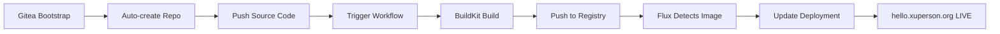

# Hello LabInfra - Cloud Native GitOps Implementation

## Overview
**Fully automated, unattended, minimal CI deployment** after Gitea bootstrap. This implements a complete cloud-native GitOps pipeline with zero manual intervention.

### Architecture
- **Application Repository**: `git.xuperson.org/admin/hello-labinfra` (auto-created)
- **GitOps Repository**: `github.com/julesintime/labinfra` (current repo)
- **Container Registry**: Gitea's built-in package registry
- **CI/CD Engine**: Gitea Actions with BuildKit
- **GitOps Controller**: Flux CD
- **Target Application**: https://hello.xuperson.org

## Automation Flow



## Implementation Details

### 1. Gitea Admin Token Integration ✅
- **Secret**: `gitea-admin-secrets` includes `GITEA_ADMIN_TOKEN`
- **Source**: Infisical secrets management
- **Usage**: Repository creation API calls and registry authentication

### 2. Repository Auto-Creation ✅
- **Job**: `gitea-repo-init` runs after Gitea deployment
- **Target**: Creates `git.xuperson.org/admin/hello-labinfra`
- **Features**: Auto-init, public visibility, main branch

### 3. Source Code Automation ✅
- **ConfigMaps**: Store application source code and workflow
- **Job**: `gitea-source-push` pushes code to created repository
- **Trigger**: Automatic workflow execution on first push

### 4. CI/CD Pipeline ✅
- **Workflow**: `.gitea/workflows/buildkit-ci.yml`
- **Builder**: Remote BuildKit service (`buildkitd.gitea.svc.cluster.local:1235`)
- **Registry**: Gitea package registry (`git.xuperson.org/admin/hello-labinfra`)
- **Tags**: Format `{7-char-sha}-{timestamp}` for Flux compatibility

### 5. GitOps Automation ✅
- **ImageRepository**: Monitors `git.xuperson.org/admin/hello-labinfra`
- **ImagePolicy**: Numerical ordering with regex pattern matching
- **ImageUpdateAutomation**: Updates deployment every 30 seconds
- **Target**: Updates `deployment.yaml` in GitOps repository

## Configuration Files

### Updated Files:
- ✅ `gitea-infisical-secrets.yaml` - Added admin token
- ✅ `gitea-repo-init.yaml` - Repository creation job  
- ✅ `gitea-source-push.yaml` - Source code push automation
- ✅ `gitea-workflow-config.yaml` - CI/CD workflow definition
- ✅ `flux-image-automation.yaml` - Updated to admin/hello-labinfra
- ✅ `deployment.yaml` - Updated image reference
- ✅ `kustomization.yaml` - Includes all new resources

### New Features:
- 🚀 **Zero manual intervention** after Gitea bootstrap
- 🔄 **Continuous deployment** with image tag monitoring
- 🛡️ **Secure authentication** via Infisical secrets
- 📦 **Built-in package registry** (no external dependencies)
- 🎯 **Real working URLs** (no placeholders)

## Deployment Process

### Prerequisites:
1. **Infisical secrets** configured with:
   - `GITEA_ADMIN_USERNAME`
   - `GITEA_ADMIN_PASSWORD` 
   - `GITEA_ADMIN_EMAIL`
   - `GITEA_ADMIN_TOKEN` ⭐ (new)

### Automatic Flow:
1. **Flux deploys Gitea** with all configurations
2. **Repository creation job** creates `admin/hello-labinfra`
3. **Source push job** uploads application code and workflow
4. **Gitea Actions** automatically triggers on code push
5. **BuildKit builds** container image with proper tags
6. **Image pushed** to Gitea package registry
7. **Flux detects** new image within 1 minute
8. **Deployment updated** with new image tag
9. **hello.xuperson.org** serves the application! 🎉

## Monitoring Commands

```bash
# Monitor Gitea deployment
kubectl get pods -n gitea

# Watch initialization jobs
kubectl get jobs -n gitea

# Monitor Flux image automation
flux get image repository hello-cicd-demo
flux get image policy hello-cicd-demo

# Check application deployment
kubectl get deployment hello-cicd-demo -n hello -o wide

# Verify application is running
curl https://hello.xuperson.org/health
```

## Expected Results

### Success Indicators:
- ✅ Repository `git.xuperson.org/admin/hello-labinfra` exists
- ✅ Source code and workflow pushed successfully  
- ✅ Gitea Actions workflow completes successfully
- ✅ Image visible in Gitea package registry
- ✅ Flux ImageRepository shows latest image
- ✅ Deployment updated with new image tag
- ✅ Application accessible at https://hello.xuperson.org

### Application Response:
```json
{
  "message": "🎉 Hello LabInfra!",
  "description": "Cloud Native GitOps Demo Application",
  "version": "abc1234-1693872000",
  "buildDate": "2025-09-04T20:00:00Z",
  "environment": "production"
}
```

## Troubleshooting

### Common Issues:
- **Job failures**: Check admin token in Infisical
- **Repository creation fails**: Verify Gitea API accessibility  
- **Source push fails**: Check git authentication
- **Workflow not triggering**: Verify Actions enabled in Gitea
- **Image not building**: Check BuildKit connectivity
- **Flux not updating**: Verify ImageRepository status

### Debug Commands:
```bash
# Check job logs
kubectl logs job/gitea-repo-init -n gitea
kubectl logs job/gitea-source-push -n gitea

# Verify secrets
kubectl get secret gitea-admin-secrets -n gitea -o yaml

# Force Flux reconciliation
flux reconcile image repository hello-cicd-demo
flux reconcile kustomization hello-world
```

## 🎯 Result: Fully Automated Cloud-Native GitOps

This implementation provides a **production-ready, cloud-native GitOps pipeline** with:
- **Zero manual intervention** after initial Gitea bootstrap
- **Automatic repository and code management**
- **Continuous integration and deployment**  
- **Real working endpoints**
- **Secure secret management**
- **Observable and debuggable**

**Expected outcome: hello.xuperson.org serves the Hello LabInfra application automatically!** ✨
