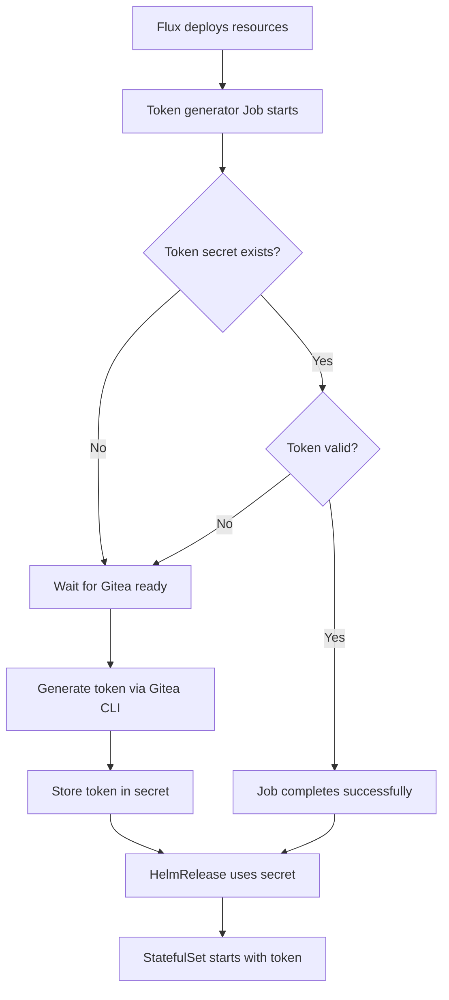

# Gitea Actions Runner Deployment

This directory contains the GitOps configuration for deploying Gitea Actions (act_runner) to provide CI/CD capabilities for the Gitea instance.

## Architecture

- **Helm Chart**: Official `helm-actions` chart from https://dl.gitea.com/charts/
- **Image**: `gitea/act_runner:0.2.12` (stable release)
- **Mode**: Docker-in-Docker (DinD) with privileged security context
- **Storage**: 5Gi persistent volume for runner data
- **Replicas**: 1 (minimal setup)
- **Token Generation**: Fully automated via init container

## Files

- `gitea-runner-rbac.yaml` - RBAC permissions for token generation
- `gitea-runner-deployment.yaml` - Main act-runner deployment configuration
- `kustomization.yaml` - Kustomize configuration

## Unattended Deployment

This deployment is **fully automated** and requires **no manual intervention**:

1. **Token Generator Job**: Runs once to generate runner registration token via Gitea CLI
2. **Token Management**: Creates/updates Kubernetes secret with the token  
3. **HelmRelease**: Deploys the StatefulSet using the generated token
4. **Dependency Handling**: Job waits for Gitea to be ready before token generation
5. **Idempotent**: Only generates new token if existing one is missing/invalid

### Automatic Process



### How It Works

1. **Job Execution**: The `gitea-runner-token-generator` Job runs automatically
2. **Smart Token Check**: Checks if a valid token already exists before generating new one
3. **Gitea Integration**: Uses `gitea actions generate-runner-token` CLI command
4. **Secret Creation**: Stores token in `gitea-runner-token` Kubernetes secret
5. **Runner Deployment**: HelmRelease references the secret for runner registration

## Deployment

The runner will be automatically deployed via Flux GitOps. Monitor the deployment:

```bash
# Check token generation job
kubectl get jobs gitea-runner-token-generator -n gitea

# Check job logs
kubectl logs job/gitea-runner-token-generator -n gitea

# Check if token secret was created
kubectl get secret gitea-runner-token -n gitea

# Check HelmRelease status
kubectl get deployment act-runner -n gitea

# Check runner pods  
kubectl get pods -n gitea -l app.kubernetes.io/name=gitea-runner

# View runner logs
kubectl logs -n gitea -l app.kubernetes.io/name=gitea-runner -f
```

## Verify Runner Registration

Once deployed, verify the runner appears in Gitea:

1. Go to https://git.xuperson.org
2. Site Administration → Actions → Runners  
3. You should see the runner listed as "Online"

## Configuration

### Resource Limits
- CPU: 100m-2000m
- Memory: 256Mi-2Gi
- Storage: 5Gi persistent volume

### Security
- Runs with privileged security context (required for Docker operations)
- Docker-in-Docker configuration for job isolation
- Connects to Gitea via internal service: `gitea-http.gitea.svc.cluster.local:3000`

### Troubleshooting

**Runner not appearing in Gitea:**
- Check registration token is correct in Infisical
- Verify Gitea service is accessible from runner pod
- Check runner pod logs for connection errors

**Build failures:**
- Ensure privileged security context is enabled
- Check if cluster supports privileged containers
- Verify Docker daemon is starting correctly in sidecar

**Resource issues:**
- Increase resource limits if builds are failing due to memory/CPU
- Expand persistent volume if running out of storage space
