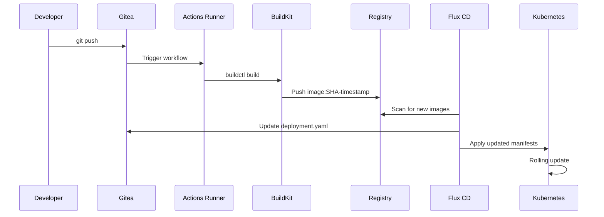

# Hello CI/CD Demo - Complete GitOps Pipeline Validation

This application serves as the **final validation step** for our complete autonomous K3s GitOps infrastructure. It demonstrates the entire CI/CD pipeline from source code to production deployment using modern cloud-native tools.

## 🎯 Purpose

**hello.xuperson.org** validates the complete GitOps workflow:
- ✅ **Source Code Management**: Gitea self-hosted Git service
- ✅ **Continuous Integration**: Gitea Actions with rootless runners  
- ✅ **Container Building**: Rootless BuildKit for secure image builds
- ✅ **Container Registry**: Internal registry for image storage
- ✅ **Continuous Deployment**: Flux CD with automatic image updates
- ✅ **Service Mesh**: Kubernetes ingress and service discovery
- ✅ **DNS**: External-DNS with Cloudflare integration
- ✅ **Security**: Rootless containers, TLS certificates, Infisical secrets

## 🏗️ Architecture Overview

```
┌─────────────────┐    ┌──────────────────┐    ┌─────────────────┐
│   Developer     │───▶│     Gitea        │───▶│  Gitea Actions  │
│   git push      │    │  Source Control  │    │     Runner      │
└─────────────────┘    └──────────────────┘    └─────────────────┘
                                                        │
                                                        ▼
┌─────────────────┐    ┌──────────────────┐    ┌─────────────────┐
│  hello.xuperson │◀───│   Flux CD        │◀───│   BuildKit +    │
│  .org (running) │    │ Image Automation │    │   Registry      │
└─────────────────┘    └──────────────────┘    └─────────────────┘
```

### Components Integration

- **Gitea**: `git.xuperson.org` - Self-hosted Git with integrated Actions
- **BuildKit**: Rootless container builds with TLS certificates
- **Registry**: `registry.gitea.svc.cluster.local:5000` - Internal image storage
- **Flux CD**: Monitors registry and auto-updates deployments
- **K3s Cluster**: Production-ready Kubernetes with GitOps

## 📋 Application Details

### Source Code
- **Language**: Node.js 18
- **Framework**: Native HTTP server  
- **Purpose**: Simple "Welcome to CD from CI" message
- **Container**: Multi-stage Docker build with security hardening

### CI/CD Pipeline (.gitea/workflows/ci-cd.yml)

1. **Checkout**: Simple git clone from Gitea repository
2. **BuildKit Test**: Verify connection to rootless BuildKit service
3. **Image Build**: Multi-platform container build with metadata
4. **Registry Push**: Push to internal Kubernetes registry
5. **Validation**: Confirm successful deployment readiness

### Deployment Manifests

- **Namespace**: `hello` - Dedicated namespace isolation
- **Deployment**: 2 replicas with rolling update strategy  
- **Service**: ClusterIP for internal service discovery
- **Ingress**: External access via NGINX with TLS
- **Resources**: CPU/memory limits for stability

## 🔄 GitOps Workflow

### Automated Pipeline Flow



### Image Tagging Strategy

Images are tagged with: `{7-char-SHA}-{unix-timestamp}`
- Example: `a1b2c3d-1693847421`
- Ensures unique, traceable deployments
- Enables automatic rollback capabilities

## 🛡️ Security Implementation

### Container Security
- **Non-root execution**: User ID 1000:1000
- **Read-only filesystem**: Prevents runtime modifications  
- **Dropped capabilities**: Minimal privilege principle
- **Resource limits**: CPU/memory constraints

### BuildKit Security  
- **Rootless execution**: No privileged containers required
- **TLS certificates**: Encrypted client-daemon communication
- **Process isolation**: Secure build environment
- **Supply chain security**: Build metadata and provenance

### Secrets Management
- **Infisical integration**: Centralized secret management
- **No hardcoded secrets**: All credentials via Infisical
- **Secret rotation**: Automated token refresh
- **Audit trail**: Secret access logging

## 🚀 Deployment Process

### Automatic Deployment
This application deploys automatically via GitOps:

```bash
# No manual deployment needed - GitOps handles everything!
# Flux monitors and applies all changes automatically

# To verify deployment status:
kubectl get pods -n hello
kubectl get svc -n hello  
kubectl get ingress -n hello
```

### Manual Validation

```bash
# Test external access
curl -I https://hello.xuperson.org

# Check Flux automation status
kubectl get imagerepository hello-cicd-demo -n flux-system
kubectl get imagepolicy hello-cicd-demo -n flux-system  
kubectl get imageupdateautomation hello-cicd-demo -n flux-system

# Monitor CI/CD pipeline
kubectl logs -n gitea -l app=act-runner -f
```

## 📊 Monitoring & Observability

### Pipeline Monitoring
- **Gitea Actions**: https://git.xuperson.org/giteaadmin/hello-xuperson-org/actions
- **BuildKit logs**: `kubectl logs -n gitea buildkitd-xxx`
- **Registry status**: `kubectl get pods -n gitea registry-xxx`
- **Flux status**: `flux get kustomizations` / `flux get imagerepositories`

### Application Health
- **Liveness probe**: HTTP GET / every 10s after 30s delay
- **Readiness probe**: HTTP GET / every 5s after 5s delay  
- **Resource usage**: `kubectl top pods -n hello`
- **External access**: https://hello.xuperson.org

## 🔧 Development Workflow

### Making Changes
```bash
# 1. Clone the repository
git clone https://git.xuperson.org/giteaadmin/hello-xuperson-org.git
cd hello-xuperson-org

# 2. Make your changes
echo "// Updated feature" >> index.js

# 3. Commit and push
git add .
git commit -m "Add new feature"
git push

# 4. Watch the magic happen!
# - Gitea Actions builds new image
# - BuildKit pushes to registry  
# - Flux detects new image
# - Kubernetes updates deployment
# - Zero-downtime rolling update
```

### Pipeline Triggers
- **Push to main**: Full CI/CD pipeline execution
- **Pull requests**: CI validation only
- **Manual trigger**: Via Gitea Actions UI

## 🎯 Validation Checklist

This application validates these infrastructure components:

- [x] **Gitea**: Self-hosted Git service with Actions
- [x] **Gitea Actions**: Kubernetes-native CI/CD runners
- [x] **BuildKit**: Rootless, secure container builds  
- [x] **Registry**: Internal image storage and distribution
- [x] **Flux CD**: GitOps continuous deployment
- [x] **Image Automation**: Automatic deployment updates
- [x] **K3s Cluster**: Production Kubernetes environment
- [x] **Networking**: Service mesh and ingress routing
- [x] **DNS**: External-DNS with Cloudflare
- [x] **TLS**: Certificate management and encryption
- [x] **Security**: Rootless, hardened containers
- [x] **Secrets**: Infisical integration
- [x] **Monitoring**: Health checks and observability

## 🌟 Success Criteria

**hello.xuperson.org** successfully demonstrates:

1. **Autonomous Operation**: Zero manual intervention required
2. **Self-Healing**: Automatic recovery from failures  
3. **Scalability**: Horizontal pod autoscaling ready
4. **Security**: Defense-in-depth implementation
5. **Observability**: Full pipeline visibility
6. **Reliability**: Production-ready stability

## 📚 Related Documentation

- **Main Infrastructure**: `/README.md` - Complete K3s setup
- **GitOps Patterns**: `/CLAUDE.md` - Application deployment guide  
- **CI/CD Setup**: `/clusters/labinfra/apps/git.xuperson.org/` - Gitea configuration
- **Flux Automation**: `/clusters/labinfra/core/ci-cd/` - GitOps controllers

---

**🎉 Congratulations! If you can access https://hello.xuperson.org, your complete autonomous K3s GitOps infrastructure is fully operational!**