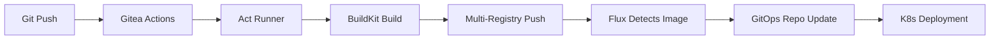
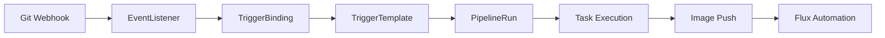

# 🚀 Hello GitOps - Comprehensive CI/CD Demonstration

A complete reference implementation showcasing modern GitOps CI/CD patterns with **BuildKit**, **Gitea Actions**, **Tekton Pipelines**, and **Flux CD**.

## 🎯 What This Demonstrates

This application serves as a **comprehensive template** for implementing GitOps workflows in Kubernetes environments, featuring:

### ✨ **Key Technologies**
- **🔧 BuildKit**: Rootless container builds (no Docker-in-Docker)
- **🏃 Gitea Actions**: Lightweight CI/CD with Act runners
- **⚙️ Tekton Pipelines**: Cloud-native pipeline orchestration
- **🔄 Flux CD**: GitOps continuous delivery with image automation
- **☸️ Kubernetes**: Container orchestration on K3s

### 🏗️ **Architecture Highlights**
- **Dual CI/CD Pipelines**: Both Gitea Actions (.gitea/) and Tekton (.tekton/)
- **Multi-Registry Support**: Push to HTTP, Gitea, and Harbor registries
- **Security-First**: Rootless builds, non-root containers, minimal privileges
- **Image Automation**: Flux detects new images and updates deployments automatically
- **GitOps Separation**: Source repo vs. deployment repo pattern

## 📁 Project Structure

```
hello.xuperson.org/
├── 📄 index.js                 # Node.js hello world application
├── 📦 package.json             # Dependencies and metadata
├── 🐳 Dockerfile              # Multi-stage, security-hardened build
├── ☸️ hello-world.yaml        # Kubernetes deployment manifest
├── 🔧 kustomization.yaml      # Kustomize configuration
├── 📖 README.md               # This comprehensive guide
├── .gitea/workflows/           # Gitea Actions CI/CD
│   └── buildkit-ci.yml        # BuildKit pipeline with multi-registry push
└── .tekton/                   # Tekton Pipelines (cloud-native CI/CD)
    ├── pipeline.yaml          # Main build pipeline
    ├── pipelinerun.yaml       # Pipeline execution
    ├── trigger.yaml           # Git webhook triggers
    ├── eventlistener.yaml     # Event processing
    ├── gitea-*.yaml          # Gitea integration
    └── kustomization.yaml     # Tekton resource management
```

## 🔄 CI/CD Pipeline Flow

### **1. Gitea Actions Pipeline** (Recommended for simplicity)



**Workflow:** `.gitea/workflows/buildkit-ci.yml`
- ✅ Rootless BuildKit builds
- ✅ Parallel registry pushes (HTTP + Gitea)
- ✅ Build metadata injection
- ✅ Security-hardened containers

### **2. Tekton Pipeline** (Cloud-native alternative)



**Components:** `.tekton/` directory
- ⚙️ Cloud-native pipeline execution
- 🔗 Git webhook integration
- 📊 Built-in observability
- 🎯 Enterprise-grade scalability

## 🛡️ Security Configuration

### **Container Security**
- **Non-root user**: `appuser:1000`
- **Read-only filesystem**: Enhanced security posture
- **Minimal privileges**: No unnecessary capabilities
- **Health checks**: Automated container monitoring

### **BuildKit Security**
- **Rootless execution**: No privileged containers required
- **Shared cache**: Efficient, secure build acceleration
- **OCI compliance**: Standard container image format
- **Supply chain security**: Build metadata and provenance

### **Kubernetes Security**
```yaml
securityContext:
  runAsNonRoot: true
  runAsUser: 1000
  runAsGroup: 1000
  allowPrivilegeEscalation: false
  readOnlyRootFilesystem: true
  capabilities:
    drop: ["ALL"]
```

## 📋 **Infrastructure Dependencies**

This application requires the following infrastructure components (configured separately):

### **Core Services**
- **BuildKit Service** (`buildkit.xuperson.org`): Rootless container builds
- **Gitea Instance** (`git.xuperson.org`): Git repository and registry
- **Act Runners**: Kubernetes-based CI/CD execution
- **Flux CD**: Image automation and GitOps controllers

### **Registry Configuration**
- **HTTP Registry**: `192.168.80.104:5000` (insecure, internal)
- **Gitea Registry**: `git.xuperson.org` (authenticated)
- **Harbor Registry**: Enterprise features (optional)

### **Rootless BuildKit Setup**
Key environment variables required for rootless operation:
```bash
HOME=/home/user
USER=user
XDG_RUNTIME_DIR=/run/user/1000
TMPDIR=/home/user/.local/tmp
DOCKER_CONFIG=/home/user/.local/share/docker
```

Security context for BuildKit pods:
```yaml
securityContext:
  seccompProfile:
    type: Unconfined
  appArmorProfile:
    type: Unconfined
```

### **Tekton Configuration**
- **Tekton Pipelines**: Core pipeline execution engine
- **Tekton Triggers**: Git webhook processing
- **Event Listeners**: HTTP trigger endpoints
- **Service Account**: RBAC for pipeline execution

### **Flux CD Image Automation**
```yaml
ImageRepository: Scans container registry for new images
ImagePolicy: Selects images based on semantic versioning or timestamps
ImageUpdateAutomation: Updates GitOps repository with new image tags
```

## 🚀 **Deployment Instructions**

### **Prerequisites**
1. K3s/K8s cluster with Flux CD installed
2. BuildKit service deployed and accessible
3. Gitea with Act runners configured
4. Container registries configured and accessible

### **Deploy Application**
```bash
# Application is automatically deployed via GitOps
# Flux monitors this directory and applies changes

# Verify deployment
kubectl get pods -n hello
kubectl get svc -n hello
kubectl get ingress -n hello

# Access application
curl https://hello.xuperson.org
```

### **Trigger CI/CD**
```bash
# Make changes to application code
echo "// Updated $(date)" >> index.js

# Commit and push
git add .
git commit -m "Trigger CI/CD pipeline"
git push

# Pipeline will automatically:
# 1. Build new container image
# 2. Push to registries with timestamped tag
# 3. Flux detects new image
# 4. Updates Kubernetes deployment
# 5. Rolls out new version
```

## 🔍 **Monitoring and Troubleshooting**

### **Pipeline Status**
```bash
# Check Gitea Actions
# Visit: https://git.xuperson.org/repo/actions

# Check Act Runner logs
kubectl logs -n gitea -l app=act-runner -f

# Check BuildKit status
kubectl logs -n buildkit -l app=buildkit -f
```

### **Flux Automation**
```bash
# Check image repository scanning
kubectl get imagerepository hello-app -n flux-system

# Check image policy selection
kubectl get imagepolicy hello-app -n flux-system

# Check automation status
kubectl get imageupdateautomation hello-app -n flux-system

# Force reconciliation
flux reconcile source git flux-system
flux reconcile kustomization apps
```

### **Tekton Monitoring**
```bash
# List pipeline runs
kubectl get pipelinerun -n tekton-pipelines

# Check pipeline logs
tkn pipelinerun logs <pipelinerun-name> -n tekton-pipelines

# Event listener status
kubectl logs -n tekton-pipelines -l app=eventlistener
```

## 📚 **Reference Documentation**

This application demonstrates patterns documented in:
- **Main GitOps README**: `/README.md` - Infrastructure overview
- **Claude Instructions**: `/CLAUDE.md` - Application deployment patterns
- **BuildKit Documentation**: Container build optimization
- **Flux CD Documentation**: GitOps automation patterns

## 🎯 **Use as Template**

This hello app serves as a **reference template** for new applications:

1. **Copy Structure**: Use this directory structure for new apps
2. **Update Metadata**: Change image names, domains, and descriptions
3. **Customize Pipeline**: Adapt CI/CD workflows for your requirements
4. **Security Review**: Ensure security contexts match your policies
5. **Test Integration**: Verify with your registry and GitOps setup

## 🔧 **Advanced Configuration**

### **Multi-Environment Support**
- Extend with environment-specific overlays
- Configure different image policies per environment
- Implement promotion pipelines between environments

### **Enterprise Features**
- Add SAST/DAST security scanning
- Implement image signing with Cosign
- Configure policy enforcement with OPA Gatekeeper
- Add observability with Prometheus/Grafana integration

---

**🌟 This application showcases a complete, production-ready GitOps CI/CD implementation suitable for enterprise Kubernetes environments.**
