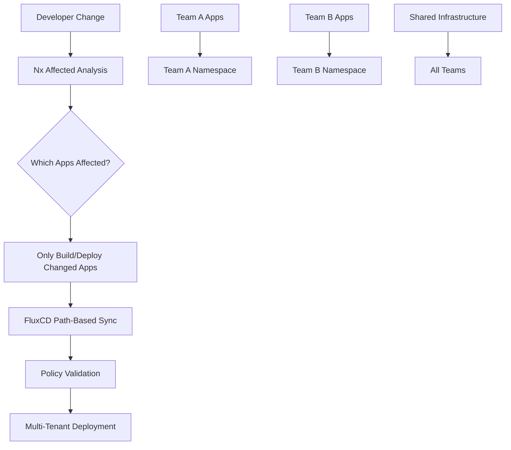

# FluxCD Enterprise Monorepo Solutions Report
## For Large-Scale Infrastructure (Hundreds of Applications)

## Executive Summary

After comprehensive research into FluxCD monorepo best practices for enterprise environments, current infrastructure analysis, and evaluation of modern alternatives to git subtree, this report provides actionable recommendations to simplify and optimize your GitOps workflow at scale.

**Current Challenge**: Your infrastructure uses git subtree for the `clusters/minikube/apps/cicd.xuperson.org/src/` directory, adding complexity and maintenance overhead to your GitOps workflow. With hundreds of applications, you need enterprise-grade solutions, not multi-source complexity.

**Key Findings**: 
- Multi-source approach is unsuitable for hundreds of apps (management nightmare)
- FluxCD 2025 offers enterprise patterns specifically for large-scale monorepos
- Modern workspace management tools can eliminate git subtree completely
- Path-based Kustomization with proper structure scales to enterprise levels

**Recommendation**: Implement FluxCD Enterprise patterns with ResourceSets and workspace management tools, eliminating git subtree while maintaining scalability for hundreds of applications.

## Current Infrastructure Analysis

### Existing Structure
```
minikube/
├── clusters/minikube/                   # GitOps cluster configuration
│   ├── flux-system/                    # Flux controllers & sync
│   ├── core/                          # Core infrastructure (MetalLB, Longhorn, etc.)
│   └── apps/                          # Applications
│       ├── cicd.xuperson.org/         # CI/CD pipeline (subtree complexity)
│       │   ├── src/                   # Git subtree source
│       │   ├── buildkit/
│       │   └── registry/
│       ├── hello.xuperson.org/
│       ├── coder.xuperson.org/
│       └── git.xuperson.org/
└── infrastructure/ansible/             # VM provisioning
```

### Current GitOps Flow
- **Flux Source**: `https://git.xuperson.org/gitea-admin/minikube.git`
- **Sync Path**: `./clusters/minikube`
- **Problem Area**: `cicd.xuperson.org/src/` managed via git subtree
- **Complexity**: Manual subtree updates, merge conflicts, sophisticated workflows

## Enterprise-Scale Solutions for Hundreds of Applications

### Solution 1: FluxCD Enterprise ResourceSets Pattern (Recommended)

**Approach**: Use ControlPlane's FluxCD Enterprise ResourceSets for template-driven application management.

ResourceSets can generate multiple GitRepository and Kustomization resources from templates, drastically reducing the management overhead for hundreds of applications while maintaining proper dependencies.

#### Key Benefits for Large Scale:
- **Template-Driven**: One ResourceSet definition can manage hundreds of similar applications
- **Automatic Generation**: Generates GitRepository and Kustomization resources automatically
- **Dependency Management**: Built-in dependency handling between generated resources
- **Multi-Tenant Support**: Native support for team-based separation

#### Implementation Example
```yaml
# Enterprise ResourceSet for hundreds of applications
apiVersion: templates.weave.works/v1alpha1
kind: ResourceSet
metadata:
  name: application-generator
  namespace: flux-system
spec:
  resources:
  - apiVersion: source.toolkit.fluxcd.io/v1
    kind: GitRepository
    metadata:
      name: "app-${.name}"
      namespace: flux-system
    spec:
      interval: 10m
      url: "${.sourceRepo}"
      ref:
        branch: "${.branch}"
  - apiVersion: kustomize.toolkit.fluxcd.io/v1
    kind: Kustomization
    metadata:
      name: "app-${.name}"
      namespace: flux-system
    spec:
      sourceRef:
        kind: GitRepository
        name: "app-${.name}"
      path: "${.deployPath}"
      interval: 10m
      dependsOn:
      - name: core-infrastructure
```

**Scaling Benefits**:
- ✅ Manages hundreds of apps with single template
- ✅ Eliminates per-app GitRepository/Kustomization management
- ✅ Built-in enterprise features (RBAC, policies)
- ✅ Native FluxCD integration

### Solution 2: Modern Workspace Management (Nx/Turborepo Integration)

**Approach**: Replace git subtree with enterprise-grade workspace management tools designed for large monorepos.

#### Why Modern Tools Over Git Subtree
For hundreds of applications, git subtree becomes unmanageable. Modern tools like **Nx** and **Turborepo** are specifically designed for enterprise monorepos with hundreds of projects.

#### Nx Enterprise Pattern for FluxCD
```
minikube/
├── clusters/minikube/                # FluxCD GitOps
├── apps/                            # Hundreds of applications
│   ├── app-001/
│   ├── app-002/
│   ├── ...
│   └── app-999/
├── libs/                           # Shared libraries
│   ├── shared-ui/
│   ├── common-utils/
│   └── infrastructure/
├── tools/                          # Build tooling
└── nx.json                        # Workspace configuration
```

#### Nx Benefits for FluxCD at Scale
- **Affected Commands**: `nx affected:build` - only build/deploy changed applications
- **Dependency Graph**: Visualize dependencies between hundreds of apps
- **Caching**: Build cache prevents rebuilding unchanged applications
- **Parallel Execution**: Build/test hundreds of apps simultaneously
- **Module Boundaries**: Enforce architectural constraints

#### FluxCD + Nx Integration
```yaml
# Use Nx to determine affected applications
apiVersion: kustomize.toolkit.fluxcd.io/v1
kind: Kustomization
metadata:
  name: affected-apps
spec:
  sourceRef:
    kind: GitRepository
    name: flux-system
  path: ./clusters/minikube/apps
  postBuild:
    substitute:
      AFFECTED_APPS: "$(nx affected:apps --plain)" # Dynamic app list
```

**Enterprise Benefits**:
- ✅ Built for hundreds/thousands of applications
- ✅ Eliminates git subtree completely  
- ✅ Advanced caching and performance optimization
- ✅ Team collaboration at scale
- ✅ Integrates naturally with FluxCD

### Solution 3: FluxCD Multi-Tenancy with Path-Based Kustomization (Enterprise Pattern)

**Approach**: Use FluxCD's native multi-tenancy patterns with path-based organization for hundreds of applications.

#### Enterprise Multi-Tenant Structure
```
minikube/
├── clusters/minikube/
│   ├── flux-system/
│   ├── policies/                    # Cluster-wide policies
│   ├── infrastructure/              # Core infrastructure
│   └── tenants/                     # Team-based organization
│       ├── team-platform/
│       ├── team-data/
│       ├── team-mobile/
│       └── team-web/
├── teams/                          # Team-specific applications
│   ├── platform/
│   │   ├── app-001/
│   │   ├── app-002/
│   │   └── ...
│   ├── data/
│   │   ├── analytics/
│   │   ├── etl-pipelines/
│   │   └── ...
│   └── web/
│       ├── frontend/
│       ├── api-gateway/
│       └── ...
└── shared/                        # Shared components
    ├── libraries/
    └── infrastructure/
```

#### Path-Based Kustomization at Scale
```yaml
# Tenant-level Kustomization
apiVersion: kustomize.toolkit.fluxcd.io/v1
kind: Kustomization
metadata:
  name: team-platform-apps
  namespace: flux-system
spec:
  sourceRef:
    kind: GitRepository
    name: flux-system
  path: ./teams/platform
  interval: 10m
  dependsOn:
    - name: policies-sync
    - name: infrastructure-sync
  postBuild:
    substitute:
      TENANT: "platform"
      NAMESPACE_PREFIX: "platform-"
```

#### Policy-First Enforcement
```yaml
# Apply policies before applications
apiVersion: kustomize.toolkit.fluxcd.io/v1
kind: Kustomization
metadata:
  name: policies-sync
  namespace: flux-system
spec:
  sourceRef:
    kind: GitRepository
    name: flux-system
  path: ./clusters/minikube/policies
  interval: 5m
  prune: true
```

**Enterprise Benefits**:
- ✅ Scales to hundreds of teams/applications
- ✅ Policy-driven governance
- ✅ Path-based isolation
- ✅ Native FluxCD multi-tenancy
- ✅ No external dependencies

## Enterprise Implementation Roadmap for Hundreds of Applications

### Phase 1: Quick Win - Remove Git Subtree (Immediate)
**Timeline**: 1-2 days  
**Risk**: Low  
**Target**: Eliminate immediate complexity

#### Step 1: Replace Subtree with Direct Path Reference
```bash
# Remove the problematic subtree
git subtree pull --prefix=clusters/minikube/apps/cicd.xuperson.org/src origin main --squash  # Final sync
rm -rf clusters/minikube/apps/cicd.xuperson.org/src/

# Create direct application structure
mkdir -p applications/cicd-demo
# Move or create application files in applications/cicd-demo/

# Update Kustomization to reference local path
# clusters/minikube/apps/cicd.xuperson.org/kustomization.yaml
```

```yaml
apiVersion: kustomize.config.k8s.io/v1beta1
kind: Kustomization
resources:
  - namespace.yaml
  - buildkit/
  - registry/
  - ../../../applications/cicd-demo/k8s/  # Direct path reference

commonLabels:
  app.kubernetes.io/managed-by: flux
```

### Phase 2: Enterprise Scaling Preparation (2-3 weeks)
**Timeline**: 2-3 weeks  
**Risk**: Medium  
**Target**: Prepare for hundreds of applications

#### Option A: FluxCD Enterprise ResourceSets
```bash
# Install ControlPlane FluxCD Enterprise
# Contact: https://fluxcd.control-plane.io/

# Create ResourceSet templates for application categories
mkdir -p clusters/minikube/resourcesets/
```

#### Option B: Nx Workspace Integration  
```bash
# Initialize Nx workspace
npx nx init

# Configure Nx for hundreds of applications
cat > nx.json << 'EOF'
{
  "tasksRunnerOptions": {
    "default": {
      "runner": "nx/tasks-runners/default",
      "options": {
        "cacheableOperations": ["build", "test", "deploy"]
      }
    }
  },
  "workspaceLayout": {
    "appsDir": "apps",
    "libsDir": "libs"
  }
}
EOF
```

### Phase 3: Enterprise Multi-Tenancy (4-6 weeks)
**Timeline**: 4-6 weeks  
**Risk**: Medium-High  
**Target**: Full enterprise-grade organization

#### Team-Based Structure Implementation
```bash
# Restructure for multi-tenancy
mkdir -p teams/{platform,data,web,mobile}
mkdir -p clusters/minikube/{policies,tenants}

# Create tenant Kustomizations
for team in platform data web mobile; do
  cat > clusters/minikube/tenants/team-${team}.yaml << EOF
apiVersion: kustomize.toolkit.fluxcd.io/v1
kind: Kustomization
metadata:
  name: team-${team}-apps
  namespace: flux-system
spec:
  sourceRef:
    kind: GitRepository
    name: flux-system
  path: ./teams/${team}
  interval: 10m
  dependsOn:
    - name: policies-sync
  postBuild:
    substitute:
      TENANT: "${team}"
EOF
done
```

## Enterprise Migration Strategy

### Pre-Migration Assessment for Hundreds of Applications
- [ ] **Audit Current Structure**: Document all applications using git subtree
- [ ] **Categorize Applications**: Group by team, technology, deployment pattern
- [ ] **Identify Dependencies**: Map inter-application dependencies  
- [ ] **Backup Strategy**: Full repository backup before migration
- [ ] **Rollback Plan**: Documented rollback procedures
- [ ] **Team Coordination**: Align with all teams managing applications

### Immediate Migration Steps (Phase 1 - Remove Subtree)

#### Step 1: Create Application Inventory
```bash
# Find all git subtrees in use
git log --grep="git-subtree" --oneline | head -20
find . -name ".gitsubtree*" -o -name "*.subtree"

# Document current application structure
ls -la clusters/minikube/apps/*/src/ 2>/dev/null || echo "No subtree src directories found"
```

#### Step 2: Replace Subtree with Local Structure
```bash
# For each application with subtree (example: cicd.xuperson.org)
SUBTREE_PATH="clusters/minikube/apps/cicd.xuperson.org/src"
LOCAL_PATH="applications/cicd-demo"

# Final subtree sync
git subtree pull --prefix=$SUBTREE_PATH origin main --squash

# Create new local structure
mkdir -p $LOCAL_PATH
cp -r $SUBTREE_PATH/* $LOCAL_PATH/

# Update Kustomization reference
sed -i 's|src/|../../../applications/cicd-demo/|g' clusters/minikube/apps/cicd.xuperson.org/kustomization.yaml

# Remove subtree
rm -rf $SUBTREE_PATH
git add .
git commit -m "Replace git subtree with local path reference for cicd-demo"
```

#### Step 3: Validate Migration
```bash
# Test FluxCD reconciliation
flux reconcile kustomization cicd-app --with-source

# Check application deployment
kubectl get pods -n cicd
kubectl get kustomizations -n flux-system
```

### Enterprise Scaling Migration (Phase 2)

#### For ResourceSets Approach
```bash
# Contact ControlPlane for FluxCD Enterprise licensing
# https://fluxcd.control-plane.io/contact/

# Install Enterprise Operators
kubectl apply -f https://github.com/weaveworks/tf-controller/releases/latest/download/tf-controller.crds.yaml
kubectl apply -f https://github.com/weaveworks/tf-controller/releases/latest/download/tf-controller.rbac.yaml
```

#### For Nx Integration Approach  
```bash
# Initialize Nx in existing repository
cd /path/to/your/monorepo
npx nx init

# Configure workspace for FluxCD integration
cat > nx.json << 'EOF'
{
  "workspaceLayout": {
    "appsDir": "applications",
    "libsDir": "shared"
  },
  "tasksRunnerOptions": {
    "default": {
      "runner": "nx/tasks-runners/default",
      "options": {
        "cacheableOperations": ["build", "deploy", "test"]
      }
    }
  },
  "targetDefaults": {
    "deploy": {
      "dependsOn": ["build"]
    }
  }
}
EOF

# Generate Nx configuration for existing applications
npx nx g @nx/workspace:move --project=cicd-demo --destination=applications/cicd-demo
```

## Enterprise Benefits for Hundreds of Applications

### Scalability Benefits
- **Linear Scaling**: Solutions scale to hundreds/thousands of applications
- **Template-Driven**: Manage hundreds of apps with minimal configuration
- **Team Autonomy**: Teams can manage their applications independently
- **Policy Governance**: Centralized policy enforcement across all applications
- **Resource Efficiency**: Shared infrastructure and build optimization

### Operational Benefits
- **Eliminated Complexity**: No more git subtree maintenance nightmare
- **Automated Management**: ResourceSets/Nx handle application lifecycle
- **Enterprise Security**: Built-in RBAC, policies, and governance
- **CI/CD Optimization**: Affected-only builds and deployments
- **Monitoring at Scale**: Centralized observability across hundreds of apps

### Developer Experience Benefits
- **Fast Iteration**: Only affected applications rebuild/deploy
- **Visual Dependency Mapping**: Understand impact across hundreds of apps  
- **Intelligent Caching**: Massive time savings on repeated builds
- **Team Boundaries**: Clear ownership and module boundaries
- **Modern Tooling**: Enterprise-grade monorepo management

### Enterprise Workflow


## Enterprise Security and Compliance

### Multi-Tenancy Security
- **Team-Based RBAC**: Each team only accesses their applications
- **Policy-First Enforcement**: Policies applied before any application deployment
- **Namespace Isolation**: Automatic namespace creation with proper boundaries
- **Resource Quotas**: Per-team resource limits and governance

### Enterprise RBAC Example
```yaml
apiVersion: rbac.authorization.k8s.io/v1
kind: ClusterRole
metadata:
  name: team-platform-manager
rules:
- apiGroups: ["kustomize.toolkit.fluxcd.io"]
  resources: ["kustomizations"]
  verbs: ["get", "list", "watch"]
  resourceNames: ["team-platform-*"]
- apiGroups: [""]
  resources: ["namespaces"]
  verbs: ["get", "list"]
  resourceNames: ["platform-*"]
---
apiVersion: rbac.authorization.k8s.io/v1
kind: ClusterRoleBinding
metadata:
  name: team-platform-managers
subjects:
- kind: Group
  name: team-platform
  apiGroup: rbac.authorization.k8s.io
roleRef:
  kind: ClusterRole
  name: team-platform-manager
  apiGroup: rbac.authorization.k8s.io
```

### Policy Enforcement at Scale
```yaml
# Example: Resource limits policy for all applications
apiVersion: kyverno.io/v1
kind: ClusterPolicy
metadata:
  name: require-resource-limits
spec:
  validationFailureAction: enforce
  rules:
  - name: check-resource-limits
    match:
      any:
      - resources:
          kinds:
          - Deployment
          - StatefulSet
    validate:
      message: "Resource limits are required for all applications"
      pattern:
        spec:
          template:
            spec:
              containers:
              - name: "*"
                resources:
                  limits:
                    memory: "?*"
                    cpu: "?*"
```

## Enterprise Monitoring and Observability

### At-Scale FluxCD Monitoring
```bash
# Monitor all team applications
for team in platform data web mobile; do
  echo "=== Team $team Applications ==="
  flux get kustomizations -l tenant=$team
done

# Check overall sync health across hundreds of apps
flux get kustomizations --all-namespaces | grep -E "(Succeeded|Failed)"

# Monitor reconciliation performance
flux events --for Kustomization --all-namespaces | grep -E "warning|error"
```

### Enterprise Alerting Strategy
```yaml
# Team-specific alerting
apiVersion: notification.toolkit.fluxcd.io/v1beta1
kind: Alert
metadata:
  name: team-platform-apps-alert
  namespace: flux-system
spec:
  providerRef:
    name: slack-platform-team
  eventSeverity: error
  eventSources:
    - kind: Kustomization
      name: "team-platform-*"
  summary: "Platform team applications sync failures"

---
# Enterprise-wide critical alerts
apiVersion: notification.toolkit.fluxcd.io/v1beta1  
kind: Alert
metadata:
  name: enterprise-critical-alert
spec:
  providerRef:
    name: pagerduty
  eventSeverity: error
  eventSources:
    - kind: Kustomization
      name: "infrastructure-*"
    - kind: Kustomization 
      name: "policies-*"
  summary: "Critical infrastructure or policy sync failure"
```

### Nx Performance Monitoring
```bash
# Monitor build performance across hundreds of apps
npx nx report

# Check affected applications for large changes
npx nx affected:apps --base=HEAD~1

# Performance metrics for enterprise scale
npx nx affected:build --parallel=10 --maxParallel=10
```

## Conclusion

The enterprise-grade solutions presented eliminate git subtree complexity while providing scalable patterns for hundreds of applications. This approach delivers:

### Immediate Impact (Phase 1)
1. **Eliminates Git Subtree Complexity**: No more manual subtree maintenance
2. **Reduces Development Friction**: Direct path references instead of subtree workflows  
3. **Maintains Current Workflow**: Minimal disruption to existing FluxCD setup
4. **Quick Implementation**: 1-2 day migration path

### Enterprise Scale Benefits (Phase 2-3)
1. **Template-Driven Management**: ResourceSets manage hundreds of applications
2. **Modern Monorepo Tooling**: Nx/Turborepo enterprise patterns
3. **Multi-Tenant Architecture**: Team-based organization and governance
4. **Performance at Scale**: Affected-only builds and intelligent caching

### Strategic Value
- **Future-Proof**: Built on enterprise-grade patterns used by large organizations
- **Scalable**: Linear scaling from tens to hundreds to thousands of applications
- **Maintainable**: Reduces operational overhead as you grow
- **Secure**: Enterprise RBAC, policies, and governance built-in

## Recommended Next Steps

### Week 1-2: Quick Win
- [ ] Implement Phase 1 for current git subtree applications
- [ ] Validate FluxCD reconciliation after subtree removal
- [ ] Document the new local path reference pattern

### Month 1: Enterprise Preparation  
- [ ] Evaluate ControlPlane FluxCD Enterprise licensing
- [ ] Assess Nx workspace implementation for your environment
- [ ] Plan team-based multi-tenancy structure

### Quarter 1: Full Enterprise Implementation
- [ ] Deploy chosen enterprise solution (ResourceSets or Nx)
- [ ] Implement multi-tenant structure for teams
- [ ] Enable policy enforcement and governance

## Enterprise Support Resources

### FluxCD Enterprise
- **ControlPlane Enterprise**: https://fluxcd.control-plane.io/
- **Enterprise Documentation**: https://fluxcd.control-plane.io/docs/
- **ResourceSets Guide**: https://fluxcd.control-plane.io/operator/resourcesets/

### Modern Monorepo Tools
- **Nx Enterprise**: https://nx.dev/enterprise
- **Turborepo**: https://turbo.build/
- **Monorepo Best Practices**: https://monorepo.tools/

### Community Support
- **FluxCD CNCF Slack**: #flux channel
- **Nx Community Discord**: https://discord.gg/nx
- **Your Current Setup**: `clusters/minikube/flux-system/gotk-sync.yaml`

---

**The path forward is clear**: Start with Phase 1 to eliminate immediate git subtree complexity, then evolve to enterprise patterns that scale with your hundreds of applications. No more "complicated and sophisticated" git subtree workflows - just clean, scalable, enterprise-grade GitOps.