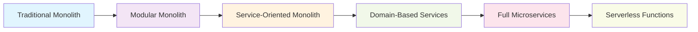
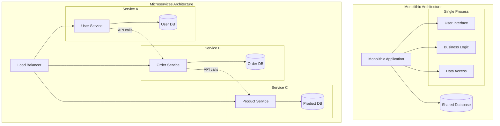
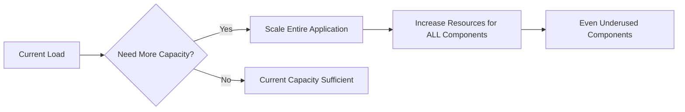
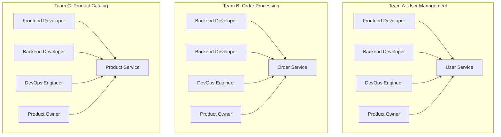
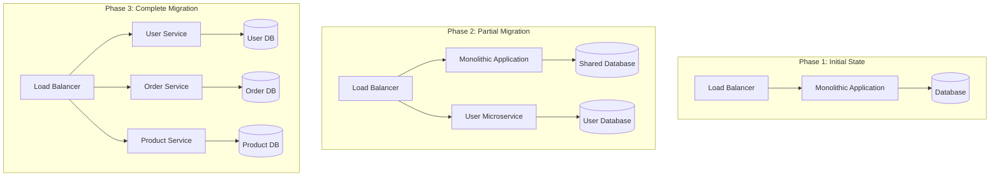
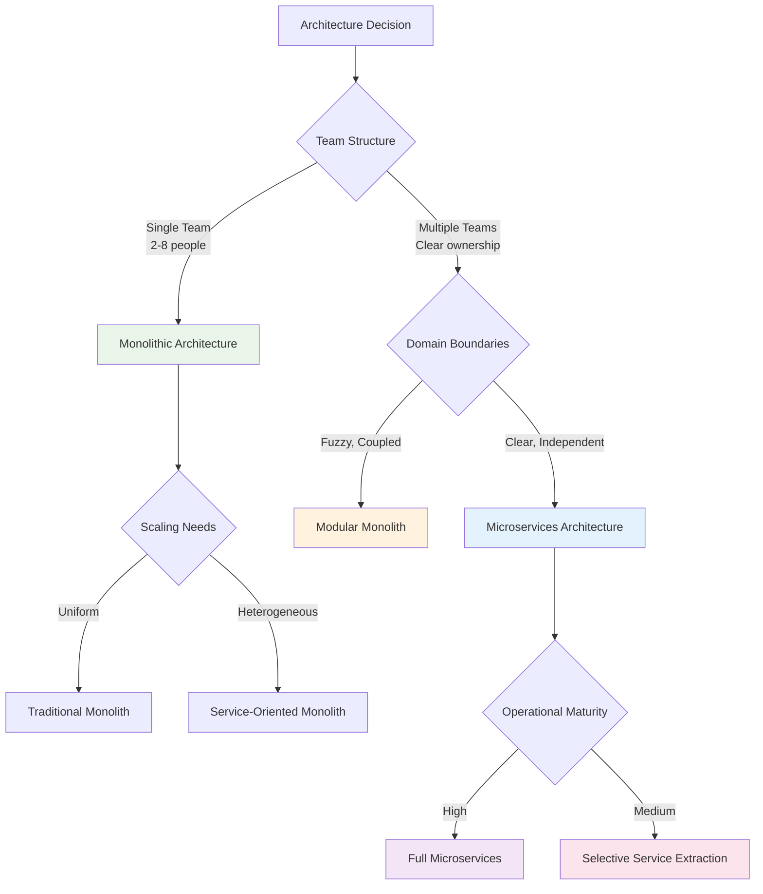

# Microservices vs. Monolithic Architecture: A 2025 Decision Framework

**Course Module:** Architecture Fundamentals  
**Session:** Technical Course Development  
**Duration:** 45 minutes  
**Level:** Intermediate to Advanced  

## Executive Summary

The architectural landscape has matured significantly by 2025. According to the 2024 O'Reilly survey, while 61% of enterprises adopted microservices, 29% returned to monolithic architectures due to operational complexity. Additionally, Gartner reports that organizations using the wrong architecture experience 40% higher development costs and 60% longer time-to-market.

**Key Insight:** The monolith vs microservices debate is not about choosing sides—it's about making context-driven decisions based on business requirements, team structure, and scaling patterns.

## Learning Objectives

By the end of this module, you will:
- Understand the evolution of architectural thinking from 2020-2025
- Apply a structured decision framework for choosing between monolithic and microservices architectures
- Recognize when Conway's Law impacts architectural decisions
- Evaluate trade-offs using real-world examples and industry data
- Design systems that align architecture with business and team structure

## The 2025 Perspective: Beyond Binary Choices

### The Architectural Spectrum

Modern system design exists on a spectrum rather than as a binary choice:



### Industry Reality Check (2024 Data)

**Success Rates by Architecture:**
- **Monolith success rate:** 78% (projects meeting time/budget goals)
- **Microservices success rate:** 52% (first attempt)
- **Hybrid approaches:** 71% (modular monoliths, selective decomposition)

**Common Failure Patterns:**
- 67% of failed microservices projects cite "premature decomposition"
- 45% struggle with distributed system complexity
- 38% underestimate operational overhead

---

## Architecture Patterns Overview

### Defining the Architectural Approaches

**Monolithic Architecture:**
A monolithic application is built as a single unified unit with all components tightly integrated into one deployable artifact. All business functions share the same codebase, database, and runtime environment.

**Microservices Architecture:**
A microservices architecture composes applications from a collection of loosely coupled, independently deployable services that communicate over well-defined APIs. Each service typically owns its data and implements specific business capabilities.

### Visual Comparison



---

## Monolithic Architecture Deep Dive

### Core Characteristics

**Single Deployment Unit:**
- All components packaged together
- Shared runtime environment and resources
- Unified build and deployment process
- Single point of failure and recovery

**Shared Database:**
- Centralized data storage
- ACID transactions across all operations
- Referential integrity enforcement
- Simplified data consistency

**Synchronized Development:**
- Single codebase for all features
- Shared libraries and frameworks
- Coordinated releases and deployments
- Unified testing and quality assurance

### Monolithic Advantages

#### 1. Development Simplicity

```yaml
Development Benefits:
  Initial Setup:
    - Single codebase to maintain
    - Unified development environment
    - Simple IDE configuration
    - Straightforward debugging process
  
  Team Coordination:
    - Single source of truth
    - Shared understanding of entire system
    - Easier knowledge transfer
    - Reduced communication overhead
  
  Testing Strategy:
    - End-to-end testing in single process
    - No network-related test complexity
    - Simplified test data setup
    - Integrated test environments
```

**Example: E-commerce Monolith Structure**
```
ecommerce-app/
├── src/
│   ├── controllers/
│   │   ├── UserController.js
│   │   ├── ProductController.js
│   │   └── OrderController.js
│   ├── services/
│   │   ├── UserService.js
│   │   ├── ProductService.js
│   │   └── OrderService.js
│   ├── models/
│   │   ├── User.js
│   │   ├── Product.js
│   │   └── Order.js
│   └── database/
│       └── connection.js
├── tests/
├── config/
└── package.json
```

#### 2. Performance Optimization

**In-Process Communication:**
- No network latency between components
- Direct function calls instead of API calls
- Shared memory and resources
- Minimal serialization overhead

**Database Efficiency:**
```sql
-- Single transaction across multiple entities
BEGIN TRANSACTION;

INSERT INTO orders (user_id, total, status) 
VALUES (123, 99.99, 'pending');

UPDATE products 
SET stock_quantity = stock_quantity - 1 
WHERE id = 456;

INSERT INTO order_items (order_id, product_id, quantity, price)
VALUES (LAST_INSERT_ID(), 456, 1, 99.99);

COMMIT;
```

#### 3. Operational Simplicity

**Deployment Model:**
- Single artifact to deploy
- Unified configuration management
- Simple monitoring and logging
- Straightforward backup and recovery

**Resource Management:**
```yaml
# Simple resource allocation
resources:
  requests:
    memory: "2Gi"
    cpu: "1000m"
  limits:
    memory: "4Gi" 
    cpu: "2000m"

# Single container deployment
containers:
- name: ecommerce-app
  image: ecommerce:v1.0.0
  ports:
  - containerPort: 8080
```

### Monolithic Challenges

#### 1. Scalability Limitations

**Vertical Scaling Constraints:**


**Resource Waste Example:**
```yaml
# CPU-intensive image processing component needs scaling
# But entire application must be scaled
Resource Usage Analysis:
  Image Processing: 90% CPU utilization (bottleneck)
  User Management: 10% CPU utilization  
  Product Catalog: 5% CPU utilization
  
# Scaling decision forces over-provisioning
Scaling Result:
  - 3x application instances deployed
  - 3x resources allocated to underused components
  - Inefficient resource utilization
```

#### 2. Development Velocity Degradation

**Team Coordination Overhead:**
- Multiple teams working on shared codebase
- Merge conflicts and coordination delays
- Synchronized release cycles
- Risk propagation across features

**Code Complexity Growth:**
```javascript
// Monolithic service method showing tight coupling
class OrderService {
  async createOrder(userId, items) {
    // Direct dependencies on multiple modules
    const user = await this.userService.validate(userId);
    const pricing = await this.pricingService.calculate(items);
    const inventory = await this.inventoryService.reserve(items);
    const payment = await this.paymentService.process(pricing.total);
    const shipping = await this.shippingService.schedule(user.address);
    const notification = await this.notificationService.send(user.email);
    
    // Tightly coupled business logic
    return this.databaseService.createOrder({
      user, items, pricing, payment, shipping
    });
  }
}
```

#### 3. Technology Constraints

**Framework Lock-in:**
- Single technology stack for entire application
- Difficult to adopt new technologies
- Legacy system modernization challenges
- Limited experimentation opportunities

**Example Technology Evolution Challenge:**
```yaml
Current Stack:
  Language: Java 8
  Framework: Spring Boot 1.x
  Database: MySQL 5.7
  Frontend: JSP/jQuery

Desired Stack:
  Language: Java 17 (performance improvements)
  Framework: Spring Boot 3.x (new features)
  Database: PostgreSQL (better JSON support)
  Frontend: React (modern UX)

Migration Challenge:
  - All-or-nothing upgrade approach
  - High risk and extended downtime
  - Coordination across entire codebase
  - Extensive regression testing required
```

---

## Microservices Architecture Deep Dive

### Core Characteristics

**Independent Deployability:**
- Each service deployed separately
- Isolated runtime environments
- Independent release cycles
- Service-specific scaling policies

**Data Ownership:**
- Each service owns its data
- Database per service pattern
- Eventual consistency models
- Distributed transaction management

**Team Autonomy:**
- Service-aligned team structure
- Independent technology choices
- Autonomous delivery cycles
- Reduced coordination overhead

### Microservices Advantages

#### 1. Independent Scalability

**Granular Resource Allocation:**
```yaml
# User Service (high read load)
user-service:
  replicas: 10
  resources:
    memory: "256Mi"
    cpu: "100m"

# Order Service (high write load)  
order-service:
  replicas: 5
  resources:
    memory: "512Mi"
    cpu: "500m"

# Analytics Service (compute intensive)
analytics-service:
  replicas: 2
  resources:
    memory: "2Gi"
    cpu: "1000m"
```

**Auto-scaling Policies:**
```yaml
apiVersion: autoscaling/v2
kind: HorizontalPodAutoscaler
metadata:
  name: order-service-hpa
spec:
  scaleTargetRef:
    apiVersion: apps/v1
    kind: Deployment
    name: order-service
  minReplicas: 3
  maxReplicas: 50
  metrics:
  - type: Resource
    resource:
      name: cpu
      target:
        type: Utilization
        averageUtilization: 70
  - type: Pods
    pods:
      metric:
        name: orders_per_second
      target:
        type: AverageValue
        averageValue: "100"
```

#### 2. Technology Diversity

**Service-Specific Technology Choices:**
```yaml
Service Technology Stack:
  User Service:
    Language: Node.js (fast development)
    Database: MongoDB (flexible schema)
    Cache: Redis (session management)
  
  Order Service:
    Language: Java (enterprise features)
    Database: PostgreSQL (ACID compliance)
    Queue: RabbitMQ (reliable messaging)
  
  Analytics Service:
    Language: Python (data science libraries)
    Database: ClickHouse (analytical queries)
    ML Platform: TensorFlow (machine learning)
  
  Recommendation Service:
    Language: Go (high performance)
    Database: Neo4j (graph relationships)
    Cache: Apache Kafka (real-time streams)
```

#### 3. Development Team Autonomy

**Team Structure Alignment:**


**Independent Development Cycles:**
```yaml
Team A Deployment Pipeline:
  Development: 2-week sprints
  Testing: Automated + 2 days manual
  Deployment: Weekly releases
  Rollback: 5-minute automated rollback

Team B Deployment Pipeline:  
  Development: 1-week sprints
  Testing: Fully automated
  Deployment: Daily releases
  Rollback: Blue-green deployment

Team C Deployment Pipeline:
  Development: 3-week sprints
  Testing: Extensive A/B testing
  Deployment: Bi-weekly releases
  Rollback: Canary deployment rollback
```

### Microservices Challenges

#### 1. Distributed System Complexity

**Network Communication Overhead:**
```javascript
// Service-to-service communication complexity
class OrderService {
  async createOrder(userId, items) {
    try {
      // Multiple network calls with failure handling
      const user = await this.userServiceClient.getUser(userId)
        .timeout(5000)
        .retry(3);
        
      const pricing = await this.pricingServiceClient.calculatePrice(items)
        .timeout(3000)
        .retry(2);
        
      const inventory = await this.inventoryServiceClient.reserveItems(items)
        .timeout(10000)
        .retry(1);
        
      // Circuit breaker pattern
      const payment = await this.paymentServiceClient.processPayment({
        amount: pricing.total,
        userId
      }).circuitBreaker({
        threshold: 5,
        timeout: 30000
      });
      
      return await this.createOrderRecord({
        user, items, pricing, payment
      });
      
    } catch (error) {
      // Distributed rollback complexity
      await this.handleOrderCreationFailure(error);
      throw error;
    }
  }
}
```

**Data Consistency Challenges:**
```yaml
Distributed Transaction Scenario:
  Order Creation Process:
    1. Reserve inventory (Inventory Service)
    2. Process payment (Payment Service)  
    3. Create order record (Order Service)
    4. Send confirmation (Notification Service)
  
  Failure Scenarios:
    - Inventory reserved, payment fails
    - Payment processed, order creation fails
    - Order created, notification fails
    
  Consistency Patterns:
    - Saga Pattern (orchestration/choreography)
    - Event Sourcing
    - Compensating transactions
    - Eventual consistency acceptance
```

#### 2. Operational Complexity

**Infrastructure Requirements:**
```yaml
Microservices Infrastructure Stack:
  Container Orchestration: Kubernetes
  Service Discovery: Consul/etcd
  Load Balancing: Envoy/NGINX
  API Gateway: Kong/Ambassador
  Service Mesh: Istio/Linkerd
  Monitoring: Prometheus/Grafana
  Logging: ELK/EFK Stack
  Distributed Tracing: Jaeger/Zipkin
  Configuration Management: Helm/Kustomize
  CI/CD: Jenkins/GitLab/ArgoCD
  Security: Vault/cert-manager
  Backup/DR: Velero/Stash
```

**Monitoring and Debugging Complexity:**
```yaml
Observability Requirements:
  Metrics Collection:
    - Service-level metrics (SLI/SLO)
    - Business metrics
    - Infrastructure metrics
    - Custom application metrics
  
  Distributed Tracing:
    - Request correlation across services
    - Performance bottleneck identification  
    - Error propagation tracking
    - Dependency mapping
  
  Centralized Logging:
    - Structured logging standards
    - Log correlation and filtering
    - Log retention and archival
    - Security and compliance logging
  
  Alerting Strategy:
    - Service health alerts
    - Business KPI alerts
    - Infrastructure alerts
    - Escalation procedures
```

#### 3. Team and Process Overhead

**Coordination Requirements:**
```yaml
Inter-Team Coordination:
  API Contract Management:
    - API versioning strategy
    - Backward compatibility requirements
    - Contract testing (PACT/OpenAPI)
    - Documentation maintenance
  
  Dependency Management:
    - Service dependency mapping
    - Breaking change communication
    - Deployment coordination
    - Rollback impact analysis
  
  Cross-Cutting Concerns:
    - Security policy implementation
    - Compliance requirements
    - Performance standards
    - Disaster recovery procedures
```

---

## Decision Framework: The 2025 Architecture Decision Tree

### Phase 1: Team and Organization Assessment

#### Team Structure Analysis (Conway's Law Application)

Conway's Law states: "Organizations design systems that mirror their communication structure." This isn't just observation—it's architectural prediction.

**Single Team (2-8 developers):**
```yaml
Recommendation: Monolithic Architecture
Reasoning:
  - Shared context and communication
  - Unified deployment and debugging
  - Lower operational complexity
  - Faster feature delivery
```

**Multiple Autonomous Teams (3+ teams):**
```yaml
Recommendation: Service-Oriented Architecture
Reasoning:
  - Independent deployment cycles
  - Reduced coordination overhead
  - Team ownership boundaries
  - Technology choice flexibility
```

### Phase 2: System Complexity and Domain Analysis

#### Domain Boundary Clarity Assessment

**Clear, Well-Defined Boundaries:**
- User authentication vs. order processing
- Payment processing vs. inventory management
- Content management vs. analytics

**Fuzzy or Coupled Boundaries:**
- Product catalog with pricing and inventory
- User profiles with personalization
- Reporting across all business functions

**Decision Matrix:**

| Domain Characteristic | Monolith Score | Microservices Score |
|----------------------|----------------|-------------------|
| Clear boundaries | 2 | 8 |
| Fuzzy boundaries | 8 | 2 |
| High cohesion | 7 | 5 |
| Cross-domain workflows | 8 | 3 |
| Shared data models | 9 | 2 |

### Phase 3: Scaling and Performance Requirements

#### Scaling Pattern Analysis

**Uniform Scaling (Monolith-Friendly):**
```yaml
Pattern: "All components scale together"
Example: 
  - Blog platform (readers, writers, comments scale proportionally)
  - Small SaaS application (users, features, data grow uniformly)
Architecture: Monolithic with horizontal scaling
```

**Heterogeneous Scaling (Microservices-Friendly):**
```yaml
Pattern: "Different components have different scaling needs"
Example:
  - Video platform (streaming scales 100x more than user management)
  - IoT platform (data ingestion scales differently than analytics)
Architecture: Service-oriented with independent scaling
```

## When to Choose Each Architecture

### Choose Monolithic Architecture When:

#### 1. **Early-Stage Development**
- **MVP development** where requirements are evolving
- **Startup environment** with limited resources
- **Proof of concept** that needs rapid iteration

**Example: Startup SaaS Platform**
```yaml
Context:
  team_size: 3-5 developers
  timeline: 6 months to market
  requirements: High uncertainty
  infrastructure_budget: Limited
  
Monolith Benefits:
  - Single codebase for rapid development
  - Simple deployment and debugging
  - Lower operational complexity
  - Easy to refactor as requirements clarify
```

#### 2. **Simple to Medium Complexity Systems**
- **CRUD applications** with straightforward business logic
- **Content management systems**
- **Internal tools** with limited user base

#### 3. **Uniform Scaling Requirements**
- All system components scale proportionally
- Predictable traffic patterns
- Similar resource requirements across features

#### 4. **Strong Data Consistency Requirements**
- **Financial systems** requiring ACID transactions
- **Inventory management** where consistency is critical
- **Booking systems** preventing double allocation

#### Example: Content Management System
```yaml
CMS Requirements Analysis:
  Characteristics:
    - Content creation, editing, publishing tightly coupled
    - Strong consistency for content versioning
    - Single-tenant or small multi-tenant
    - Moderate traffic patterns
  
  Team Structure:
    - 5-person development team
    - Full-stack developers
    - Limited DevOps experience
  
  Decision: Monolithic Architecture
    Reasoning:
      - Strong consistency requirements favor monolith
      - Small team benefits from unified codebase
      - Operational simplicity reduces overhead
      - Clear business domain boundaries
```

### Choose Microservices Architecture When:

#### 1. **Large, Distributed Teams**
- **Multiple autonomous teams** (Conway's Law)
- **Different release cycles** required
- **Technology diversity** needs

**Example: Netflix-Scale Media Platform**
```yaml
Team_Structure:
  - Content Management: 12 engineers
  - Recommendation Engine: 15 engineers  
  - Streaming Infrastructure: 20 engineers
  - User Experience: 10 engineers
  - Analytics: 8 engineers

Benefits:
  - Independent deployments
  - Technology choice per team
  - Failure isolation
  - Team ownership and accountability
```

#### 2. **Heterogeneous Scaling Requirements**
- **Different performance characteristics** per component
- **Varied resource requirements**
- **Independent scaling needs**

#### 3. **Domain Complexity with Clear Boundaries**
- **Well-defined business domains**
- **Independent data models**
- **Minimal cross-service transactions**

#### 4. **High Availability and Fault Tolerance**
- **Failure isolation** requirements
- **Partial system operation** acceptable
- **Geographic distribution** needs

#### Example: E-commerce Platform
```yaml
E-commerce Requirements Analysis:
  Characteristics:
    - Multiple business domains (users, products, orders, payments)
    - Varying scalability needs (catalog vs checkout)
    - Independent development teams
    - Different technology requirements per domain
  
  Team Structure:
    - 50+ developers across 6 teams
    - Domain expertise per team
    - Dedicated DevOps/Platform team
  
  Decision: Microservices Architecture
    Reasoning:
      - Clear domain boundaries
      - Independent scaling requirements  
      - Team autonomy benefits
      - Technology diversity needs
      - Operational capability exists
```

---

## Migration Strategies

### Monolith to Microservices Evolution

#### 1. Strangler Fig Pattern


#### 2. Database Decomposition Strategy
```sql
-- Phase 1: Identify bounded contexts within monolithic database
MONOLITHIC_DATABASE:
  users (user_id, name, email, preferences, ...)
  products (product_id, name, price, inventory, ...)
  orders (order_id, user_id, product_ids, status, ...)
  payments (payment_id, order_id, amount, method, ...)

-- Phase 2: Extract service-specific schemas
USER_SERVICE_DB:
  users (user_id, name, email, created_at)
  user_preferences (user_id, preference_key, preference_value)

PRODUCT_SERVICE_DB:
  products (product_id, name, description, price)
  inventory (product_id, quantity, reserved_quantity)

ORDER_SERVICE_DB:
  orders (order_id, user_id, status, total_amount)
  order_items (order_id, product_id, quantity, price)

-- Phase 3: Implement event-driven synchronization
EVENT_STORE:
  user_events (event_id, user_id, event_type, event_data, timestamp)
  product_events (event_id, product_id, event_type, event_data, timestamp)
  order_events (event_id, order_id, event_type, event_data, timestamp)
```

#### 3. Feature Toggle Approach
```javascript
// Gradual migration using feature toggles
class OrderService {
  async createOrder(orderData) {
    if (FeatureToggle.isEnabled('microservice_order_creation')) {
      // Route to new microservice
      return await this.orderMicroservice.createOrder(orderData);
    } else {
      // Use existing monolithic implementation
      return await this.monolithicOrderCreation(orderData);
    }
  }
  
  async monolithicOrderCreation(orderData) {
    // Existing monolithic implementation
    const connection = await this.database.beginTransaction();
    try {
      const order = await this.insertOrder(orderData, connection);
      await this.updateInventory(orderData.items, connection);
      await this.processPayment(orderData.payment, connection);
      await connection.commit();
      return order;
    } catch (error) {
      await connection.rollback();
      throw error;
    }
  }
}
```

### Modular Monolith as Intermediate Step

#### Architecture Pattern
```yaml
Modular Monolith Structure:
  Single Deployment Unit: ✓
  Modular Code Organization: ✓
  Clear Domain Boundaries: ✓  
  Independent Data Models: ✓
  Shared Infrastructure: ✓
  
Benefits:
  - Preparation for microservices migration
  - Improved code organization
  - Domain boundary validation
  - Reduced migration risk
  
Implementation:
  modules/
    user-management/
      ├── domain/
      ├── application/
      ├── infrastructure/
      └── interfaces/
    order-processing/
      ├── domain/
      ├── application/ 
      ├── infrastructure/
      └── interfaces/
    product-catalog/
      ├── domain/
      ├── application/
      ├── infrastructure/
      └── interfaces/
```

---

## Real-World Case Studies

### Case Study 1: Netflix - Microservices Success

**Context:**
- Global streaming platform
- 200M+ subscribers worldwide
- High availability requirements (99.99%)
- Massive scale (billions of requests/day)

**Architecture Evolution:**
```yaml
2008 - Monolithic Architecture:
  - Single Java application
  - MySQL database
  - Physical data center deployment
  - Manual scaling and deployment

2012 - Microservices Transition:
  - 500+ microservices
  - AWS cloud deployment
  - Service-oriented architecture
  - Automated deployment pipeline

2024 - Mature Microservices:
  - 1000+ microservices
  - Multi-region deployment
  - Chaos engineering practices
  - Advanced observability
```

**Key Success Factors:**
```yaml
Technical Capabilities:
  - Strong DevOps culture
  - Comprehensive monitoring
  - Automated testing
  - Chaos engineering

Organizational Structure:
  - Small, autonomous teams
  - Service ownership model
  - Clear communication patterns
  - Innovation-focused culture

Business Outcomes:
  - Global scale achievement
  - Rapid feature development
  - High availability maintenance
  - Technology innovation leadership
```

### Case Study 2: Shopify - Modular Monolith Approach

**Context:**
- E-commerce platform serving 1M+ merchants
- High transaction volumes
- Complex business logic
- Rapid feature development needs

**Architecture Decision:**
```yaml
2006-2015 - Traditional Monolith:
  - Ruby on Rails monolithic application
  - Rapid initial development
  - Feature-rich platform
  - Growing complexity challenges

2015-Present - Modular Monolith:
  - Domain-driven modular structure
  - Clear service boundaries
  - Shared infrastructure
  - Selective service extraction
```

**Hybrid Strategy Benefits:**
```yaml
Operational Advantages:
  - Single deployment simplicity
  - Reduced infrastructure overhead
  - Simplified monitoring and debugging
  - Lower operational complexity

Development Benefits:
  - Clear domain boundaries
  - Improved code organization
  - Preparation for future extraction
  - Maintained development velocity

Business Outcomes:
  - Continued rapid growth
  - Maintained system reliability
  - Effective team scaling
  - Reduced operational overhead
```

### Case Study 3: Airbnb - Gradual Migration

**Context:**
- Global marketplace platform
- Complex booking and payment flows
- High data consistency requirements
- Multiple business domains

**Migration Strategy:**
```yaml
2008-2014 - Monolithic Foundation:
  - Ruby on Rails monolith
  - Rapid market validation
  - Feature development focus
  - Scaling challenges emergence

2014-2020 - Gradual Decomposition:
  - Service-oriented architecture (SOA)
  - Critical path service extraction
  - Data consistency focus
  - Incremental migration approach

Key Extracted Services:
  - User authentication service
  - Payment processing service
  - Search and discovery service
  - Booking management service
```

---

## Best Practices and Anti-Patterns

### Microservices Best Practices

#### 1. Service Design Principles
```yaml
Single Responsibility:
  - One business capability per service
  - Clear service boundaries
  - High cohesion within service
  - Loose coupling between services

Data Ownership:
  - Database per service
  - No shared database tables
  - Event-driven data synchronization
  - Eventual consistency acceptance

API Design:
  - RESTful API design
  - API versioning strategy
  - Backward compatibility maintenance
  - Contract-first development
```

#### 2. Operational Excellence
```javascript
// Service health monitoring
class HealthController {
  async getHealth() {
    const health = {
      status: 'healthy',
      timestamp: new Date().toISOString(),
      version: process.env.SERVICE_VERSION,
      dependencies: {}
    };
    
    // Check database connectivity
    try {
      await this.database.ping();
      health.dependencies.database = 'healthy';
    } catch (error) {
      health.dependencies.database = 'unhealthy';
      health.status = 'unhealthy';
    }
    
    // Check external service dependencies
    try {
      await this.userServiceClient.healthCheck();
      health.dependencies.userService = 'healthy';
    } catch (error) {
      health.dependencies.userService = 'unhealthy';
      // Don't mark overall health as unhealthy for external dependencies
    }
    
    return health;
  }
}
```

### Common Anti-Patterns

#### 1. Distributed Monolith
```yaml
Warning Signs:
  - Services sharing databases
  - Synchronous communication chains
  - Coordinated deployments required
  - Tight coupling between services
  - Shared business logic libraries

Prevention Strategies:
  - Clear service boundaries
  - Asynchronous communication
  - Independent deployment capability
  - Service-specific data ownership
  - Domain-driven design principles
```

#### 2. Premature Decomposition
```yaml
Anti-Pattern: Starting with Microservices
  Problem:
    - Unclear domain boundaries
    - Over-engineering complexity
    - Development velocity reduction
    - Operational overhead
  
  Solution: Start with Modular Monolith
    - Validate domain boundaries
    - Build operational capability
    - Establish team processes
    - Graduate to microservices when ready
```

---

## Decision Implementation Guide

### Architecture Decision Record Template

```yaml
ADR: Architecture Decision Record
Title: Microservices vs Monolith for [Project Name]
Date: [YYYY-MM-DD]
Status: [Proposed/Accepted/Superseded]

Context:
  - Business requirements summary
  - Technical constraints
  - Team capabilities
  - Timeline considerations

Decision:
  - Chosen architecture pattern
  - Key determining factors
  - Trade-offs accepted

Consequences:
  Positive:
    - Expected benefits
    - Risk mitigation
    - Capability improvements
  
  Negative:
    - Accepted trade-offs
    - Risk factors
    - Mitigation strategies

Implementation Plan:
  - Migration strategy (if applicable)
  - Timeline and milestones
  - Success metrics
  - Monitoring and evaluation plan
```

### Success Metrics Framework

```yaml
Technical Metrics:
  Performance:
    - Response time (p95, p99)
    - Throughput (requests/second)
    - Error rate (percentage)
    - Availability (uptime percentage)
  
  Scalability:
    - Horizontal scaling efficiency
    - Resource utilization
    - Auto-scaling responsiveness
    - Cost per transaction

Development Metrics:
  Velocity:
    - Deployment frequency
    - Lead time for changes
    - Time to recovery
    - Change failure rate
  
  Quality:
    - Test coverage percentage
    - Code quality scores
    - Technical debt ratio
    - Security vulnerability count

Business Metrics:
  Delivery:
    - Feature delivery frequency
    - Time to market
    - Customer satisfaction scores
    - Revenue impact
  
  Operational:
    - Infrastructure costs
    - Maintenance overhead
    - Team productivity
    - Knowledge sharing effectiveness
```

---

## Conclusion and Recommendations

### Key Decision Factors Summary

**Choose Monolithic Architecture When:**
- Small to medium-sized teams (< 10 developers)
- Simple, well-defined business domains
- High-performance requirements with low latency needs
- Strong data consistency requirements
- Limited operational capabilities
- Early-stage product development

**Choose Microservices Architecture When:**
- Large development teams (20+ developers)
- Complex, multi-domain business requirements
- Independent scalability needs per component
- Strong operational and DevOps capabilities
- Technology diversity requirements
- Mature product with established domain boundaries

**Consider Modular Monolith As:**
- Intermediate step toward microservices
- Long-term architecture for medium complexity systems
- Preparation for future service extraction
- Balance between simplicity and modularity

### Evolution Strategy Recommendations

```yaml
Recommended Evolution Path:
  Phase 1: Well-Structured Monolith
    - Clear domain separation
    - Modular code organization
    - Comprehensive testing
    - Operational excellence
  
  Phase 2: Modular Monolith
    - Domain-driven design
    - Service boundary validation
    - Interface standardization
    - Data ownership clarity
  
  Phase 3: Selective Service Extraction
    - High-value service extraction
    - Independent scaling needs
    - Technology diversity requirements
    - Team autonomy benefits
  
  Phase 4: Mature Microservices
    - Comprehensive service mesh
    - Advanced observability
    - Chaos engineering
    - Platform engineering
```

### The 2025 Architectural Mindset

**Context Over Dogma:** The most successful teams in 2025 make architectural decisions based on their specific context rather than following industry trends or one-size-fits-all approaches.

**Evolution Over Revolution:** Whether starting with a monolith or microservices, the best architectures evolve gradually based on learning and changing requirements.

**Team Structure as Primary Driver:** Conway's Law remains the most reliable predictor of architectural success. Align your architecture with your team structure and communication patterns.

### Decision Summary Framework



### Final Recommendations

1. **Start Simple, Evolve Thoughtfully**
   - Begin with a well-structured monolith unless you have compelling reasons for microservices
   - Establish clear domain boundaries from the start
   - Build operational capabilities progressively

2. **Measure and Learn**
   - Track development velocity, deployment frequency, and system reliability
   - Monitor team productivity and satisfaction
   - Make architectural changes based on data, not assumptions

3. **Invest in Fundamentals**
   - Monitoring and observability are crucial for both architectures
   - Automated testing and CI/CD enable confident evolution
   - Documentation and operational runbooks reduce cognitive load

4. **Plan for Change**
   - Design systems that can evolve as understanding improves
   - Maintain flexibility to extract services or consolidate as needed
   - Regular architectural reviews to reassess decisions

### Industry Outlook for 2025-2030

The future belongs to **contextual architecture**—teams that can adapt their architectural approach based on changing business needs, team structure, and operational capabilities. The monolith vs. microservices debate will continue to evolve into a more nuanced discussion about finding the right architectural approach for each specific context.

**Emerging Trends:**
- **Serverless-first architectures** for event-driven workloads
- **Modular monoliths** as the default starting point
- **Platform engineering** teams enabling architectural evolution
- **AI-assisted architectural decision-making** tools

The key to success remains the same: understand your context, make informed trade-offs, and build systems that can evolve with your understanding and requirements.

---

*This module is part of the Technical Course series on cloud-native infrastructure. Next: [Technology Choice Frameworks](../02-technology-choices/01-container-orchestration.md)*