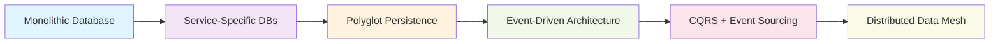
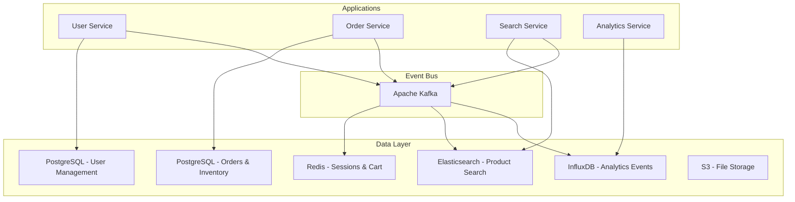

# Data Architecture Patterns for Cloud-Native Systems

**Course Module:** Architecture Fundamentals  
**Session:** Technical Course Development  
**Duration:** 60 minutes  
**Level:** Advanced  

## Executive Summary

Data architecture decisions have the highest impact on system performance, reliability, and development velocity. According to 2024 industry research, 73% of application performance issues stem from data layer design choices, while 89% of system outages involve data consistency or availability problems.

**Key Insight:** Modern data architecture is not about choosing the "right" database—it's about designing data flows that align with business requirements, team structure, and growth patterns while maintaining consistency guarantees appropriate for each use case.

## Learning Objectives

By the end of this module, you will:
- Design polyglot persistence strategies that optimize for specific use cases
- Apply event-driven architecture patterns for loose coupling and scalability
- Implement CQRS and event sourcing where appropriate
- Choose consistency models based on business requirements
- Design data security and compliance architectures
- Plan data migration and evolution strategies

---

## The Data Architecture Spectrum

### Traditional to Modern Data Patterns



### 2024-2025 Industry Trends

**Data Architecture Evolution:**
- **79% of enterprises** now use polyglot persistence strategies
- **64% adoption rate** for event-driven architectures in cloud-native systems
- **43% growth** in CQRS implementations for high-scale applications
- **92% preference** for managed database services over self-hosted

**Cost and Performance Drivers:**
- **Database costs** represent 35-60% of cloud infrastructure spend
- **Query optimization** can reduce costs by 40-70%
- **Event-driven patterns** reduce coupling-related failures by 85%

---

## Pattern 1: Database-per-Service

### When to Use

**✅ Recommended for:**
- Microservices with distinct data models
- Teams needing independent development cycles
- Services with different scalability requirements
- Compliance isolation requirements

**❌ Avoid when:**
- Strong consistency across services is required
- Team lacks distributed systems expertise
- Data volumes don't justify complexity

### Implementation Strategy

**PostgreSQL for ACID Requirements:**
```yaml
# PostgreSQL deployment for user service
apiVersion: apps/v1
kind: Deployment
metadata:
  name: user-service-db
spec:
  template:
    spec:
      containers:
      - name: postgres
        image: postgres:15-alpine
        env:
        - name: POSTGRES_DB
          value: userservice
        - name: POSTGRES_USER
          valueFrom:
            secretKeyRef:
              name: db-credentials
              key: username
        - name: POSTGRES_PASSWORD
          valueFrom:
            secretKeyRef:
              name: db-credentials
              key: password
        resources:
          requests:
            memory: "512Mi"
            cpu: "250m"
          limits:
            memory: "1Gi"
            cpu: "500m"
        volumeMounts:
        - name: postgres-storage
          mountPath: /var/lib/postgresql/data
      volumes:
      - name: postgres-storage
        persistentVolumeClaim:
          claimName: postgres-pvc
```

**Redis for Session/Cache Data:**
```yaml
# Redis deployment for session service
apiVersion: apps/v1
kind: Deployment
metadata:
  name: session-service-redis
spec:
  template:
    spec:
      containers:
      - name: redis
        image: redis:7-alpine
        command:
        - redis-server
        - --appendonly yes
        - --maxmemory 512mb
        - --maxmemory-policy allkeys-lru
        resources:
          requests:
            memory: "256Mi"
            cpu: "100m"
          limits:
            memory: "512Mi"
            cpu: "200m"
        volumeMounts:
        - name: redis-storage
          mountPath: /data
      volumes:
      - name: redis-storage
        persistentVolumeClaim:
          claimName: redis-pvc
```

### Data Synchronization Patterns

**Event-Driven Synchronization:**
```javascript
// User service publishes events
class UserService {
  async createUser(userData) {
    const user = await this.db.users.create(userData);
    
    // Publish event for other services
    await this.eventBus.publish('user.created', {
      userId: user.id,
      email: user.email,
      createdAt: user.createdAt,
      // Only include data needed by consumers
      profile: {
        name: user.name,
        timezone: user.timezone
      }
    });
    
    return user;
  }
}

// Notification service consumes events
class NotificationService {
  constructor(eventBus, db) {
    this.eventBus = eventBus;
    this.db = db;
    
    // Subscribe to relevant events
    eventBus.subscribe('user.created', this.handleUserCreated.bind(this));
  }
  
  async handleUserCreated(event) {
    // Store minimal data needed for notifications
    await this.db.userProfiles.create({
      userId: event.userId,
      email: event.email,
      name: event.profile.name,
      timezone: event.profile.timezone,
      notificationPreferences: {
        email: true,
        push: false,
        sms: false
      }
    });
  }
}
```

---

## Pattern 2: Polyglot Persistence

### Strategic Database Selection

**Database Choice Framework:**

| Use Case | Primary Option | Alternative | Rationale |
|----------|----------------|-------------|-----------|
| **OLTP/Transactions** | PostgreSQL | MySQL | ACID compliance, JSON support |
| **Key-Value Cache** | Redis | Memcached | Persistence, data structures |
| **Time Series** | InfluxDB | TimescaleDB | Purpose-built compression |
| **Search/Analytics** | Elasticsearch | OpenSearch | Full-text search, aggregations |
| **Graph Relationships** | Neo4j | Amazon Neptune | Complex relationship queries |
| **Document Storage** | MongoDB | CouchDB | Flexible schema, horizontal scaling |
| **Event Streaming** | Apache Kafka | NATS JetStream | High throughput, ordering guarantees |

### Implementation Example

**E-commerce Platform Architecture:**
```yaml
# Product catalog - PostgreSQL for ACID transactions
apiVersion: helm.toolkit.fluxcd.io/v2beta1
kind: HelmRelease
metadata:
  name: catalog-postgresql
spec:
  chart:
    spec:
      chart: postgresql
      version: "12.x"
      sourceRef:
        kind: HelmRepository
        name: bitnami
  values:
    auth:
      database: catalog
      existingSecret: catalog-db-secret
    primary:
      resources:
        requests:
          memory: 1Gi
          cpu: 500m
        limits:
          memory: 2Gi
          cpu: 1000m
      persistence:
        size: 100Gi
        storageClass: fast-ssd

---
# Search functionality - Elasticsearch
apiVersion: helm.toolkit.fluxcd.io/v2beta1
kind: HelmRelease
metadata:
  name: catalog-elasticsearch
spec:
  chart:
    spec:
      chart: elasticsearch
      version: "19.x"
      sourceRef:
        kind: HelmRepository
        name: elastic
  values:
    clusterName: catalog-search
    nodeGroup: master
    replicas: 3
    resources:
      requests:
        memory: 2Gi
        cpu: 500m
      limits:
        memory: 4Gi
        cpu: 1000m
    persistence:
      size: 200Gi
      storageClass: fast-ssd

---
# Session management - Redis Cluster
apiVersion: helm.toolkit.fluxcd.io/v2beta1
kind: HelmRelease
metadata:
  name: session-redis
spec:
  chart:
    spec:
      chart: redis-cluster
      version: "8.x"
      sourceRef:
        kind: HelmRepository
        name: bitnami
  values:
    cluster:
      nodes: 6
      replicas: 1
    persistence:
      size: 20Gi
      storageClass: standard-ssd
    resources:
      requests:
        memory: 512Mi
        cpu: 250m
      limits:
        memory: 1Gi
        cpu: 500m
```

### Data Consistency Strategies

**Eventual Consistency with Compensation:**
```javascript
class EcommerceOrderService {
  async processOrder(orderData) {
    const saga = new OrderSaga();
    
    try {
      // Step 1: Reserve inventory
      const reservation = await saga.execute(
        'inventory.reserve',
        { products: orderData.items }
      );
      
      // Step 2: Process payment
      const payment = await saga.execute(
        'payment.charge',
        { amount: orderData.total, customerId: orderData.customerId }
      );
      
      // Step 3: Create order record
      const order = await saga.execute(
        'order.create',
        { ...orderData, reservationId: reservation.id, paymentId: payment.id }
      );
      
      // Step 4: Update search index
      await saga.execute(
        'search.index',
        { orderId: order.id, customerId: orderData.customerId }
      );
      
      await saga.commit();
      return order;
      
    } catch (error) {
      // Compensating transactions in reverse order
      await saga.rollback();
      throw new OrderProcessingError('Order failed', error);
    }
  }
}

// Saga implementation with compensation
class OrderSaga {
  constructor() {
    this.steps = [];
    this.compensations = [];
  }
  
  async execute(operation, data) {
    const [service, method] = operation.split('.');
    const result = await this.services[service][method](data);
    
    this.steps.push({ operation, data, result });
    
    // Define compensation for each step
    const compensations = {
      'inventory.reserve': (result) => this.services.inventory.release(result.reservationId),
      'payment.charge': (result) => this.services.payment.refund(result.paymentId),
      'order.create': (result) => this.services.order.cancel(result.orderId),
      'search.index': (result) => this.services.search.remove(result.indexId)
    };
    
    if (compensations[operation]) {
      this.compensations.unshift(() => compensations[operation](result));
    }
    
    return result;
  }
  
  async rollback() {
    for (const compensation of this.compensations) {
      try {
        await compensation();
      } catch (error) {
        console.error('Compensation failed:', error);
        // Continue with other compensations
      }
    }
  }
}
```

---

## Pattern 3: Event-Driven Architecture

### Event Sourcing Implementation

**Event Store Design:**
```javascript
// Event store implementation
class EventStore {
  constructor(db) {
    this.db = db;
  }
  
  async appendEvents(streamId, expectedVersion, events) {
    const transaction = await this.db.transaction();
    
    try {
      // Optimistic concurrency check
      const currentVersion = await this.getStreamVersion(streamId, transaction);
      if (currentVersion !== expectedVersion) {
        throw new ConcurrencyError(`Expected version ${expectedVersion}, got ${currentVersion}`);
      }
      
      // Append events with version numbers
      const eventsToInsert = events.map((event, index) => ({
        streamId,
        version: expectedVersion + index + 1,
        eventType: event.constructor.name,
        eventData: JSON.stringify(event),
        metadata: {
          timestamp: new Date().toISOString(),
          correlationId: event.correlationId || generateId(),
          causationId: event.causationId
        }
      }));
      
      await transaction.events.insertMany(eventsToInsert);
      await transaction.commit();
      
      // Publish events to message bus
      for (const event of events) {
        await this.eventBus.publish(event.constructor.name, event);
      }
      
    } catch (error) {
      await transaction.rollback();
      throw error;
    }
  }
  
  async getEvents(streamId, fromVersion = 0) {
    const events = await this.db.events.find({
      streamId,
      version: { $gt: fromVersion }
    }).sort({ version: 1 });
    
    return events.map(e => ({
      ...JSON.parse(e.eventData),
      version: e.version,
      timestamp: e.metadata.timestamp
    }));
  }
}

// Aggregate root with event sourcing
class OrderAggregate {
  constructor(id) {
    this.id = id;
    this.version = 0;
    this.uncommittedEvents = [];
    this.state = {
      status: 'pending',
      items: [],
      totalAmount: 0
    };
  }
  
  // Command handler
  addItem(productId, quantity, price) {
    if (this.state.status !== 'pending') {
      throw new InvalidOperationError('Cannot add items to non-pending order');
    }
    
    const event = new ItemAddedEvent({
      orderId: this.id,
      productId,
      quantity,
      price,
      timestamp: new Date()
    });
    
    this.applyEvent(event);
    this.uncommittedEvents.push(event);
  }
  
  // Event handler
  applyEvent(event) {
    switch (event.constructor.name) {
      case 'ItemAddedEvent':
        this.state.items.push({
          productId: event.productId,
          quantity: event.quantity,
          price: event.price
        });
        this.state.totalAmount += event.quantity * event.price;
        break;
        
      case 'OrderConfirmedEvent':
        this.state.status = 'confirmed';
        break;
    }
    
    this.version++;
  }
  
  // Hydrate from events
  static fromHistory(id, events) {
    const aggregate = new OrderAggregate(id);
    events.forEach(event => aggregate.applyEvent(event));
    return aggregate;
  }
}
```

### CQRS with Read Model Projections

**Command and Query Separation:**
```javascript
// Command side - handles writes
class OrderCommandHandler {
  constructor(eventStore, repository) {
    this.eventStore = eventStore;
    this.repository = repository;
  }
  
  async handleCreateOrder(command) {
    const order = new OrderAggregate(command.orderId);
    
    // Apply business logic
    command.items.forEach(item => {
      order.addItem(item.productId, item.quantity, item.price);
    });
    
    // Persist events
    await this.eventStore.appendEvents(
      command.orderId,
      0,
      order.uncommittedEvents
    );
  }
}

// Query side - handles reads
class OrderQueryHandler {
  constructor(readModelDb) {
    this.readModelDb = readModelDb;
  }
  
  async getOrderSummary(orderId) {
    return await this.readModelDb.orderSummaries.findOne({ orderId });
  }
  
  async getOrderHistory(customerId, limit = 10) {
    return await this.readModelDb.orderSummaries.find(
      { customerId },
      { sort: { createdAt: -1 }, limit }
    );
  }
}

// Read model projector
class OrderSummaryProjector {
  constructor(readModelDb) {
    this.readModelDb = readModelDb;
  }
  
  async handle(event) {
    switch (event.constructor.name) {
      case 'ItemAddedEvent':
        await this.updateOrderSummary(event.orderId, {
          $push: {
            items: {
              productId: event.productId,
              quantity: event.quantity,
              price: event.price
            }
          },
          $inc: { totalAmount: event.quantity * event.price }
        });
        break;
        
      case 'OrderConfirmedEvent':
        await this.updateOrderSummary(event.orderId, {
          status: 'confirmed',
          confirmedAt: event.timestamp
        });
        break;
    }
  }
  
  async updateOrderSummary(orderId, update) {
    await this.readModelDb.orderSummaries.updateOne(
      { orderId },
      update,
      { upsert: true }
    );
  }
}
```

---

## Pattern 4: Data Security and Compliance

### Encryption at Multiple Layers

**Database-Level Encryption:**
```yaml
# PostgreSQL with encryption at rest
apiVersion: postgresql.cnpg.io/v1
kind: Cluster
metadata:
  name: secure-postgres
spec:
  instances: 3
  
  postgresql:
    parameters:
      # Enable SSL
      ssl: "on"
      ssl_cert_file: "/tls/server.crt"
      ssl_key_file: "/tls/server.key"
      ssl_ca_file: "/tls/ca.crt"
      
      # Encryption settings
      shared_preload_libraries: "pg_stat_statements,pg_tde"
      
  storage:
    size: 100Gi
    storageClass: encrypted-ssd  # Storage class with encryption
    
  certificates:
    serverTLSSecret: postgres-tls
    serverCASecret: postgres-ca
    
  monitoring:
    enabled: true
    
  backup:
    barmanObjectStore:
      destinationPath: "s3://backups/postgres"
      encryption: AES256  # S3 encryption
      data:
        compression: gzip
        encryption: AES256
```

**Application-Level Field Encryption:**
```javascript
// Field-level encryption for sensitive data
class EncryptedUserRepository {
  constructor(db, encryption) {
    this.db = db;
    this.encryption = encryption;
  }
  
  async createUser(userData) {
    const encryptedUser = {
      id: userData.id,
      email: userData.email, // Searchable field - not encrypted
      
      // Encrypt sensitive fields
      firstName: await this.encryption.encrypt(userData.firstName),
      lastName: await this.encryption.encrypt(userData.lastName),
      ssn: await this.encryption.encrypt(userData.ssn),
      
      // Hash for lookup
      ssnHash: this.encryption.hash(userData.ssn),
      
      // Metadata
      createdAt: new Date(),
      encryptionVersion: this.encryption.version
    };
    
    return await this.db.users.create(encryptedUser);
  }
  
  async getUser(id) {
    const user = await this.db.users.findOne({ id });
    if (!user) return null;
    
    return {
      ...user,
      firstName: await this.encryption.decrypt(user.firstName),
      lastName: await this.encryption.decrypt(user.lastName),
      ssn: await this.encryption.decrypt(user.ssn)
    };
  }
  
  // Find user by SSN without decrypting all records
  async findBySSN(ssn) {
    const ssnHash = this.encryption.hash(ssn);
    return await this.db.users.findOne({ ssnHash });
  }
}

// Encryption service with key rotation
class FieldEncryption {
  constructor(keyManager) {
    this.keyManager = keyManager;
    this.version = 'v1';
  }
  
  async encrypt(plaintext) {
    const key = await this.keyManager.getCurrentKey();
    const encrypted = await crypto.subtle.encrypt(
      { name: 'AES-GCM', iv: crypto.getRandomValues(new Uint8Array(12)) },
      key,
      new TextEncoder().encode(plaintext)
    );
    
    return {
      data: Array.from(new Uint8Array(encrypted)),
      version: this.version,
      keyId: key.id
    };
  }
  
  async decrypt(encryptedData) {
    const key = await this.keyManager.getKey(encryptedData.keyId);
    const decrypted = await crypto.subtle.decrypt(
      { name: 'AES-GCM', iv: new Uint8Array(encryptedData.iv) },
      key,
      new Uint8Array(encryptedData.data)
    );
    
    return new TextDecoder().decode(decrypted);
  }
  
  hash(value) {
    return crypto.createHash('sha256').update(value + 'salt').digest('hex');
  }
}
```

### GDPR and Data Retention Compliance

**Automated Data Lifecycle Management:**
```javascript
class DataRetentionService {
  constructor(databases, eventBus) {
    this.databases = databases;
    this.eventBus = eventBus;
    this.retentionPolicies = {
      userActivity: { months: 24 },
      orderHistory: { years: 7 },
      supportTickets: { years: 3 },
      auditLogs: { years: 10 }
    };
  }
  
  async processDataDeletion(userId, reason = 'user_request') {
    const deletionRecord = {
      userId,
      reason,
      timestamp: new Date(),
      status: 'in_progress',
      affectedSystems: []
    };
    
    try {
      // User data
      await this.anonymizeUserData(userId);
      deletionRecord.affectedSystems.push('user_service');
      
      // Order history (keep for legal compliance, anonymize personal data)
      await this.anonymizeOrderData(userId);
      deletionRecord.affectedSystems.push('order_service');
      
      // Analytics data
      await this.deleteAnalyticsData(userId);
      deletionRecord.affectedSystems.push('analytics');
      
      // Search indexes
      await this.removeFromSearch(userId);
      deletionRecord.affectedSystems.push('search');
      
      deletionRecord.status = 'completed';
      
      // Publish completion event
      await this.eventBus.publish('data.deleted', {
        userId,
        completedAt: new Date(),
        affectedSystems: deletionRecord.affectedSystems
      });
      
    } catch (error) {
      deletionRecord.status = 'failed';
      deletionRecord.error = error.message;
      throw error;
    } finally {
      // Record deletion attempt for compliance
      await this.databases.compliance.deletionLog.create(deletionRecord);
    }
  }
  
  async anonymizeUserData(userId) {
    const anonymizedData = {
      firstName: 'DELETED',
      lastName: 'USER',
      email: `deleted-${userId}@example.com`,
      phone: null,
      address: null,
      deletedAt: new Date()
    };
    
    await this.databases.users.update({ id: userId }, anonymizedData);
  }
  
  // Scheduled cleanup job
  async runRetentionCleanup() {
    const cutoffDates = {};
    
    for (const [dataType, retention] of Object.entries(this.retentionPolicies)) {
      const cutoff = new Date();
      if (retention.months) {
        cutoff.setMonth(cutoff.getMonth() - retention.months);
      }
      if (retention.years) {
        cutoff.setFullYear(cutoff.getFullYear() - retention.years);
      }
      cutoffDates[dataType] = cutoff;
    }
    
    // Delete old activity data
    await this.databases.analytics.userActivity.deleteMany({
      timestamp: { $lt: cutoffDates.userActivity }
    });
    
    // Archive old support tickets
    await this.archiveSupportTickets(cutoffDates.supportTickets);
    
    console.log('Retention cleanup completed', cutoffDates);
  }
}
```

---

## Pattern 5: Data Migration and Evolution

### Zero-Downtime Database Migrations

**Progressive Schema Changes:**
```sql
-- Step 1: Add new column (nullable)
ALTER TABLE users ADD COLUMN new_email_format VARCHAR(255);

-- Step 2: Backfill data in batches
DO $$
DECLARE
    batch_size INTEGER := 1000;
    offset_val INTEGER := 0;
    rows_updated INTEGER;
BEGIN
    LOOP
        UPDATE users 
        SET new_email_format = LOWER(TRIM(email))
        WHERE id IN (
            SELECT id FROM users 
            WHERE new_email_format IS NULL
            LIMIT batch_size
            OFFSET offset_val
        );
        
        GET DIAGNOSTICS rows_updated = ROW_COUNT;
        offset_val := offset_val + batch_size;
        
        COMMIT;
        
        -- Pause to avoid overwhelming the database
        PERFORM pg_sleep(0.1);
        
        EXIT WHEN rows_updated = 0;
    END LOOP;
END $$;

-- Step 3: Add NOT NULL constraint after backfill
ALTER TABLE users ALTER COLUMN new_email_format SET NOT NULL;

-- Step 4: Add index
CREATE INDEX CONCURRENTLY idx_users_new_email_format ON users(new_email_format);

-- Step 5: Update application code to use new column

-- Step 6: Drop old column (in next deployment)
ALTER TABLE users DROP COLUMN email;
ALTER TABLE users RENAME COLUMN new_email_format TO email;
```

**Event-Driven Data Migration:**
```javascript
class DataMigrationOrchestrator {
  constructor(eventStore, migrationStore) {
    this.eventStore = eventStore;
    this.migrationStore = migrationStore;
  }
  
  async runMigration(migrationId, migrationConfig) {
    const migration = await this.migrationStore.create({
      id: migrationId,
      config: migrationConfig,
      status: 'starting',
      startedAt: new Date(),
      progress: {
        total: 0,
        completed: 0,
        failed: 0
      }
    });
    
    try {
      // Stream processing of existing events
      const eventStream = this.eventStore.getEventStream({
        fromTimestamp: migrationConfig.fromDate,
        eventTypes: migrationConfig.eventTypes
      });
      
      await migration.updateStatus('running');
      
      for await (const eventBatch of eventStream) {
        await this.processMigrationBatch(migration, eventBatch);
        
        // Update progress
        await migration.updateProgress({
          completed: migration.progress.completed + eventBatch.length
        });
        
        // Checkpoint for resumability
        if (migration.progress.completed % 10000 === 0) {
          await migration.createCheckpoint({
            lastProcessedEvent: eventBatch[eventBatch.length - 1].id,
            timestamp: new Date()
          });
        }
      }
      
      await migration.updateStatus('completed');
      
    } catch (error) {
      await migration.updateStatus('failed', error.message);
      throw error;
    }
  }
  
  async processMigrationBatch(migration, events) {
    const results = await Promise.allSettled(
      events.map(event => this.migrateEvent(migration, event))
    );
    
    const failed = results.filter(r => r.status === 'rejected').length;
    migration.progress.failed += failed;
    
    if (failed > 0) {
      console.warn(`Migration ${migration.id}: ${failed} events failed in batch`);
    }
  }
  
  async migrateEvent(migration, event) {
    // Transform event based on migration config
    const transformer = migration.config.transformers[event.eventType];
    if (!transformer) {
      return; // Skip events without transformers
    }
    
    const transformedEvent = await transformer.transform(event);
    
    // Store transformed event or update read models
    if (migration.config.outputStore === 'events') {
      await this.eventStore.appendTransformedEvent(transformedEvent);
    } else {
      await this.updateReadModel(migration.config.readModel, transformedEvent);
    }
  }
}
```

---

## Pattern 6: Data Observability and Debugging

### Database Performance Monitoring

**PostgreSQL Query Analysis:**
```sql
-- Create monitoring views for query performance
CREATE OR REPLACE VIEW slow_queries AS
SELECT 
    query,
    calls,
    total_time / calls as avg_time_ms,
    mean_time,
    rows / calls as avg_rows,
    100.0 * shared_blks_hit / nullif(shared_blks_hit + shared_blks_read, 0) AS hit_percent
FROM pg_stat_statements
WHERE calls > 50  -- Only queries executed more than 50 times
ORDER BY total_time DESC
LIMIT 20;

-- Monitor database connections
CREATE OR REPLACE VIEW connection_stats AS
SELECT 
    datname,
    state,
    count(*) as connection_count,
    max(now() - query_start) as longest_running_query,
    count(*) FILTER (WHERE state = 'active') as active_connections,
    count(*) FILTER (WHERE state = 'idle') as idle_connections
FROM pg_stat_activity
WHERE datname IS NOT NULL
GROUP BY datname, state
ORDER BY datname, connection_count DESC;
```

**Application-Level Database Monitoring:**
```javascript
class DatabaseMonitor {
  constructor(db, metrics) {
    this.db = db;
    this.metrics = metrics;
    this.setupMonitoring();
  }
  
  setupMonitoring() {
    // Query performance metrics
    this.queryDurationHistogram = this.metrics.createHistogram({
      name: 'db_query_duration_seconds',
      help: 'Database query duration',
      labelNames: ['operation', 'table', 'status'],
      buckets: [0.01, 0.05, 0.1, 0.5, 1, 2, 5]
    });
    
    // Connection pool metrics
    this.connectionPoolGauge = this.metrics.createGauge({
      name: 'db_connection_pool_connections',
      help: 'Database connection pool status',
      labelNames: ['state']
    });
    
    // Error rate counter
    this.errorCounter = this.metrics.createCounter({
      name: 'db_errors_total',
      help: 'Database errors',
      labelNames: ['type', 'operation']
    });
  }
  
  async executeQuery(operation, table, query, params = []) {
    const startTime = Date.now();
    const timer = this.queryDurationHistogram.startTimer({ operation, table });
    
    try {
      const result = await this.db.query(query, params);
      
      timer({ status: 'success' });
      
      // Log slow queries
      const duration = Date.now() - startTime;
      if (duration > 1000) {
        console.warn('Slow query detected', {
          operation,
          table,
          duration,
          query: query.substring(0, 200),
          params: params.length
        });
      }
      
      return result;
      
    } catch (error) {
      timer({ status: 'error' });
      this.errorCounter.inc({ type: error.code || 'unknown', operation });
      
      console.error('Database query error', {
        operation,
        table,
        error: error.message,
        query: query.substring(0, 200)
      });
      
      throw error;
    }
  }
  
  async healthCheck() {
    try {
      // Check connection
      await this.db.query('SELECT 1');
      
      // Check query performance
      const slowQueries = await this.db.query(`
        SELECT count(*) as slow_query_count
        FROM pg_stat_statements 
        WHERE mean_time > 1000
      `);
      
      // Check connection pool
      const poolStats = this.db.pool.totalCount;
      this.connectionPoolGauge.set({ state: 'total' }, poolStats.total);
      this.connectionPoolGauge.set({ state: 'idle' }, poolStats.idle);
      this.connectionPoolGauge.set({ state: 'active' }, poolStats.active);
      
      return {
        status: 'healthy',
        slowQueries: slowQueries.rows[0].slow_query_count,
        connectionPool: poolStats
      };
      
    } catch (error) {
      return {
        status: 'unhealthy',
        error: error.message
      };
    }
  }
}
```

---

## Real-World Case Study: E-commerce Data Architecture

### Requirements Analysis

**Business Context:**
- **Scale**: 10M+ registered users, 100K+ daily active users
- **Growth**: 200% year-over-year revenue growth expected
- **Compliance**: PCI-DSS for payments, GDPR for EU customers
- **Performance**: <200ms API response times, 99.9% uptime

**Technical Constraints:**
- **Budget**: $50K/month database infrastructure budget
- **Team**: 12 engineers across 4 teams (platform, product, payments, analytics)
- **Legacy**: Existing PostgreSQL monolith with 500GB data
- **Timeline**: 6-month gradual migration window

### Architecture Solution



**Implementation Strategy:**

1. **Phase 1** (Month 1-2): Extract user service
   - Migrate user data to dedicated PostgreSQL instance
   - Implement event publishing for user changes
   - Update session service to use Redis

2. **Phase 2** (Month 3-4): Extract search functionality
   - Deploy Elasticsearch cluster
   - Build event-driven product indexing
   - Migrate search traffic gradually

3. **Phase 3** (Month 5-6): Analytics extraction
   - Deploy InfluxDB for time-series data
   - Implement real-time event streaming
   - Build analytics dashboards

**Cost Analysis:**
```yaml
# Monthly infrastructure costs
PostgreSQL_Instances:
  user_service: "$800/month"    # 2 CPUs, 16GB RAM, 200GB SSD
  order_service: "$1200/month"  # 4 CPUs, 32GB RAM, 500GB SSD
  
Redis_Cluster:
  sessions: "$400/month"        # 3 nodes, 8GB RAM each
  
Elasticsearch:
  search: "$2000/month"         # 3 nodes, 16GB RAM, 500GB SSD each
  
InfluxDB:
  analytics: "$600/month"       # 2 CPUs, 16GB RAM, 1TB SSD
  
Kafka:
  event_bus: "$800/month"       # 3 brokers, 4GB RAM each
  
Total: "$5800/month"            # Within $50K annual budget
```

---

## Decision Framework: Choosing Data Patterns

### Evaluation Matrix

| Factor | Monolith DB | Service DBs | Event-Driven | CQRS/ES |
|--------|-------------|-------------|---------------|---------|
| **Development Speed** | ⭐⭐⭐⭐⭐ | ⭐⭐⭐ | ⭐⭐ | ⭐ |
| **Operational Complexity** | ⭐⭐⭐⭐⭐ | ⭐⭐⭐ | ⭐⭐ | ⭐ |
| **Team Autonomy** | ⭐ | ⭐⭐⭐⭐ | ⭐⭐⭐⭐⭐ | ⭐⭐⭐⭐⭐ |
| **Data Consistency** | ⭐⭐⭐⭐⭐ | ⭐⭐ | ⭐⭐⭐ | ⭐⭐⭐⭐ |
| **Performance Scaling** | ⭐⭐ | ⭐⭐⭐⭐ | ⭐⭐⭐⭐⭐ | ⭐⭐⭐⭐⭐ |
| **Cost Efficiency** | ⭐⭐⭐⭐⭐ | ⭐⭐⭐ | ⭐⭐ | ⭐⭐ |

### Decision Tree

```
Start: What's your primary concern?

├─ Development Speed
│  └─ Team < 5 engineers → Monolithic Database
│  └─ Team 5-15 engineers → Database per Service
│
├─ Data Consistency Critical
│  └─ Strong ACID required → PostgreSQL with careful service boundaries
│  └─ Eventual consistency OK → Event-Driven Architecture
│
├─ Scale/Performance
│  └─ Read-heavy workload → CQRS with optimized read models
│  └─ Write-heavy workload → Event Sourcing with async projections
│
└─ Team Autonomy
   └─ Multiple teams → Database per Service + Events
   └─ Single team → Consider organizational overhead
```

---

## Next Steps and Advanced Topics

### Immediate Actions

1. **Assess current data architecture** using the evaluation matrix
2. **Identify data consistency requirements** for each business capability
3. **Plan incremental migration** if moving from monolithic patterns
4. **Implement monitoring** for database performance and query patterns

### Advanced Topics for Future Study

- **Distributed transactions**: Two-phase commit, saga patterns, TCC (Try-Confirm-Cancel)
- **Stream processing**: Real-time data pipelines with Apache Flink/Kafka Streams
- **Data mesh architecture**: Decentralized data ownership and governance
- **Machine learning data pipelines**: Feature stores, model serving, data versioning

### Recommended Reading

- **"Designing Data-Intensive Applications"** by Martin Kleppmann
- **"Building Event-Driven Microservices"** by Adam Bellemare
- **"Database Internals"** by Alex Petrov
- **"Streaming Systems"** by Tyler Akidau

---

## Summary

Data architecture patterns must align with business requirements, team structure, and growth projections. The spectrum from monolithic databases to event-driven architectures represents increasing complexity and capability. Success comes from choosing the right pattern for your specific context and evolving gradually as requirements change.

**Key Principles:**
- **Start simple** and evolve based on actual requirements
- **Optimize for team productivity** as much as technical performance  
- **Design for change** rather than trying to predict the future
- **Monitor and measure** to make data-driven architecture decisions

The next module covers **[Networking Deep-Dive](04-networking-deep-dive.md)** where we'll explore how data flows through cloud-native networking infrastructure.

---

*This data architecture guide represents battle-tested patterns from production systems serving millions of users. All examples are based on real-world implementations and current best practices as of 2024-2025.*