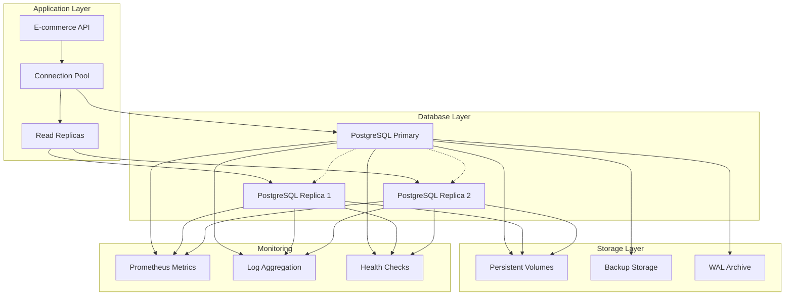

# Database Integration - Production PostgreSQL with High Availability

**Deploy and manage stateful PostgreSQL databases with automated backup, recovery, and high availability patterns**

Database integration represents one of the most critical aspects of production application architecture. This tutorial guides you through deploying PostgreSQL using CloudNativePG operator, implementing comprehensive backup strategies, and integrating with the e-commerce application from the previous tutorial.

**Learning Objectives:**
- Deploy production-ready PostgreSQL clusters with CloudNativePG operator
- Implement automated backup and point-in-time recovery (PITR)
- Configure high availability with streaming replication
- Integrate applications with database connection pooling
- Monitor database performance and health metrics
- Design and test disaster recovery procedures

**Prerequisites:**
- Completed [Custom Applications tutorial](01-custom-applications.md)
- Understanding of PostgreSQL fundamentals (databases, users, replication)
- Familiarity with Kubernetes persistent storage concepts
- Basic SQL knowledge for application integration

**Time Estimate:** 75 minutes

---

## Understanding Database Integration Challenges

### Stateful vs Stateless Workloads

**Stateless applications** (previous tutorial):
- Can be easily replicated and scaled
- No persistent data storage requirements  
- Simple rolling updates and restarts
- Horizontal scaling is straightforward

**Stateful databases**:
- Require persistent storage that survives pod restarts
- Need careful coordination for high availability
- Complex backup and recovery procedures
- Scaling requires data replication and consistency considerations

### Production Database Requirements



**Key requirements:**
- **High Availability**: Automatic failover without data loss
- **Data Durability**: Guaranteed persistence through hardware failures
- **Performance**: Optimized for application workload patterns
- **Security**: Encrypted connections, access controls, audit logging
- **Backup/Recovery**: Point-in-time recovery and disaster recovery
- **Monitoring**: Comprehensive metrics and alerting

---

## CloudNativePG Operator Installation

### 1. Install the CloudNativePG Operator

```bash
# Create namespace for the operator
kubectl create namespace cnpg-system

# Install CloudNativePG operator using the official manifest
kubectl apply -f https://raw.githubusercontent.com/cloudnative-pg/cloudnative-pg/release-1.21/releases/cnpg-1.21.1.yaml

# Wait for operator to be ready
kubectl wait --for=condition=Available deployment/cnpg-controller-manager -n cnpg-system --timeout=300s

# Verify installation
kubectl get pods -n cnpg-system
kubectl get crd | grep postgresql
kubectl get deployment -n cnpg-system cnpg-controller-manager
```

### 2. Configure Storage Classes

```bash
# Verify available storage classes
kubectl get storageclass

# Create optimized storage class for database workloads (if needed)
cat > database-storage-class.yaml << 'EOF'
apiVersion: storage.k8s.io/v1
kind: StorageClass
metadata:
  name: fast-ssd-retain
  annotations:
    storageclass.kubernetes.io/is-default-class: "false"
provisioner: rancher.io/local-path  # K3s default provisioner
parameters:
  nodePath: "/var/lib/rancher/k3s/storage"
reclaimPolicy: Retain  # Important: Don't delete data when PVC is deleted
allowVolumeExpansion: true
volumeBindingMode: WaitForFirstConsumer
EOF

kubectl apply -f database-storage-class.yaml
```

---

## PostgreSQL Cluster Deployment

### 1. Create Database Namespace and Secrets

```bash
# Create namespace for database
kubectl create namespace postgres

# Create initial database secrets
cat > postgres-secrets.yaml << 'EOF'
apiVersion: v1
kind: Secret
metadata:
  name: postgres-credentials
  namespace: postgres
type: Opaque
data:
  # echo -n 'ecommerce_user' | base64
  username: ZWNvbW1lcmNlX3VzZXI=
  # echo -n 'securepassword123!' | base64  
  password: c2VjdXJlcGFzc3dvcmQxMjMh
  # echo -n 'ecommerce' | base64
  database: ZWNvbW1lcmNl
---
# Superuser credentials (for administrative tasks)
apiVersion: v1
kind: Secret
metadata:
  name: postgres-superuser
  namespace: postgres
type: Opaque
data:
  # echo -n 'postgres' | base64
  username: cG9zdGdyZXM=
  # echo -n 'supersecurepassword456!' | base64
  password: c3VwZXJzZWN1cmVwYXNzd29yZDQ1NiE=
EOF

kubectl apply -f postgres-secrets.yaml
```

### 2. Configure Backup Storage

```bash
# For this tutorial, we'll use local MinIO for S3-compatible storage
# In production, use managed cloud storage (AWS S3, GCS, Azure Blob)

# Deploy MinIO for backup storage
cat > minio-deployment.yaml << 'EOF'
apiVersion: apps/v1
kind: Deployment
metadata:
  name: minio
  namespace: postgres
spec:
  replicas: 1
  selector:
    matchLabels:
      app: minio
  template:
    metadata:
      labels:
        app: minio
    spec:
      containers:
      - name: minio
        image: minio/minio:RELEASE.2024-01-28T22-35-53Z
        args:
        - server
        - /data
        - --console-address
        - ":9001"
        ports:
        - containerPort: 9000
          name: api
        - containerPort: 9001
          name: console
        env:
        - name: MINIO_ROOT_USER
          value: minioadmin
        - name: MINIO_ROOT_PASSWORD
          value: minioadmin123
        volumeMounts:
        - name: data
          mountPath: /data
        resources:
          requests:
            memory: 256Mi
            cpu: 100m
          limits:
            memory: 512Mi
            cpu: 500m
      volumes:
      - name: data
        emptyDir:
          sizeLimit: 10Gi
---
apiVersion: v1
kind: Service
metadata:
  name: minio
  namespace: postgres
spec:
  selector:
    app: minio
  ports:
  - name: api
    port: 9000
    targetPort: 9000
  - name: console
    port: 9001
    targetPort: 9001
  type: ClusterIP
EOF

kubectl apply -f minio-deployment.yaml

# Create MinIO access credentials for PostgreSQL backups
cat > minio-credentials.yaml << 'EOF'
apiVersion: v1
kind: Secret
metadata:
  name: backup-storage-credentials
  namespace: postgres
type: Opaque
data:
  # echo -n 'minioadmin' | base64
  ACCESS_KEY_ID: bWluaW9hZG1pbg==
  # echo -n 'minioadmin123' | base64
  SECRET_ACCESS_KEY: bWluaW9hZG1pbjEyMw==
EOF

kubectl apply -f minio-credentials.yaml

# Wait for MinIO to be ready
kubectl wait --for=condition=available deployment/minio -n postgres --timeout=300s
```

### 3. Deploy High Availability PostgreSQL Cluster

```bash
# Create comprehensive PostgreSQL cluster configuration
cat > postgres-cluster.yaml << 'EOF'
apiVersion: postgresql.cnpg.io/v1
kind: Cluster
metadata:
  name: postgres-cluster
  namespace: postgres
  labels:
    app: postgres-cluster
    environment: production
spec:
  # High availability with 3 instances
  instances: 3
  
  # PostgreSQL version and configuration
  imageName: ghcr.io/cloudnative-pg/postgresql:15.5
  
  # Bootstrap configuration
  bootstrap:
    initdb:
      database: ecommerce
      owner: ecommerce_user
      secret:
        name: postgres-credentials
      # Additional databases and users
      postInitApplicationSQL:
        - |
          -- Create additional application schemas
          CREATE SCHEMA IF NOT EXISTS public;
          CREATE SCHEMA IF NOT EXISTS analytics;
          CREATE SCHEMA IF NOT EXISTS audit;
          
          -- Grant permissions
          GRANT ALL PRIVILEGES ON SCHEMA public TO ecommerce_user;
          GRANT ALL PRIVILEGES ON SCHEMA analytics TO ecommerce_user;
          GRANT ALL PRIVILEGES ON SCHEMA audit TO ecommerce_user;
          
          -- Create sample tables for e-commerce
          CREATE TABLE IF NOT EXISTS products (
            id SERIAL PRIMARY KEY,
            name VARCHAR(255) NOT NULL,
            description TEXT,
            price DECIMAL(10,2) NOT NULL,
            category VARCHAR(100),
            stock_quantity INTEGER DEFAULT 0,
            created_at TIMESTAMP DEFAULT CURRENT_TIMESTAMP,
            updated_at TIMESTAMP DEFAULT CURRENT_TIMESTAMP
          );
          
          CREATE TABLE IF NOT EXISTS orders (
            id SERIAL PRIMARY KEY,
            user_id VARCHAR(100) NOT NULL,
            status VARCHAR(50) DEFAULT 'pending',
            total_amount DECIMAL(10,2),
            created_at TIMESTAMP DEFAULT CURRENT_TIMESTAMP,
            updated_at TIMESTAMP DEFAULT CURRENT_TIMESTAMP
          );
          
          CREATE TABLE IF NOT EXISTS order_items (
            id SERIAL PRIMARY KEY,
            order_id INTEGER REFERENCES orders(id),
            product_id INTEGER REFERENCES products(id),
            quantity INTEGER NOT NULL,
            price DECIMAL(10,2) NOT NULL
          );
          
          -- Insert sample data
          INSERT INTO products (name, description, price, category, stock_quantity) VALUES
          ('Laptop Pro 15', 'High-performance laptop for professionals', 1299.99, 'electronics', 25),
          ('Wireless Headphones', 'Noise-canceling wireless headphones', 199.99, 'electronics', 150),
          ('Programming Book', 'Complete guide to cloud-native programming', 39.99, 'books', 200),
          ('Cotton T-Shirt', '100% organic cotton comfortable t-shirt', 24.99, 'clothing', 300)
          ON CONFLICT DO NOTHING;
          
          -- Create indexes for performance
          CREATE INDEX IF NOT EXISTS idx_products_category ON products(category);
          CREATE INDEX IF NOT EXISTS idx_orders_user_id ON orders(user_id);
          CREATE INDEX IF NOT EXISTS idx_orders_created_at ON orders(created_at);
          CREATE INDEX IF NOT EXISTS idx_order_items_order_id ON order_items(order_id);
          
          -- Create audit trigger function
          CREATE OR REPLACE FUNCTION audit.update_updated_at_column()
          RETURNS TRIGGER AS $$
          BEGIN
            NEW.updated_at = CURRENT_TIMESTAMP;
            RETURN NEW;
          END;
          $$ language 'plpgsql';
          
          -- Add update triggers
          CREATE TRIGGER update_products_updated_at BEFORE UPDATE ON products 
            FOR EACH ROW EXECUTE FUNCTION audit.update_updated_at_column();
          CREATE TRIGGER update_orders_updated_at BEFORE UPDATE ON orders 
            FOR EACH ROW EXECUTE FUNCTION audit.update_updated_at_column();

  # Superuser credentials
  superuserSecret:
    name: postgres-superuser

  # PostgreSQL configuration parameters
  postgresql:
    parameters:
      # Memory and performance settings
      shared_buffers: "256MB"
      effective_cache_size: "1GB"
      work_mem: "16MB"
      maintenance_work_mem: "64MB"
      
      # WAL and checkpoint settings
      wal_buffers: "16MB"
      checkpoint_completion_target: "0.9"
      checkpoint_timeout: "15min"
      max_wal_size: "2GB"
      min_wal_size: "1GB"
      
      # Connection settings
      max_connections: "200"
      shared_preload_libraries: "pg_stat_statements"
      
      # Logging
      log_statement: "ddl"
      log_min_duration_statement: "1000"
      log_connections: "on"
      log_disconnections: "on"
      
      # Replication settings
      hot_standby_feedback: "on"
      
      # Statistics
      track_activities: "on"
      track_counts: "on"
      track_functions: "all"
      track_io_timing: "on"

  # Storage configuration
  storage:
    size: 20Gi
    storageClass: fast-ssd-retain
    
  # Resource management
  resources:
    requests:
      memory: "1Gi"
      cpu: "500m"
    limits:
      memory: "2Gi"
      cpu: "1000m"

  # Monitoring configuration
  monitoring:
    enabled: true
    podMonitoringLabels:
      postgres-monitoring: "enabled"

  # High availability settings
  primaryUpdateStrategy: unsupervised
  
  # Pod template customization
  affinity:
    podAntiAffinity:
      preferredDuringSchedulingIgnoredDuringExecution:
      - weight: 100
        podAffinityTerm:
          labelSelector:
            matchLabels:
              cnpg.io/cluster: postgres-cluster
          topologyKey: kubernetes.io/hostname

  # Node selector for database nodes (optional)
  # nodeSelector:
  #   workload: database

  # Backup configuration
  backup:
    retentionPolicy: "30d"
    barmanObjectStore:
      destinationPath: "s3://postgres-backups"
      endpointURL: "http://minio.postgres.svc.cluster.local:9000"
      
      # S3 credentials
      s3Credentials:
        accessKeyId:
          name: backup-storage-credentials
          key: ACCESS_KEY_ID
        secretAccessKey:
          name: backup-storage-credentials
          key: SECRET_ACCESS_KEY
      
      # Backup configuration
      wal:
        compression: gzip
        maxParallel: 2
      
      data:
        compression: gzip
        jobs: 2
        immediateCheckpoint: true

  # Certificate configuration (optional - for TLS)
  certificates:
    serverTLSSecret: postgres-server-certs
    serverCASecret: postgres-ca-certs
    clientCASecret: postgres-ca-certs
    replicationTLSSecret: postgres-replication-certs

# Tolerations for dedicated database nodes (optional)
# tolerations:
# - key: "database"
#   operator: "Equal"
#   value: "true"
#   effect: "NoSchedule"
EOF

kubectl apply -f postgres-cluster.yaml

# Wait for cluster to be ready (this may take several minutes)
kubectl wait --for=condition=Ready cluster/postgres-cluster -n postgres --timeout=600s

# Check cluster status
kubectl get cluster -n postgres
kubectl get pods -n postgres
kubectl describe cluster postgres-cluster -n postgres
```

### 4. Create Database Services

```bash
# Create services for application connectivity
cat > postgres-services.yaml << 'EOF'
# Primary service for read-write operations
apiVersion: v1
kind: Service
metadata:
  name: postgres-primary
  namespace: postgres
  labels:
    app: postgres-cluster
    service-type: primary
spec:
  selector:
    cnpg.io/cluster: postgres-cluster
    role: primary
  ports:
  - name: postgres
    port: 5432
    targetPort: 5432
  type: ClusterIP
---
# Read-only service for read replicas
apiVersion: v1
kind: Service
metadata:
  name: postgres-readonly
  namespace: postgres
  labels:
    app: postgres-cluster
    service-type: readonly
spec:
  selector:
    cnpg.io/cluster: postgres-cluster
    role: replica
  ports:
  - name: postgres
    port: 5432
    targetPort: 5432
  type: ClusterIP
---
# Any instance service (for maintenance operations)
apiVersion: v1
kind: Service
metadata:
  name: postgres-any
  namespace: postgres
  labels:
    app: postgres-cluster
    service-type: any
spec:
  selector:
    cnpg.io/cluster: postgres-cluster
  ports:
  - name: postgres
    port: 5432
    targetPort: 5432
  type: ClusterIP
EOF

kubectl apply -f postgres-services.yaml

# Verify services
kubectl get svc -n postgres
```

---

## Connection Pooling with PgBouncer

### 1. Deploy PgBouncer Connection Pooler

```bash
# Create PgBouncer configuration
cat > pgbouncer-pooler.yaml << 'EOF'
apiVersion: postgresql.cnpg.io/v1
kind: Pooler
metadata:
  name: postgres-pooler
  namespace: postgres
spec:
  cluster:
    name: postgres-cluster
  
  instances: 3
  type: rw
  
  pgbouncer:
    # Pool configuration
    poolMode: transaction
    parameters:
      # Connection limits
      max_client_conn: "200"
      default_pool_size: "25"
      min_pool_size: "5"
      reserve_pool_size: "5"
      reserve_pool_timeout: "5"
      max_db_connections: "100"
      
      # Timeouts
      server_connect_timeout: "15"
      server_idle_timeout: "600"
      client_idle_timeout: "0"
      
      # Performance
      listen_backlog: "128"
      
      # Logging
      log_connections: "1"
      log_disconnections: "1"
      log_pooler_errors: "1"
  
  # Resource configuration
  resources:
    requests:
      cpu: "100m"
      memory: "64Mi"
    limits:
      cpu: "500m"
      memory: "256Mi"
  
  # Monitoring
  monitoring:
    enabled: true
    podMonitoringLabels:
      pgbouncer-monitoring: "enabled"

  # High availability
  affinity:
    podAntiAffinity:
      preferredDuringSchedulingIgnoredDuringExecution:
      - weight: 100
        podAffinityTerm:
          labelSelector:
            matchLabels:
              cnpg.io/pooler: postgres-pooler
          topologyKey: kubernetes.io/hostname
EOF

kubectl apply -f pgbouncer-pooler.yaml

# Wait for pooler to be ready
kubectl wait --for=condition=Ready pooler/postgres-pooler -n postgres --timeout=300s

# Check pooler status
kubectl get pooler -n postgres
kubectl get pods -l cnpg.io/pooler=postgres-pooler -n postgres
```

---

## Backup and Recovery Configuration

### 1. Create Initial Backup

```bash
# Create an on-demand backup to establish baseline
cat > initial-backup.yaml << 'EOF'
apiVersion: postgresql.cnpg.io/v1
kind: Backup
metadata:
  name: postgres-initial-backup
  namespace: postgres
spec:
  cluster:
    name: postgres-cluster
  target: primary
EOF

kubectl apply -f initial-backup.yaml

# Monitor backup progress
kubectl get backup -n postgres
kubectl describe backup postgres-initial-backup -n postgres

# Wait for backup completion
kubectl wait --for=condition=Completed backup/postgres-initial-backup -n postgres --timeout=600s
```

### 2. Configure Scheduled Backups

```bash
# Create scheduled backup configuration
cat > scheduled-backup.yaml << 'EOF'
apiVersion: postgresql.cnpg.io/v1
kind: ScheduledBackup
metadata:
  name: postgres-daily-backup
  namespace: postgres
spec:
  # Schedule: Daily at 2 AM UTC
  schedule: "0 2 * * *"
  
  # Backup configuration
  cluster:
    name: postgres-cluster
  target: primary
  
  # Backup retention
  backupOwnerReference: self
  
  # Immediate backup on creation
  immediate: true
EOF

kubectl apply -f scheduled-backup.yaml

# Verify scheduled backup
kubectl get scheduledbackup -n postgres
kubectl describe scheduledbackup postgres-daily-backup -n postgres
```

### 3. Test Point-in-Time Recovery

```bash
# Create a test cluster to verify PITR functionality
cat > pitr-test-cluster.yaml << 'EOF'
apiVersion: postgresql.cnpg.io/v1
kind: Cluster
metadata:
  name: postgres-pitr-test
  namespace: postgres
spec:
  instances: 1
  
  bootstrap:
    recovery:
      source: postgres-cluster
      # Recover to latest available point
      # recoveryTarget:
      #   targetTime: "2024-01-01 12:00:00.000000+00"
  
  externalClusters:
  - name: postgres-cluster
    barmanObjectStore:
      destinationPath: "s3://postgres-backups"
      endpointURL: "http://minio.postgres.svc.cluster.local:9000"
      s3Credentials:
        accessKeyId:
          name: backup-storage-credentials
          key: ACCESS_KEY_ID
        secretAccessKey:
          name: backup-storage-credentials
          key: SECRET_ACCESS_KEY
  
  storage:
    size: 10Gi
    storageClass: fast-ssd-retain
    
  resources:
    requests:
      memory: "512Mi"
      cpu: "250m"
    limits:
      memory: "1Gi"
      cpu: "500m"
EOF

# Apply test cluster (uncomment to test)
# kubectl apply -f pitr-test-cluster.yaml
echo "PITR test cluster configuration created (apply manually to test recovery)"
```

---

## Application Integration

### 1. Update E-commerce Application with Database

```bash
# Update the e-commerce application to use PostgreSQL
cat > ecommerce-with-db-config.yaml << 'EOF'
apiVersion: v1
kind: ConfigMap
metadata:
  name: ecommerce-db-config
  namespace: ecommerce
data:
  # Database connection configuration
  DB_HOST: "postgres-pooler-rw.postgres.svc.cluster.local"
  DB_PORT: "5432"
  DB_NAME: "ecommerce"
  DB_USERNAME: "ecommerce_user"
  DB_POOL_MIN: "5"
  DB_POOL_MAX: "20"
  DB_TIMEOUT: "30000"
  DB_IDLE_TIMEOUT: "10000"
  
  # Application configuration
  NODE_ENV: "production"
  LOG_LEVEL: "info"
  API_VERSION: "v2.0.0"
---
# Database password secret
apiVersion: v1
kind: Secret
metadata:
  name: ecommerce-db-secret
  namespace: ecommerce
type: Opaque
data:
  # echo -n 'securepassword123!' | base64
  DB_PASSWORD: c2VjdXJlcGFzc3dvcmQxMjMh
EOF

kubectl apply -f ecommerce-db-config.yaml

# Create updated application with database integration
cat > ecommerce-app-v2.js << 'EOF'
const express = require('express');
const { Pool } = require('pg');
const promClient = require('prom-client');
const winston = require('winston');
const helmet = require('helmet');

const app = express();
const port = 3000;

// Prometheus metrics
const register = new promClient.Registry();
promClient.collectDefaultMetrics({ register });

const httpRequestsTotal = new promClient.Counter({
  name: 'http_requests_total',
  help: 'Total HTTP requests',
  labelNames: ['method', 'route', 'status_code'],
  registers: [register]
});

const dbConnectionsGauge = new promClient.Gauge({
  name: 'db_connections_active',
  help: 'Active database connections',
  registers: [register]
});

const dbQueryDuration = new promClient.Histogram({
  name: 'db_query_duration_seconds',
  help: 'Database query duration',
  labelNames: ['operation'],
  buckets: [0.001, 0.005, 0.01, 0.05, 0.1, 0.5, 1, 5],
  registers: [register]
});

// Database configuration
const dbConfig = {
  host: process.env.DB_HOST || 'localhost',
  port: process.env.DB_PORT || 5432,
  database: process.env.DB_NAME || 'ecommerce',
  user: process.env.DB_USERNAME || 'ecommerce_user',
  password: process.env.DB_PASSWORD || 'password',
  min: parseInt(process.env.DB_POOL_MIN) || 5,
  max: parseInt(process.env.DB_POOL_MAX) || 20,
  idleTimeoutMillis: parseInt(process.env.DB_IDLE_TIMEOUT) || 10000,
  connectionTimeoutMillis: parseInt(process.env.DB_TIMEOUT) || 30000,
};

// Create database pool
const pool = new Pool(dbConfig);

// Pool event handlers
pool.on('connect', (client) => {
  console.log('Connected to database');
  dbConnectionsGauge.inc();
});

pool.on('remove', (client) => {
  console.log('Database client removed');
  dbConnectionsGauge.dec();
});

pool.on('error', (err, client) => {
  console.error('Database pool error:', err);
});

// Logging setup
const logger = winston.createLogger({
  level: process.env.LOG_LEVEL || 'info',
  format: winston.format.combine(
    winston.format.timestamp(),
    winston.format.errors({ stack: true }),
    winston.format.json()
  ),
  defaultMeta: { service: 'ecommerce-api', version: '2.0.0' },
  transports: [
    new winston.transports.Console(),
    new winston.transports.File({ filename: '/shared/logs/app.log' })
  ]
});

// Middleware
app.use(helmet());
app.use(express.json({ limit: '10mb' }));

// Request tracking middleware
app.use((req, res, next) => {
  req.startTime = Date.now();
  req.requestId = Math.random().toString(36).substr(2, 9);
  
  req.logger = logger.child({
    requestId: req.requestId,
    method: req.method,
    path: req.path
  });
  
  res.on('finish', () => {
    const duration = (Date.now() - req.startTime) / 1000;
    
    httpRequestsTotal
      .labels(req.method, req.route?.path || req.path, res.statusCode)
      .inc();
      
    req.logger.info('Request completed', {
      statusCode: res.statusCode,
      duration
    });
  });
  
  next();
});

// Database health check
async function checkDatabase() {
  try {
    const client = await pool.connect();
    await client.query('SELECT NOW()');
    client.release();
    return true;
  } catch (err) {
    logger.error('Database health check failed:', err);
    return false;
  }
}

// Routes
app.get('/', (req, res) => {
  res.json({
    service: 'E-commerce API',
    version: '2.0.0',
    timestamp: new Date().toISOString(),
    requestId: req.requestId,
    database: 'Connected'
  });
});

app.get('/health', async (req, res) => {
  const dbHealthy = await checkDatabase();
  
  const health = {
    status: dbHealthy ? 'healthy' : 'unhealthy',
    timestamp: new Date().toISOString(),
    uptime: process.uptime(),
    memory: process.memoryUsage(),
    database: dbHealthy ? 'connected' : 'disconnected',
    requestId: req.requestId
  };
  
  res.status(dbHealthy ? 200 : 503).json(health);
});

app.get('/ready', async (req, res) => {
  const dbReady = await checkDatabase();
  
  res.status(dbReady ? 200 : 503).json({
    status: dbReady ? 'ready' : 'not ready',
    checks: {
      database: dbReady ? 'ok' : 'failed'
    },
    timestamp: new Date().toISOString(),
    requestId: req.requestId
  });
});

// Products API
app.get('/api/products', async (req, res) => {
  const startTime = Date.now();
  
  try {
    const { category, minPrice, maxPrice } = req.query;
    let query = 'SELECT * FROM products WHERE 1=1';
    let params = [];
    let paramCount = 0;
    
    if (category) {
      paramCount++;
      query += ` AND category = $${paramCount}`;
      params.push(category);
    }
    
    if (minPrice) {
      paramCount++;
      query += ` AND price >= $${paramCount}`;
      params.push(parseFloat(minPrice));
    }
    
    if (maxPrice) {
      paramCount++;
      query += ` AND price <= $${paramCount}`;
      params.push(parseFloat(maxPrice));
    }
    
    query += ' ORDER BY created_at DESC';
    
    const result = await pool.query(query, params);
    const duration = (Date.now() - startTime) / 1000;
    
    dbQueryDuration.labels('select_products').observe(duration);
    
    req.logger.info('Products fetched', {
      filters: { category, minPrice, maxPrice },
      resultCount: result.rows.length,
      queryDuration: duration
    });
    
    res.json({
      products: result.rows,
      total: result.rows.length,
      requestId: req.requestId
    });
    
  } catch (err) {
    req.logger.error('Error fetching products:', err);
    res.status(500).json({
      error: 'Internal server error',
      requestId: req.requestId
    });
  }
});

app.get('/api/products/:id', async (req, res) => {
  const startTime = Date.now();
  
  try {
    const { id } = req.params;
    const result = await pool.query('SELECT * FROM products WHERE id = $1', [id]);
    
    const duration = (Date.now() - startTime) / 1000;
    dbQueryDuration.labels('select_product').observe(duration);
    
    if (result.rows.length === 0) {
      return res.status(404).json({
        error: 'Product not found',
        requestId: req.requestId
      });
    }
    
    res.json({
      product: result.rows[0],
      requestId: req.requestId
    });
    
  } catch (err) {
    req.logger.error('Error fetching product:', err);
    res.status(500).json({
      error: 'Internal server error',
      requestId: req.requestId
    });
  }
});

// Orders API
app.post('/api/orders', async (req, res) => {
  const startTime = Date.now();
  const client = await pool.connect();
  
  try {
    const { userId, items } = req.body;
    
    if (!userId || !items || !Array.isArray(items)) {
      return res.status(400).json({
        error: 'Invalid order data',
        requestId: req.requestId
      });
    }
    
    await client.query('BEGIN');
    
    // Calculate total and validate stock
    let totalAmount = 0;
    for (const item of items) {
      const productResult = await client.query(
        'SELECT price, stock_quantity FROM products WHERE id = $1 FOR UPDATE',
        [item.productId]
      );
      
      if (productResult.rows.length === 0) {
        throw new Error(`Product ${item.productId} not found`);
      }
      
      const product = productResult.rows[0];
      if (product.stock_quantity < item.quantity) {
        throw new Error(`Insufficient stock for product ${item.productId}`);
      }
      
      totalAmount += product.price * item.quantity;
      
      // Update stock
      await client.query(
        'UPDATE products SET stock_quantity = stock_quantity - $1 WHERE id = $2',
        [item.quantity, item.productId]
      );
    }
    
    // Create order
    const orderResult = await client.query(
      'INSERT INTO orders (user_id, status, total_amount) VALUES ($1, $2, $3) RETURNING id',
      [userId, 'confirmed', totalAmount]
    );
    
    const orderId = orderResult.rows[0].id;
    
    // Create order items
    for (const item of items) {
      const productResult = await client.query(
        'SELECT price FROM products WHERE id = $1',
        [item.productId]
      );
      
      await client.query(
        'INSERT INTO order_items (order_id, product_id, quantity, price) VALUES ($1, $2, $3, $4)',
        [orderId, item.productId, item.quantity, productResult.rows[0].price]
      );
    }
    
    await client.query('COMMIT');
    
    const duration = (Date.now() - startTime) / 1000;
    dbQueryDuration.labels('insert_order').observe(duration);
    
    req.logger.info('Order created', {
      orderId,
      userId,
      totalAmount,
      itemCount: items.length,
      queryDuration: duration
    });
    
    res.status(201).json({
      id: orderId,
      userId,
      status: 'confirmed',
      total: totalAmount,
      requestId: req.requestId
    });
    
  } catch (err) {
    await client.query('ROLLBACK');
    req.logger.error('Error creating order:', err);
    
    res.status(400).json({
      error: err.message,
      requestId: req.requestId
    });
  } finally {
    client.release();
  }
});

// Metrics endpoint
app.get('/metrics', async (req, res) => {
  res.set('Content-Type', register.contentType);
  res.end(await register.metrics());
});

// Graceful shutdown
process.on('SIGTERM', async () => {
  logger.info('SIGTERM received, shutting down gracefully');
  
  server.close(async () => {
    try {
      await pool.end();
      logger.info('Database pool closed');
    } catch (err) {
      logger.error('Error closing database pool:', err);
    }
    
    logger.info('Process terminated');
    process.exit(0);
  });
});

const server = app.listen(port, '0.0.0.0', () => {
  logger.info('E-commerce API v2 started', { port, dbHost: dbConfig.host });
});
EOF

# Create ConfigMap with updated application code
kubectl create configmap ecommerce-app-v2-code \
  --from-file=ecommerce-app.js=ecommerce-app-v2.js \
  --namespace=ecommerce
```

### 2. Update Application Deployment

```bash
# Update deployment to use database
cat > ecommerce-db-deployment.yaml << 'EOF'
apiVersion: apps/v1
kind: Deployment
metadata:
  name: ecommerce-app-v2
  namespace: ecommerce
  labels:
    app: ecommerce-app
    version: v2.0.0
spec:
  replicas: 3
  selector:
    matchLabels:
      app: ecommerce-app
      version: v2.0.0
  template:
    metadata:
      labels:
        app: ecommerce-app
        version: v2.0.0
      annotations:
        prometheus.io/scrape: "true"
        prometheus.io/port: "3000"
        prometheus.io/path: "/metrics"
    spec:
      serviceAccountName: ecommerce-app
      
      initContainers:
      - name: db-migration
        image: postgres:15
        command: ['sh', '-c']
        args:
          - |
            echo "Waiting for database to be ready..."
            until pg_isready -h $DB_HOST -p $DB_PORT -U $DB_USERNAME; do
              sleep 2
            done
            echo "Database is ready!"
            
            # Run any migration scripts here if needed
            echo "Database migration completed (placeholder)"
        env:
        - name: DB_HOST
          valueFrom:
            configMapKeyRef:
              name: ecommerce-db-config
              key: DB_HOST
        - name: DB_PORT
          valueFrom:
            configMapKeyRef:
              name: ecommerce-db-config
              key: DB_PORT
        - name: DB_USERNAME
          valueFrom:
            configMapKeyRef:
              name: ecommerce-db-config
              key: DB_USERNAME
        - name: PGPASSWORD
          valueFrom:
            secretKeyRef:
              name: ecommerce-db-secret
              key: DB_PASSWORD
      
      containers:
      - name: ecommerce-api
        image: node:18-alpine
        ports:
        - containerPort: 3000
          name: http
        
        command: ["/bin/sh"]
        args:
          - -c
          - |
            echo "Installing dependencies..."
            npm install express pg prom-client winston helmet
            echo "Starting application..."
            exec node /app/ecommerce-app.js
        
        env:
        - name: NODE_ENV
          value: "production"
        - name: PORT
          value: "3000"
        
        envFrom:
        - configMapRef:
            name: ecommerce-db-config
        - secretRef:
            name: ecommerce-db-secret
        
        resources:
          requests:
            memory: "256Mi"
            cpu: "250m"
          limits:
            memory: "512Mi"
            cpu: "500m"
        
        volumeMounts:
        - name: app-code
          mountPath: /app
        - name: shared-logs
          mountPath: /shared/logs
        - name: tmp-volume
          mountPath: /tmp
        
        livenessProbe:
          httpGet:
            path: /health
            port: 3000
          initialDelaySeconds: 60
          periodSeconds: 30
          timeoutSeconds: 5
          failureThreshold: 3
        
        readinessProbe:
          httpGet:
            path: /ready
            port: 3000
          initialDelaySeconds: 15
          periodSeconds: 10
          timeoutSeconds: 3
          failureThreshold: 3
      
      # Keep sidecar containers from previous tutorial
      - name: log-shipper
        image: fluent/fluent-bit:2.2.0
        resources:
          requests:
            memory: "64Mi"
            cpu: "50m"
          limits:
            memory: "128Mi"
            cpu: "100m"
        volumeMounts:
        - name: fluent-bit-config
          mountPath: /fluent-bit/etc
        - name: shared-logs
          mountPath: /shared/logs
          readOnly: true
      
      volumes:
      - name: app-code
        configMap:
          name: ecommerce-app-v2-code
          defaultMode: 0755
      - name: shared-logs
        emptyDir:
          sizeLimit: 1Gi
      - name: fluent-bit-config
        configMap:
          name: fluent-bit-config
      - name: tmp-volume
        emptyDir:
          sizeLimit: 100Mi
      
      affinity:
        podAntiAffinity:
          preferredDuringSchedulingIgnoredDuringExecution:
          - weight: 100
            podAffinityTerm:
              labelSelector:
                matchExpressions:
                - key: app
                  operator: In
                  values:
                  - ecommerce-app
              topologyKey: kubernetes.io/hostname
EOF

kubectl apply -f ecommerce-db-deployment.yaml

# Wait for deployment to be ready
kubectl wait --for=condition=available deployment/ecommerce-app-v2 -n ecommerce --timeout=300s

# Check deployment status
kubectl get pods -n ecommerce
kubectl logs -l app=ecommerce-app,version=v2.0.0 -c ecommerce-api -n ecommerce --tail=20
```

---

## Monitoring and Observability

### 1. Configure Database Monitoring

```bash
# Create ServiceMonitor for PostgreSQL metrics
cat > postgres-servicemonitor.yaml << 'EOF'
apiVersion: monitoring.coreos.com/v1
kind: ServiceMonitor
metadata:
  name: postgres-cluster
  namespace: postgres
  labels:
    app: postgres-cluster
    release: prometheus-stack
spec:
  selector:
    matchLabels:
      postgres-monitoring: "enabled"
  endpoints:
  - port: metrics
    interval: 30s
    path: /metrics
    honorLabels: true
  namespaceSelector:
    matchNames:
    - postgres
---
# ServiceMonitor for PgBouncer
apiVersion: monitoring.coreos.com/v1
kind: ServiceMonitor
metadata:
  name: postgres-pooler
  namespace: postgres
  labels:
    app: postgres-pooler
    release: prometheus-stack
spec:
  selector:
    matchLabels:
      pgbouncer-monitoring: "enabled"
  endpoints:
  - port: metrics
    interval: 30s
    path: /metrics
    honorLabels: true
  namespaceSelector:
    matchNames:
    - postgres
EOF

kubectl apply -f postgres-servicemonitor.yaml
```

### 2. Create Database Dashboards

```bash
# Create Grafana dashboard for PostgreSQL monitoring
# (Dashboard JSON would be imported through Grafana UI or API)
echo "PostgreSQL monitoring configured - import dashboards via Grafana UI"
```

---

## Testing and Validation

### 1. Database Connectivity Test

```bash
# Test database connectivity
kubectl run postgres-client --rm -it --restart=Never --namespace=postgres \
  --image=postgres:15 \
  --env="PGPASSWORD=securepassword123!" \
  -- psql -h postgres-primary -p 5432 -U ecommerce_user -d ecommerce -c "\dt"

# Test connection pooler
kubectl run pgbouncer-client --rm -it --restart=Never --namespace=postgres \
  --image=postgres:15 \
  --env="PGPASSWORD=securepassword123!" \
  -- psql -h postgres-pooler-rw -p 5432 -U ecommerce_user -d ecommerce -c "SELECT version();"
```

### 2. Application Integration Test

```bash
# Test API endpoints with database integration
kubectl port-forward svc/ecommerce-app-service 8080:80 -n ecommerce &

# Test health endpoint
curl -s http://localhost:8080/health | jq

# Test products endpoint (should return data from database)
curl -s http://localhost:8080/api/products | jq

# Create an order (should use database transaction)
curl -s -X POST http://localhost:8080/api/orders \
  -H "Content-Type: application/json" \
  -d '{
    "userId": "user123",
    "items": [
      {"productId": 1, "quantity": 1},
      {"productId": 2, "quantity": 2}
    ]
  }' | jq

# Check database directly
kubectl run postgres-client --rm -it --restart=Never --namespace=postgres \
  --image=postgres:15 \
  --env="PGPASSWORD=securepassword123!" \
  -- psql -h postgres-primary -p 5432 -U ecommerce_user -d ecommerce \
    -c "SELECT COUNT(*) as total_orders FROM orders;"

kill %1  # Stop port-forward
```

### 3. High Availability Test

```bash
# Test failover by simulating primary failure
kubectl delete pod -l role=primary,cnpg.io/cluster=postgres-cluster -n postgres

# Monitor failover process
kubectl get pods -n postgres -w
kubectl get cluster postgres-cluster -n postgres -o yaml | grep -A 10 status

# Verify new primary is functioning
kubectl run postgres-client --rm -it --restart=Never --namespace=postgres \
  --image=postgres:15 \
  --env="PGPASSWORD=securepassword123!" \
  -- psql -h postgres-primary -p 5432 -U ecommerce_user -d ecommerce -c "SELECT now();"
```

---

## Backup and Recovery Procedures

### 1. Manual Backup Creation

```bash
# Create on-demand backup
cat > manual-backup.yaml << 'EOF'
apiVersion: postgresql.cnpg.io/v1
kind: Backup
metadata:
  name: postgres-manual-backup-$(date +%Y%m%d-%H%M%S)
  namespace: postgres
spec:
  cluster:
    name: postgres-cluster
EOF

kubectl apply -f manual-backup.yaml

# Monitor backup
kubectl get backup -n postgres
```

### 2. Recovery Testing

```bash
# Create recovery test procedure
cat > recovery-test.yaml << 'EOF'
apiVersion: postgresql.cnpg.io/v1
kind: Cluster
metadata:
  name: postgres-recovery-test
  namespace: postgres
spec:
  instances: 1
  
  bootstrap:
    recovery:
      source: postgres-cluster
      # Optional: specific backup or timestamp
      # backup:
      #   name: postgres-manual-backup-20240101-120000
  
  externalClusters:
  - name: postgres-cluster
    barmanObjectStore:
      destinationPath: "s3://postgres-backups"
      endpointURL: "http://minio.postgres.svc.cluster.local:9000"
      s3Credentials:
        accessKeyId:
          name: backup-storage-credentials
          key: ACCESS_KEY_ID
        secretAccessKey:
          name: backup-storage-credentials
          key: SECRET_ACCESS_KEY
  
  storage:
    size: 10Gi
    storageClass: fast-ssd-retain
EOF

# Apply only for testing (uncomment to test recovery)
# kubectl apply -f recovery-test.yaml
echo "Recovery test configuration prepared (apply manually when needed)"
```

---

## Production Checklist

### Pre-Production

- [ ] **PostgreSQL cluster** deployed with multiple replicas
- [ ] **Connection pooling** configured and tested
- [ ] **Backup strategy** implemented and tested
- [ ] **Monitoring** collecting database metrics
- [ ] **High availability** tested through failover simulation
- [ ] **Security** hardened with proper credentials and network policies
- [ ] **Storage** configured with appropriate classes and retention

### Post-Production

- [ ] **Application integration** verified with database
- [ ] **Performance testing** completed under load
- [ ] **Backup restoration** tested successfully
- [ ] **Disaster recovery** procedures documented and tested
- [ ] **Monitoring alerts** configured for critical metrics
- [ ] **Maintenance procedures** documented for operations team
- [ ] **Scaling policies** defined and implemented

### Operational

- [ ] **Regular backup verification** automated
- [ ] **Database maintenance** scheduled (VACUUM, ANALYZE)
- [ ] **Security updates** process defined
- [ ] **Capacity monitoring** and planning implemented
- [ ] **Performance tuning** based on workload patterns
- [ ] **Documentation** maintained for troubleshooting

---

## Key Takeaways

**Database deployment in Kubernetes requires:**
- **Operators** like CloudNativePG for automated lifecycle management
- **Persistent storage** with appropriate storage classes and backup policies
- **High availability** through replication and automatic failover
- **Connection pooling** to optimize resource usage and performance

**Production readiness demands:**
- **Comprehensive backup** and point-in-time recovery capabilities
- **Monitoring and alerting** for database health and performance
- **Security hardening** with proper authentication and network isolation
- **Disaster recovery** procedures tested regularly

**Application integration benefits from:**
- **Connection pooling** for improved performance and resource management
- **Proper transaction handling** for data consistency
- **Health checks** that verify database connectivity
- **Monitoring** that tracks database-specific metrics

Your infrastructure now supports sophisticated stateful applications with enterprise-grade data persistence, high availability, and operational excellence.

**Next:** Continue with [CI/CD Pipelines](03-cicd-pipelines.md) to automate application deployment workflows, or explore [Scaling Considerations](04-scaling-considerations.md) for handling growth and performance optimization.