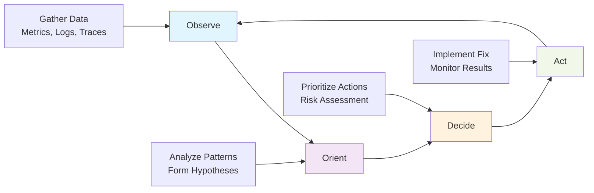

# Production Troubleshooting Guide - Systematic Problem Resolution

**Master production troubleshooting techniques and operational procedures for complex cloud-native applications**

This comprehensive guide teaches you systematic approaches to diagnosing and resolving production issues in Kubernetes environments. You'll learn battle-tested debugging techniques, implement proactive monitoring, and build operational runbooks that minimize downtime and accelerate issue resolution.

## What You'll Master

- **Systematic debugging methodologies** for complex distributed systems
- **Advanced diagnostic tools** and techniques for Kubernetes troubleshooting
- **Performance profiling** and bottleneck identification
- **Network troubleshooting** in cloud-native environments
- **Log aggregation and analysis** for rapid issue identification
- **Incident response procedures** and post-mortem processes
- **Proactive monitoring** strategies that prevent issues before they impact users

**Time investment**: 45 minutes | **Result**: Expert-level operational troubleshooting skills

---

## Prerequisites Validation

Ensure you have operational applications and monitoring infrastructure:

```bash
# Verify cluster health
kubectl cluster-info
kubectl get nodes -o wide

# Check system pods
kubectl get pods -n kube-system

# Verify monitoring stack
kubectl get pods -n monitoring
kubectl get svc -n monitoring

# Check application deployments
kubectl get deployments,pods,services -A

# Verify log collection
kubectl logs -n kube-system -l k8s-app=fluentd --tail=5

# Expected: All core systems operational with logs flowing
```

**Required infrastructure:**
- Healthy Kubernetes cluster with monitoring
- Log aggregation system (EFK/Loki)
- Metrics collection (Prometheus/Grafana)
- Distributed tracing (optional but recommended)
- Applications with proper instrumentation

---

## Troubleshooting Methodology Framework

### The OODA Loop for Incident Response



### Systematic Problem-Solving Process

**1. Immediate Response (0-5 minutes)**
- Assess impact and urgency
- Implement immediate mitigation if available
- Gather initial evidence
- Notify stakeholders

**2. Investigation Phase (5-30 minutes)**
- Apply systematic debugging methodology
- Collect comprehensive diagnostic data
- Form and test hypotheses
- Identify root cause

**3. Resolution Phase (30+ minutes)**
- Implement permanent fix
- Validate solution effectiveness
- Document findings and process
- Conduct post-incident review

---

## Pattern 1: Application-Level Troubleshooting

### Pod and Container Issues

**Comprehensive Pod Diagnostic Script:**
```bash
#!/bin/bash
# pod-diagnostic.sh - Comprehensive pod troubleshooting

set -e

POD_NAME=${1}
NAMESPACE=${2:-default}

if [[ -z "$POD_NAME" ]]; then
    echo "Usage: $0 <pod-name> [namespace]"
    exit 1
fi

echo "=== Pod Diagnostic Report for $POD_NAME in $NAMESPACE ==="
echo "Generated: $(date)"
echo ""

# Basic pod information
echo "=== Pod Overview ==="
kubectl get pod $POD_NAME -n $NAMESPACE -o wide
echo ""

# Pod details
echo "=== Pod Details ==="
kubectl describe pod $POD_NAME -n $NAMESPACE
echo ""

# Resource usage
echo "=== Resource Usage ==="
kubectl top pod $POD_NAME -n $NAMESPACE --containers 2>/dev/null || echo "Metrics not available"
echo ""

# Node information
NODE=$(kubectl get pod $POD_NAME -n $NAMESPACE -o jsonpath='{.spec.nodeName}')
if [[ -n "$NODE" ]]; then
    echo "=== Node Information: $NODE ==="
    kubectl describe node $NODE | grep -A 10 -B 5 -E "(Allocated resources|System Info|Conditions)"
    echo ""
fi

# Recent events
echo "=== Recent Events ==="
kubectl get events -n $NAMESPACE --field-selector involvedObject.name=$POD_NAME \
    --sort-by='.lastTimestamp' --no-headers | tail -10
echo ""

# Container logs
echo "=== Container Logs (last 50 lines) ==="
CONTAINERS=$(kubectl get pod $POD_NAME -n $NAMESPACE -o jsonpath='{.spec.containers[*].name}')
for container in $CONTAINERS; do
    echo "--- Container: $container ---"
    kubectl logs $POD_NAME -n $NAMESPACE -c $container --tail=50
    echo ""
done

# Previous container logs if pod restarted
echo "=== Previous Container Logs (if available) ==="
for container in $CONTAINERS; do
    echo "--- Previous Container: $container ---"
    kubectl logs $POD_NAME -n $NAMESPACE -c $container --previous --tail=20 2>/dev/null || echo "No previous logs"
    echo ""
done

# Network connectivity test
echo "=== Network Connectivity Test ==="
kubectl exec $POD_NAME -n $NAMESPACE -c ${CONTAINERS%% *} -- \
    sh -c "ping -c 3 8.8.8.8 2>/dev/null || echo 'Network connectivity test failed'"
echo ""

# DNS resolution test
echo "=== DNS Resolution Test ==="
kubectl exec $POD_NAME -n $NAMESPACE -c ${CONTAINERS%% *} -- \
    sh -c "nslookup kubernetes.default.svc.cluster.local 2>/dev/null || echo 'DNS resolution test failed'"
echo ""

# Storage information
echo "=== Storage Information ==="
kubectl get pod $POD_NAME -n $NAMESPACE -o jsonpath='
Pod Volumes:
{range .spec.volumes[*]}
- {.name}: {.persistentVolumeClaim.claimName}{.configMap.name}{.secret.secretName}{.emptyDir}
{end}

Volume Mounts:
{range .spec.containers[*]}
Container {.name}:
{range .volumeMounts[*]}
  - {.name} -> {.mountPath}
{end}
{end}'
echo -e "\n"

# Security context
echo "=== Security Context ==="
kubectl get pod $POD_NAME -n $NAMESPACE -o jsonpath='
Pod Security Context:
  runAsUser: {.spec.securityContext.runAsUser}
  runAsGroup: {.spec.securityContext.runAsGroup}
  fsGroup: {.spec.securityContext.fsGroup}

Container Security Contexts:
{range .spec.containers[*]}
Container {.name}:
  runAsUser: {.securityContext.runAsUser}
  allowPrivilegeEscalation: {.securityContext.allowPrivilegeEscalation}
  readOnlyRootFilesystem: {.securityContext.readOnlyRootFilesystem}
{end}'
echo -e "\n"

echo "=== Diagnostic Complete ==="
```

### Application Performance Analysis

**Performance Profiling Script:**
```python
#!/usr/bin/env python3
"""
Kubernetes Application Performance Analyzer
Analyzes resource usage patterns and identifies performance bottlenecks
"""

import json
import subprocess
import time
import statistics
from datetime import datetime, timedelta
from typing import Dict, List, Tuple

class K8sPerformanceAnalyzer:
    def __init__(self, namespace: str = "default"):
        self.namespace = namespace
        self.metrics_history = []
    
    def collect_metrics_sample(self, duration_minutes: int = 5) -> List[Dict]:
        """Collect performance metrics over specified duration"""
        samples = []
        end_time = datetime.now() + timedelta(minutes=duration_minutes)
        
        print(f"Collecting performance data for {duration_minutes} minutes...")
        
        while datetime.now() < end_time:
            try:
                # Get pod metrics
                result = subprocess.run([
                    "kubectl", "top", "pods", "-n", self.namespace, 
                    "--no-headers", "--sort-by=cpu"
                ], capture_output=True, text=True, check=True)
                
                sample = {
                    'timestamp': datetime.now().isoformat(),
                    'pods': []
                }
                
                for line in result.stdout.strip().split('\n'):
                    if line:
                        parts = line.split()
                        if len(parts) >= 3:
                            sample['pods'].append({
                                'name': parts[0],
                                'cpu_millicores': int(parts[1].replace('m', '')),
                                'memory_mb': self._parse_memory(parts[2])
                            })
                
                samples.append(sample)
                
                # Sleep for 30 seconds between samples
                time.sleep(30)
                
            except subprocess.CalledProcessError as e:
                print(f"Error collecting metrics: {e}")
                continue
        
        return samples
    
    def _parse_memory(self, memory_str: str) -> int:
        """Parse memory string to MB"""
        if memory_str.endswith('Mi'):
            return int(memory_str[:-2])
        elif memory_str.endswith('Gi'):
            return int(float(memory_str[:-2]) * 1024)
        elif memory_str.endswith('Ki'):
            return int(memory_str[:-2]) // 1024
        else:
            return int(memory_str)
    
    def analyze_performance_patterns(self, samples: List[Dict]) -> Dict:
        """Analyze performance patterns from collected samples"""
        analysis = {
            'pod_analysis': {},
            'cluster_summary': {
                'total_samples': len(samples),
                'duration_minutes': len(samples) * 0.5,  # 30-second intervals
                'high_cpu_events': 0,
                'high_memory_events': 0
            }
        }
        
        # Aggregate metrics by pod
        for sample in samples:
            for pod in sample['pods']:
                pod_name = pod['name']
                
                if pod_name not in analysis['pod_analysis']:
                    analysis['pod_analysis'][pod_name] = {
                        'cpu_samples': [],
                        'memory_samples': [],
                        'stability_score': 0,
                        'resource_efficiency': 0
                    }
                
                pod_data = analysis['pod_analysis'][pod_name]
                pod_data['cpu_samples'].append(pod['cpu_millicores'])
                pod_data['memory_samples'].append(pod['memory_mb'])
                
                # Count high resource usage events
                if pod['cpu_millicores'] > 800:  # 80% of 1 CPU
                    analysis['cluster_summary']['high_cpu_events'] += 1
                if pod['memory_mb'] > 800:  # High memory usage
                    analysis['cluster_summary']['high_memory_events'] += 1
        
        # Calculate statistics for each pod
        for pod_name, pod_data in analysis['pod_analysis'].items():
            cpu_samples = pod_data['cpu_samples']
            memory_samples = pod_data['memory_samples']
            
            if cpu_samples and memory_samples:
                # Basic statistics
                pod_data['cpu_stats'] = {
                    'mean': statistics.mean(cpu_samples),
                    'median': statistics.median(cpu_samples),
                    'stdev': statistics.stdev(cpu_samples) if len(cpu_samples) > 1 else 0,
                    'min': min(cpu_samples),
                    'max': max(cpu_samples),
                    'p95': self._percentile(cpu_samples, 95)
                }
                
                pod_data['memory_stats'] = {
                    'mean': statistics.mean(memory_samples),
                    'median': statistics.median(memory_samples),
                    'stdev': statistics.stdev(memory_samples) if len(memory_samples) > 1 else 0,
                    'min': min(memory_samples),
                    'max': max(memory_samples),
                    'p95': self._percentile(memory_samples, 95)
                }
                
                # Stability score (lower standard deviation = more stable)
                cpu_cv = pod_data['cpu_stats']['stdev'] / max(pod_data['cpu_stats']['mean'], 1)
                memory_cv = pod_data['memory_stats']['stdev'] / max(pod_data['memory_stats']['mean'], 1)
                pod_data['stability_score'] = max(0, 100 - (cpu_cv + memory_cv) * 50)
                
                # Resource efficiency (how well resources are utilized)
                pod_data['resource_efficiency'] = min(100, 
                    (pod_data['cpu_stats']['mean'] + pod_data['memory_stats']['mean'] / 10))
        
        return analysis
    
    def _percentile(self, data: List[float], percentile: int) -> float:
        """Calculate percentile of data"""
        if not data:
            return 0
        sorted_data = sorted(data)
        index = (percentile / 100) * (len(sorted_data) - 1)
        if index.is_integer():
            return sorted_data[int(index)]
        else:
            lower = sorted_data[int(index)]
            upper = sorted_data[int(index) + 1]
            return lower + (upper - lower) * (index - int(index))
    
    def identify_performance_issues(self, analysis: Dict) -> List[Dict]:
        """Identify potential performance issues"""
        issues = []
        
        for pod_name, pod_data in analysis['pod_analysis'].items():
            if 'cpu_stats' not in pod_data or 'memory_stats' not in pod_data:
                continue
            
            cpu_stats = pod_data['cpu_stats']
            memory_stats = pod_data['memory_stats']
            
            # High CPU usage
            if cpu_stats['p95'] > 800:  # 95th percentile > 800m
                issues.append({
                    'pod': pod_name,
                    'type': 'high_cpu_usage',
                    'severity': 'high' if cpu_stats['p95'] > 900 else 'medium',
                    'description': f"95th percentile CPU usage: {cpu_stats['p95']:.0f}m",
                    'recommendation': 'Consider increasing CPU limits or optimizing application'
                })
            
            # High memory usage
            if memory_stats['p95'] > 800:
                issues.append({
                    'pod': pod_name,
                    'type': 'high_memory_usage',
                    'severity': 'high' if memory_stats['p95'] > 1000 else 'medium',
                    'description': f"95th percentile memory usage: {memory_stats['p95']:.0f}MB",
                    'recommendation': 'Consider increasing memory limits or investigating memory leaks'
                })
            
            # Resource instability
            if pod_data['stability_score'] < 70:
                issues.append({
                    'pod': pod_name,
                    'type': 'resource_instability',
                    'severity': 'medium',
                    'description': f"Resource usage is unstable (stability score: {pod_data['stability_score']:.1f})",
                    'recommendation': 'Investigate application behavior and consider auto-scaling'
                })
            
            # Low resource efficiency
            if pod_data['resource_efficiency'] < 30:
                issues.append({
                    'pod': pod_name,
                    'type': 'low_resource_efficiency',
                    'severity': 'low',
                    'description': f"Low resource utilization (efficiency: {pod_data['resource_efficiency']:.1f}%)",
                    'recommendation': 'Consider reducing resource requests to optimize costs'
                })
        
        return sorted(issues, key=lambda x: {'high': 3, 'medium': 2, 'low': 1}[x['severity']], reverse=True)
    
    def generate_performance_report(self, analysis: Dict, issues: List[Dict]) -> str:
        """Generate comprehensive performance report"""
        report = [
            "=== Kubernetes Performance Analysis Report ===",
            f"Generated: {datetime.now().strftime('%Y-%m-%d %H:%M:%S')}",
            f"Namespace: {self.namespace}",
            f"Duration: {analysis['cluster_summary']['duration_minutes']:.1f} minutes",
            f"Samples: {analysis['cluster_summary']['total_samples']}",
            ""
        ]
        
        # Cluster summary
        report.extend([
            "=== Cluster Performance Summary ===",
            f"High CPU events: {analysis['cluster_summary']['high_cpu_events']}",
            f"High memory events: {analysis['cluster_summary']['high_memory_events']}",
            f"Pods analyzed: {len(analysis['pod_analysis'])}",
            ""
        ])
        
        # Performance issues
        if issues:
            report.extend([
                "=== Performance Issues Detected ===",
                ""
            ])
            
            for issue in issues:
                severity_icon = {'high': '🔴', 'medium': '🟡', 'low': '🟢'}[issue['severity']]
                report.extend([
                    f"{severity_icon} {issue['pod']} - {issue['type'].replace('_', ' ').title()}",
                    f"   Description: {issue['description']}",
                    f"   Recommendation: {issue['recommendation']}",
                    ""
                ])
        else:
            report.append("✅ No significant performance issues detected")
        
        # Top resource consumers
        cpu_consumers = sorted(
            [(name, data['cpu_stats']['mean']) for name, data in analysis['pod_analysis'].items() if 'cpu_stats' in data],
            key=lambda x: x[1], reverse=True
        )[:5]
        
        memory_consumers = sorted(
            [(name, data['memory_stats']['mean']) for name, data in analysis['pod_analysis'].items() if 'memory_stats' in data],
            key=lambda x: x[1], reverse=True
        )[:5]
        
        report.extend([
            "",
            "=== Top CPU Consumers ===",
        ])
        for pod, cpu in cpu_consumers:
            report.append(f"  {pod}: {cpu:.0f}m average")
        
        report.extend([
            "",
            "=== Top Memory Consumers ===",
        ])
        for pod, memory in memory_consumers:
            report.append(f"  {pod}: {memory:.0f}MB average")
        
        return "\n".join(report)

def main():
    import argparse
    
    parser = argparse.ArgumentParser(description='Kubernetes Performance Analyzer')
    parser.add_argument('--namespace', '-n', default='default', help='Kubernetes namespace')
    parser.add_argument('--duration', '-d', type=int, default=5, help='Collection duration in minutes')
    
    args = parser.parse_args()
    
    analyzer = K8sPerformanceAnalyzer(args.namespace)
    
    # Collect performance data
    samples = analyzer.collect_metrics_sample(args.duration)
    
    if not samples:
        print("No performance data collected")
        return
    
    # Analyze performance
    analysis = analyzer.analyze_performance_patterns(samples)
    issues = analyzer.identify_performance_issues(analysis)
    
    # Generate and display report
    report = analyzer.generate_performance_report(analysis, issues)
    print(report)

if __name__ == "__main__":
    main()
```

---

## Pattern 2: Network Troubleshooting

### Kubernetes Networking Diagnostics

**Network Connectivity Test Suite:**
```bash
#!/bin/bash
# network-diagnostic.sh - Comprehensive network troubleshooting

set -e

NAMESPACE=${1:-default}
POD_NAME=${2}

echo "=== Kubernetes Network Diagnostic ==="
echo "Namespace: $NAMESPACE"
echo "Target Pod: ${POD_NAME:-all pods}"
echo ""

# Function to test network connectivity from a pod
test_connectivity_from_pod() {
    local pod=$1
    local namespace=$2
    
    echo "--- Testing connectivity from pod: $pod ---"
    
    # Basic connectivity tests
    echo "DNS Resolution:"
    kubectl exec $pod -n $namespace -- nslookup kubernetes.default.svc.cluster.local 2>/dev/null || echo "❌ DNS resolution failed"
    
    echo "External connectivity:"
    kubectl exec $pod -n $namespace -- ping -c 3 8.8.8.8 2>/dev/null && echo "✅ External connectivity OK" || echo "❌ External connectivity failed"
    
    echo "Cluster IP connectivity:"
    KUBERNETES_IP=$(kubectl get svc kubernetes -o jsonpath='{.spec.clusterIP}')
    kubectl exec $pod -n $namespace -- nc -zv $KUBERNETES_IP 443 2>/dev/null && echo "✅ Kubernetes API accessible" || echo "❌ Kubernetes API not accessible"
    
    echo "Pod-to-pod connectivity:"
    OTHER_POD=$(kubectl get pods -n $namespace --no-headers -o custom-columns=":metadata.name" | grep -v $pod | head -1)
    if [[ -n "$OTHER_POD" ]]; then
        OTHER_IP=$(kubectl get pod $OTHER_POD -n $namespace -o jsonpath='{.status.podIP}')
        kubectl exec $pod -n $namespace -- ping -c 2 $OTHER_IP 2>/dev/null && echo "✅ Pod-to-pod connectivity OK" || echo "❌ Pod-to-pod connectivity failed"
    fi
    
    echo ""
}

# Network policy analysis
analyze_network_policies() {
    echo "=== Network Policy Analysis ==="
    
    POLICIES=$(kubectl get networkpolicies -n $NAMESPACE --no-headers -o custom-columns=":metadata.name" 2>/dev/null)
    
    if [[ -z "$POLICIES" ]]; then
        echo "ℹ️  No network policies found in namespace $NAMESPACE"
    else
        echo "Network policies in namespace $NAMESPACE:"
        for policy in $POLICIES; do
            echo "📋 Policy: $policy"
            kubectl describe networkpolicy $policy -n $NAMESPACE | grep -A 20 "Spec:"
            echo ""
        done
    fi
}

# Service analysis
analyze_services() {
    echo "=== Service Analysis ==="
    
    kubectl get svc -n $NAMESPACE -o wide
    echo ""
    
    # Check service endpoints
    echo "Service Endpoints:"
    kubectl get endpoints -n $NAMESPACE
    echo ""
}

# Ingress analysis
analyze_ingress() {
    echo "=== Ingress Analysis ==="
    
    INGRESSES=$(kubectl get ingress -n $NAMESPACE --no-headers -o custom-columns=":metadata.name" 2>/dev/null)
    
    if [[ -z "$INGRESSES" ]]; then
        echo "ℹ️  No ingresses found in namespace $NAMESPACE"
    else
        for ingress in $INGRESSES; do
            echo "🌐 Ingress: $ingress"
            kubectl describe ingress $ingress -n $NAMESPACE
            echo ""
            
            # Test ingress connectivity
            HOSTS=$(kubectl get ingress $ingress -n $NAMESPACE -o jsonpath='{.spec.rules[*].host}')
            for host in $HOSTS; do
                echo "Testing connectivity to $host:"
                curl -I -k https://$host --connect-timeout 5 2>/dev/null && echo "✅ $host accessible" || echo "❌ $host not accessible"
            done
            echo ""
        done
    fi
}

# CNI and node network analysis
analyze_node_network() {
    echo "=== Node Network Analysis ==="
    
    # Get node information
    kubectl get nodes -o wide
    echo ""
    
    # Check CNI pods
    echo "CNI Pods Status:"
    kubectl get pods -n kube-system -l k8s-app=cilium -o wide 2>/dev/null || \
    kubectl get pods -n kube-system -l app=flannel -o wide 2>/dev/null || \
    kubectl get pods -n kube-system -l k8s-app=calico-node -o wide 2>/dev/null || \
    echo "CNI pods not found or using different labels"
    echo ""
}

# DNS troubleshooting
troubleshoot_dns() {
    echo "=== DNS Troubleshooting ==="
    
    # Check CoreDNS pods
    echo "CoreDNS Status:"
    kubectl get pods -n kube-system -l k8s-app=kube-dns -o wide
    echo ""
    
    # Check DNS configuration
    echo "DNS Configuration:"
    kubectl get configmap coredns -n kube-system -o yaml | grep -A 20 "Corefile:"
    echo ""
    
    # Test DNS from a test pod
    echo "DNS Resolution Test:"
    kubectl run dns-test-pod --image=busybox --rm -it --restart=Never -- nslookup kubernetes.default.svc.cluster.local 2>/dev/null || echo "DNS test failed"
}

# Load balancer analysis
analyze_load_balancer() {
    echo "=== Load Balancer Analysis ==="
    
    # Check LoadBalancer services
    LB_SERVICES=$(kubectl get svc -n $NAMESPACE --field-selector spec.type=LoadBalancer --no-headers -o custom-columns=":metadata.name" 2>/dev/null)
    
    if [[ -z "$LB_SERVICES" ]]; then
        echo "ℹ️  No LoadBalancer services found in namespace $NAMESPACE"
    else
        for svc in $LB_SERVICES; do
            echo "⚖️  LoadBalancer Service: $svc"
            kubectl describe svc $svc -n $NAMESPACE
            echo ""
        done
    fi
    
    # Check MetalLB or cloud provider load balancer status
    kubectl get pods -n metallb-system 2>/dev/null || echo "MetalLB not found"
}

# Main execution
if [[ -n "$POD_NAME" ]]; then
    # Test specific pod
    test_connectivity_from_pod $POD_NAME $NAMESPACE
else
    # Test all pods in namespace
    PODS=$(kubectl get pods -n $NAMESPACE --no-headers -o custom-columns=":metadata.name" --field-selector=status.phase=Running)
    for pod in $PODS; do
        test_connectivity_from_pod $pod $NAMESPACE
    done
fi

analyze_network_policies
analyze_services
analyze_ingress
analyze_node_network
troubleshoot_dns
analyze_load_balancer

echo "=== Network Diagnostic Complete ==="
```

---

## Pattern 3: Storage and Persistence Issues

### Persistent Volume Troubleshooting

**Storage Diagnostic Framework:**
```bash
#!/bin/bash
# storage-diagnostic.sh - Comprehensive storage troubleshooting

set -e

NAMESPACE=${1:-default}
PVC_NAME=${2}

echo "=== Kubernetes Storage Diagnostic ==="
echo "Namespace: $NAMESPACE"
echo "Target PVC: ${PVC_NAME:-all PVCs}"
echo ""

# Function to analyze a specific PVC
analyze_pvc() {
    local pvc=$1
    local namespace=$2
    
    echo "--- Analyzing PVC: $pvc ---"
    
    # PVC status
    echo "PVC Status:"
    kubectl get pvc $pvc -n $namespace -o wide
    echo ""
    
    # PVC details
    echo "PVC Details:"
    kubectl describe pvc $pvc -n $namespace
    echo ""
    
    # Associated PV
    PV_NAME=$(kubectl get pvc $pvc -n $namespace -o jsonpath='{.spec.volumeName}')
    if [[ -n "$PV_NAME" ]]; then
        echo "Associated PV: $PV_NAME"
        kubectl describe pv $PV_NAME
        echo ""
    else
        echo "❌ No PV bound to this PVC"
    fi
    
    # Pods using this PVC
    echo "Pods using this PVC:"
    kubectl get pods -n $namespace -o json | jq -r --arg pvc "$pvc" '
        .items[] | 
        select(.spec.volumes[]?.persistentVolumeClaim.claimName == $pvc) | 
        .metadata.name' 2>/dev/null || echo "No pods found using this PVC"
    echo ""
}

# Storage class analysis
analyze_storage_classes() {
    echo "=== Storage Class Analysis ==="
    
    kubectl get storageclass -o wide
    echo ""
    
    # Default storage class
    DEFAULT_SC=$(kubectl get storageclass -o json | jq -r '.items[] | select(.metadata.annotations["storageclass.kubernetes.io/is-default-class"] == "true") | .metadata.name' 2>/dev/null)
    if [[ -n "$DEFAULT_SC" ]]; then
        echo "Default StorageClass: $DEFAULT_SC"
        kubectl describe storageclass $DEFAULT_SC
    else
        echo "❌ No default StorageClass configured"
    fi
    echo ""
}

# CSI driver analysis
analyze_csi_drivers() {
    echo "=== CSI Driver Analysis ==="
    
    # List CSI drivers
    kubectl get csidriver 2>/dev/null || echo "No CSI drivers found"
    echo ""
    
    # CSI controller pods
    echo "CSI Controller Pods:"
    kubectl get pods -A -l app=csi-controller 2>/dev/null || \
    kubectl get pods -A -l component=csi-controller 2>/dev/null || \
    echo "CSI controller pods not found"
    echo ""
    
    # CSI node pods
    echo "CSI Node Pods:"
    kubectl get pods -A -l app=csi-node 2>/dev/null || \
    kubectl get pods -A -l component=csi-node 2>/dev/null || \
    echo "CSI node pods not found"
    echo ""
}

# Volume snapshot analysis
analyze_volume_snapshots() {
    echo "=== Volume Snapshot Analysis ==="
    
    # Volume snapshots
    kubectl get volumesnapshot -n $NAMESPACE 2>/dev/null || echo "No volume snapshots found"
    echo ""
    
    # Volume snapshot classes
    kubectl get volumesnapshotclass 2>/dev/null || echo "No volume snapshot classes found"
    echo ""
}

# Storage performance test
test_storage_performance() {
    local pvc=$1
    local namespace=$2
    
    echo "--- Storage Performance Test for PVC: $pvc ---"
    
    # Create test pod
    cat <<EOF | kubectl apply -f -
apiVersion: v1
kind: Pod
metadata:
  name: storage-test-$RANDOM
  namespace: $namespace
spec:
  containers:
  - name: storage-test
    image: busybox
    command: ["sleep", "300"]
    volumeMounts:
    - name: test-volume
      mountPath: /test
  volumes:
  - name: test-volume
    persistentVolumeClaim:
      claimName: $pvc
  restartPolicy: Never
EOF
    
    # Wait for pod to be ready
    sleep 10
    
    TEST_POD=$(kubectl get pods -n $namespace -l app=storage-test --no-headers -o custom-columns=":metadata.name" | head -1)
    
    if [[ -n "$TEST_POD" ]]; then
        echo "Running storage performance test..."
        
        # Write test
        kubectl exec $TEST_POD -n $namespace -- \
            sh -c "time dd if=/dev/zero of=/test/testfile bs=1M count=100 2>&1" | \
            grep -E "(copied|real)" || echo "Write test failed"
        
        # Read test
        kubectl exec $TEST_POD -n $namespace -- \
            sh -c "time dd if=/test/testfile of=/dev/null bs=1M 2>&1" | \
            grep -E "(copied|real)" || echo "Read test failed"
        
        # Cleanup
        kubectl delete pod $TEST_POD -n $namespace --wait=false
        kubectl exec $TEST_POD -n $namespace -- rm -f /test/testfile 2>/dev/null || true
    else
        echo "❌ Could not create storage test pod"
    fi
    echo ""
}

# Node storage analysis
analyze_node_storage() {
    echo "=== Node Storage Analysis ==="
    
    # Node disk usage
    for node in $(kubectl get nodes --no-headers -o custom-columns=":metadata.name"); do
        echo "Node: $node"
        kubectl describe node $node | grep -A 10 "Allocated resources:" | grep -E "(storage|ephemeral-storage)" || echo "  No storage allocation info"
    done
    echo ""
}

# Main execution
if [[ -n "$PVC_NAME" ]]; then
    # Analyze specific PVC
    analyze_pvc $PVC_NAME $NAMESPACE
    test_storage_performance $PVC_NAME $NAMESPACE
else
    # Analyze all PVCs in namespace
    PVCS=$(kubectl get pvc -n $NAMESPACE --no-headers -o custom-columns=":metadata.name" 2>/dev/null)
    if [[ -n "$PVCS" ]]; then
        for pvc in $PVCS; do
            analyze_pvc $pvc $NAMESPACE
        done
    else
        echo "No PVCs found in namespace $NAMESPACE"
    fi
fi

analyze_storage_classes
analyze_csi_drivers
analyze_volume_snapshots
analyze_node_storage

echo "=== Storage Diagnostic Complete ==="
```

---

## Pattern 4: Log Aggregation and Analysis

### Centralized Logging Analysis

**Log Analysis Framework:**
```python
#!/usr/bin/env python3
"""
Kubernetes Log Analysis Tool
Advanced log parsing and pattern detection for troubleshooting
"""

import re
import json
import subprocess
import time
from datetime import datetime, timedelta
from collections import defaultdict, Counter
from typing import Dict, List, Tuple, Optional

class K8sLogAnalyzer:
    def __init__(self):
        self.error_patterns = {
            'oom_killed': r'(OOMKilled|out of memory|memory limit exceeded)',
            'image_pull_error': r'(ImagePullBackOff|ErrImagePull|Failed to pull image)',
            'dns_resolution': r'(no such host|DNS resolution failed|dial tcp.*no route to host)',
            'connection_refused': r'(connection refused|connect: connection refused)',
            'timeout_error': r'(timeout|timed out|deadline exceeded)',
            'permission_denied': r'(permission denied|access denied|unauthorized)',
            'disk_pressure': r'(disk pressure|no space left on device|disk full)',
            'network_unavailable': r'(network is unreachable|no route to host)',
            'certificate_error': r'(certificate|x509|tls|ssl.*error)',
            'database_error': r'(database.*error|sql.*error|connection.*database.*failed)'
        }
        
        self.warning_patterns = {
            'high_cpu': r'(cpu.*throttl|cpu.*limit|high cpu)',
            'high_memory': r'(memory.*pressure|high memory usage)',
            'slow_response': r'(slow.*response|request.*timeout|response time)',
            'retry_attempt': r'(retry|retrying|attempt.*failed)',
            'deprecated_api': r'(deprecated|will be removed|obsolete)'
        }
    
    def collect_logs(self, namespace: str, pod_pattern: str = None, since: str = "1h") -> List[Dict]:
        """Collect logs from pods matching pattern"""
        logs = []
        
        try:
            # Get pods in namespace
            cmd = ["kubectl", "get", "pods", "-n", namespace, "--no-headers", "-o", "custom-columns=:metadata.name"]
            result = subprocess.run(cmd, capture_output=True, text=True, check=True)
            
            pods = result.stdout.strip().split('\n')
            if pod_pattern:
                pods = [pod for pod in pods if re.search(pod_pattern, pod)]
            
            for pod in pods:
                if not pod:
                    continue
                
                try:
                    # Get logs for each container in pod
                    containers_cmd = ["kubectl", "get", "pod", pod, "-n", namespace, 
                                    "-o", "jsonpath={.spec.containers[*].name}"]
                    containers_result = subprocess.run(containers_cmd, capture_output=True, text=True, check=True)
                    containers = containers_result.stdout.strip().split()
                    
                    for container in containers:
                        log_cmd = ["kubectl", "logs", pod, "-n", namespace, "-c", container, f"--since={since}"]
                        log_result = subprocess.run(log_cmd, capture_output=True, text=True)
                        
                        if log_result.returncode == 0 and log_result.stdout.strip():
                            for line_num, line in enumerate(log_result.stdout.strip().split('\n'), 1):
                                if line.strip():
                                    logs.append({
                                        'namespace': namespace,
                                        'pod': pod,
                                        'container': container,
                                        'line_number': line_num,
                                        'timestamp': self._extract_timestamp(line),
                                        'level': self._extract_log_level(line),
                                        'message': line,
                                        'raw_message': line
                                    })
                                    
                except subprocess.CalledProcessError:
                    continue
                    
        except subprocess.CalledProcessError as e:
            print(f"Error collecting logs: {e}")
        
        return logs
    
    def _extract_timestamp(self, log_line: str) -> Optional[str]:
        """Extract timestamp from log line"""
        # Common timestamp patterns
        patterns = [
            r'(\d{4}-\d{2}-\d{2}T\d{2}:\d{2}:\d{2}(?:\.\d+)?Z?)',
            r'(\d{4}/\d{2}/\d{2} \d{2}:\d{2}:\d{2})',
            r'(\d{2}/\d{2}/\d{4} \d{2}:\d{2}:\d{2})',
        ]
        
        for pattern in patterns:
            match = re.search(pattern, log_line)
            if match:
                return match.group(1)
        
        return None
    
    def _extract_log_level(self, log_line: str) -> str:
        """Extract log level from log line"""
        levels = ['ERROR', 'WARN', 'WARNING', 'INFO', 'DEBUG', 'TRACE', 'FATAL']
        line_upper = log_line.upper()
        
        for level in levels:
            if level in line_upper:
                return level
        
        return 'UNKNOWN'
    
    def analyze_error_patterns(self, logs: List[Dict]) -> Dict:
        """Analyze logs for error patterns"""
        analysis = {
            'error_summary': defaultdict(int),
            'warning_summary': defaultdict(int),
            'error_details': defaultdict(list),
            'pod_error_count': defaultdict(int),
            'timeline_analysis': defaultdict(list)
        }
        
        for log_entry in logs:
            message = log_entry['message'].lower()
            pod = log_entry['pod']
            timestamp = log_entry['timestamp']
            
            # Check for error patterns
            for error_type, pattern in self.error_patterns.items():
                if re.search(pattern, message, re.IGNORECASE):
                    analysis['error_summary'][error_type] += 1
                    analysis['pod_error_count'][pod] += 1
                    analysis['error_details'][error_type].append({
                        'pod': pod,
                        'container': log_entry['container'],
                        'timestamp': timestamp,
                        'message': log_entry['message'][:200] + '...' if len(log_entry['message']) > 200 else log_entry['message']
                    })
                    
                    if timestamp:
                        analysis['timeline_analysis'][error_type].append({
                            'timestamp': timestamp,
                            'pod': pod
                        })
            
            # Check for warning patterns
            for warning_type, pattern in self.warning_patterns.items():
                if re.search(pattern, message, re.IGNORECASE):
                    analysis['warning_summary'][warning_type] += 1
        
        return analysis
    
    def identify_cascading_failures(self, logs: List[Dict]) -> List[Dict]:
        """Identify cascading failure patterns"""
        cascading_failures = []
        
        # Group logs by timestamp windows
        time_windows = defaultdict(list)
        
        for log_entry in logs:
            if log_entry['timestamp'] and log_entry['level'] in ['ERROR', 'FATAL']:
                try:
                    # Parse timestamp and group into 5-minute windows
                    ts = datetime.fromisoformat(log_entry['timestamp'].replace('Z', '+00:00'))
                    window = ts.replace(minute=ts.minute // 5 * 5, second=0, microsecond=0)
                    time_windows[window].append(log_entry)
                except ValueError:
                    continue
        
        # Look for time windows with multiple pod failures
        for window, entries in time_windows.items():
            if len(entries) >= 3:  # 3 or more errors in same window
                pod_set = set(entry['pod'] for entry in entries)
                if len(pod_set) >= 2:  # Affecting multiple pods
                    cascading_failures.append({
                        'window': window.isoformat(),
                        'affected_pods': list(pod_set),
                        'error_count': len(entries),
                        'sample_errors': entries[:5]  # First 5 errors as samples
                    })
        
        return sorted(cascading_failures, key=lambda x: x['error_count'], reverse=True)
    
    def generate_troubleshooting_suggestions(self, analysis: Dict) -> List[str]:
        """Generate troubleshooting suggestions based on error patterns"""
        suggestions = []
        
        error_summary = analysis['error_summary']
        
        if error_summary['oom_killed'] > 0:
            suggestions.append(
                f"🔴 {error_summary['oom_killed']} OOM kills detected. "
                "Consider increasing memory limits or investigating memory leaks. "
                "Check: kubectl top pods, memory usage patterns, and application profiling."
            )
        
        if error_summary['image_pull_error'] > 0:
            suggestions.append(
                f"🔴 {error_summary['image_pull_error']} image pull errors detected. "
                "Check image registry connectivity, credentials, and image tags. "
                "Verify: docker registry access, imagePullSecrets, and network policies."
            )
        
        if error_summary['dns_resolution'] > 0:
            suggestions.append(
                f"🔴 {error_summary['dns_resolution']} DNS resolution errors detected. "
                "Check CoreDNS status and cluster DNS configuration. "
                "Investigate: kubectl get pods -n kube-system -l k8s-app=kube-dns"
            )
        
        if error_summary['connection_refused'] > 0:
            suggestions.append(
                f"🟡 {error_summary['connection_refused']} connection refused errors detected. "
                "Check service endpoints, network policies, and port configurations. "
                "Verify: kubectl get endpoints, service selectors, and firewall rules."
            )
        
        if error_summary['certificate_error'] > 0:
            suggestions.append(
                f"🟡 {error_summary['certificate_error']} certificate errors detected. "
                "Check TLS certificates, expiration dates, and certificate chains. "
                "Investigate: cert-manager status, certificate resources, and CA bundles."
            )
        
        if error_summary['database_error'] > 0:
            suggestions.append(
                f"🔴 {error_summary['database_error']} database errors detected. "
                "Check database connectivity, credentials, and resource availability. "
                "Verify: database pod status, connection strings, and authentication."
            )
        
        # Add suggestions based on warning patterns
        warning_summary = analysis['warning_summary']
        
        if warning_summary['high_cpu'] > 0:
            suggestions.append(
                f"⚠️  {warning_summary['high_cpu']} CPU throttling warnings detected. "
                "Consider increasing CPU limits or optimizing application performance. "
                "Monitor: kubectl top pods, CPU usage patterns, and application profiling."
            )
        
        if not suggestions:
            suggestions.append("✅ No critical error patterns detected. Monitor continues normally.")
        
        return suggestions
    
    def generate_report(self, logs: List[Dict], analysis: Dict, cascading_failures: List[Dict], suggestions: List[str]) -> str:
        """Generate comprehensive troubleshooting report"""
        report = [
            "=== Kubernetes Log Analysis Report ===",
            f"Generated: {datetime.now().strftime('%Y-%m-%d %H:%M:%S')}",
            f"Total log entries analyzed: {len(logs)}",
            ""
        ]
        
        # Error summary
        if analysis['error_summary']:
            report.extend([
                "=== Error Pattern Summary ===",
                ""
            ])
            for error_type, count in sorted(analysis['error_summary'].items(), key=lambda x: x[1], reverse=True):
                report.append(f"🔴 {error_type.replace('_', ' ').title()}: {count} occurrences")
            report.append("")
        
        # Warning summary
        if analysis['warning_summary']:
            report.extend([
                "=== Warning Pattern Summary ===",
                ""
            ])
            for warning_type, count in sorted(analysis['warning_summary'].items(), key=lambda x: x[1], reverse=True):
                report.append(f"🟡 {warning_type.replace('_', ' ').title()}: {count} occurrences")
            report.append("")
        
        # Pods with highest error counts
        if analysis['pod_error_count']:
            report.extend([
                "=== Pods with Most Errors ===",
                ""
            ])
            top_error_pods = sorted(analysis['pod_error_count'].items(), key=lambda x: x[1], reverse=True)[:5]
            for pod, error_count in top_error_pods:
                report.append(f"📦 {pod}: {error_count} errors")
            report.append("")
        
        # Cascading failures
        if cascading_failures:
            report.extend([
                "=== Cascading Failure Detection ===",
                ""
            ])
            for failure in cascading_failures[:3]:  # Top 3 cascading failures
                report.extend([
                    f"⚡ Time Window: {failure['window']}",
                    f"   Affected Pods: {', '.join(failure['affected_pods'])}",
                    f"   Total Errors: {failure['error_count']}",
                    ""
                ])
        
        # Troubleshooting suggestions
        report.extend([
            "=== Troubleshooting Suggestions ===",
            ""
        ])
        for suggestion in suggestions:
            report.append(suggestion)
            report.append("")
        
        return "\n".join(report)

def main():
    import argparse
    
    parser = argparse.ArgumentParser(description='Kubernetes Log Analyzer')
    parser.add_argument('--namespace', '-n', required=True, help='Kubernetes namespace')
    parser.add_argument('--pod-pattern', '-p', help='Pod name pattern (regex)')
    parser.add_argument('--since', '-s', default='1h', help='Log collection timeframe (default: 1h)')
    
    args = parser.parse_args()
    
    analyzer = K8sLogAnalyzer()
    
    print(f"Collecting logs from namespace: {args.namespace}")
    if args.pod_pattern:
        print(f"Pod pattern: {args.pod_pattern}")
    print(f"Time range: {args.since}")
    print()
    
    # Collect and analyze logs
    logs = analyzer.collect_logs(args.namespace, args.pod_pattern, args.since)
    
    if not logs:
        print("No logs collected for analysis")
        return
    
    print(f"Analyzing {len(logs)} log entries...")
    
    analysis = analyzer.analyze_error_patterns(logs)
    cascading_failures = analyzer.identify_cascading_failures(logs)
    suggestions = analyzer.generate_troubleshooting_suggestions(analysis)
    
    # Generate and display report
    report = analyzer.generate_report(logs, analysis, cascading_failures, suggestions)
    print(report)

if __name__ == "__main__":
    main()
```

---

## Incident Response Procedures

### Emergency Response Playbook

**Critical Incident Response Template:**
```markdown
# Critical Incident Response Playbook

## Incident Classification

### Severity Levels
- **P0 (Critical)**: Complete service outage, data loss, security breach
- **P1 (High)**: Major functionality impacted, significant user impact
- **P2 (Medium)**: Minor functionality impacted, limited user impact  
- **P3 (Low)**: Cosmetic issues, no user impact

### Response Time SLAs
- **P0**: 15 minutes acknowledgment, 1 hour initial response
- **P1**: 30 minutes acknowledgment, 2 hours initial response
- **P2**: 2 hours acknowledgment, 8 hours initial response
- **P3**: 1 business day acknowledgment, 5 business days response

## Immediate Response (0-5 minutes)

### 1. Incident Assessment
```bash
# Quick cluster health check
kubectl get nodes
kubectl get pods -A | grep -v Running
kubectl get events --sort-by='.lastTimestamp' | tail -10

# Check critical services
kubectl get svc -A | grep LoadBalancer
kubectl get ingress -A
```

### 2. Impact Assessment
- [ ] Identify affected services and users
- [ ] Determine blast radius
- [ ] Check SLA/SLO compliance
- [ ] Document initial findings

### 3. Communication
- [ ] Notify incident response team
- [ ] Update status page if external impact
- [ ] Create incident channel/room
- [ ] Begin incident log

## Investigation Phase (5-30 minutes)

### 4. Data Collection
```bash
# Resource utilization
kubectl top nodes
kubectl top pods -A --sort-by=cpu

# Recent changes
kubectl get events --sort-by='.lastTimestamp' -A | tail -20
flux get kustomizations | grep -v "Ready True"

# Service status
kubectl get deployments,services,ingress -A
```

### 5. Log Analysis
```bash
# Application logs
kubectl logs -l app=<affected-app> --tail=100 --since=1h

# System logs
kubectl logs -n kube-system -l component=kube-apiserver --tail=50
kubectl logs -n kube-system -l k8s-app=kube-dns --tail=50
```

### 6. Hypothesis Formation
- [ ] Document potential root causes
- [ ] Prioritize investigation paths
- [ ] Assign investigation tasks

## Resolution Phase (30+ minutes)

### 7. Mitigation Actions
Common mitigation strategies:
- Scale deployment: `kubectl scale deployment <name> --replicas=<count>`
- Restart pods: `kubectl rollout restart deployment <name>`
- Rollback deployment: `kubectl rollout undo deployment <name>`
- Toggle feature flags
- Traffic rerouting

### 8. Fix Implementation
- [ ] Test fix in non-production first
- [ ] Implement fix with monitoring
- [ ] Validate resolution
- [ ] Update stakeholders

### 9. Recovery Validation
```bash
# Health checks
curl -f https://app.domain.com/health
kubectl get pods -l app=<app-name>

# Performance validation
kubectl top pods -l app=<app-name>
# Check metrics in Grafana dashboard
```

## Post-Incident (After Resolution)

### 10. Documentation
- [ ] Complete incident timeline
- [ ] Document root cause
- [ ] Record lessons learned
- [ ] Update runbooks

### 11. Post-Mortem Meeting
- [ ] Schedule within 48 hours
- [ ] Include all stakeholders
- [ ] Focus on process improvement
- [ ] Create action items

### 12. Follow-Up Actions
- [ ] Implement preventive measures
- [ ] Update monitoring/alerting
- [ ] Create/update documentation
- [ ] Test incident response process
```

---

## Proactive Monitoring and Alerting

### Advanced Alert Rules

**Production-Ready Prometheus Alerts:**
```yaml
groups:
- name: production.rules
  rules:
  # Application Health
  - alert: ApplicationDown
    expr: up{job="kubernetes-pods"} == 0
    for: 1m
    labels:
      severity: critical
      team: platform
    annotations:
      summary: "Application {{ $labels.pod }} is down"
      description: "{{ $labels.pod }} in namespace {{ $labels.namespace }} has been down for more than 1 minute"
      runbook: "https://runbooks.company.com/application-down"

  # Resource Exhaustion
  - alert: HighMemoryUsage
    expr: |
      (
        sum(container_memory_working_set_bytes{pod!=""}) by (pod, namespace) 
        / sum(container_spec_memory_limit_bytes{pod!=""}) by (pod, namespace) * 100
      ) > 90
    for: 5m
    labels:
      severity: warning
    annotations:
      summary: "High memory usage in pod {{ $labels.pod }}"
      description: "Pod {{ $labels.pod }} memory usage is above 90% for 5 minutes"

  # Network Issues
  - alert: HighErrorRate
    expr: |
      (
        sum(rate(nginx_ingress_controller_requests{status=~"5.."}[5m])) by (ingress) 
        / sum(rate(nginx_ingress_controller_requests[5m])) by (ingress) * 100
      ) > 5
    for: 2m
    labels:
      severity: critical
    annotations:
      summary: "High error rate for ingress {{ $labels.ingress }}"
      description: "Error rate is {{ $value }}% for 2 minutes"

  # Storage Issues
  - alert: PersistentVolumeUsageHigh
    expr: |
      (
        kubelet_volume_stats_used_bytes 
        / kubelet_volume_stats_capacity_bytes * 100
      ) > 85
    for: 5m
    labels:
      severity: warning
    annotations:
      summary: "PV usage high for {{ $labels.persistentvolumeclaim }}"
      description: "Persistent volume usage is {{ $value }}% in namespace {{ $labels.namespace }}"

  # Kubernetes System Health
  - alert: KubernetesPodCrashLooping
    expr: rate(kube_pod_container_status_restarts_total[15m]) > 0
    for: 5m
    labels:
      severity: critical
    annotations:
      summary: "Pod {{ $labels.pod }} is crash looping"
      description: "Pod {{ $labels.pod }} is restarting frequently in namespace {{ $labels.namespace }}"

  # Custom Business Metrics
  - alert: BusinessMetricAnomaly
    expr: |
      (
        rate(business_transactions_total[5m]) 
        < (avg_over_time(rate(business_transactions_total[5m])[1h:5m]) * 0.5)
      )
    for: 10m
    labels:
      severity: warning
    annotations:
      summary: "Business transaction rate anomaly detected"
      description: "Transaction rate is 50% below normal for 10 minutes"
```

---

## Next Steps

### Troubleshooting Mastery Complete ✅

You now have:
- ✅ Systematic troubleshooting methodologies for complex systems
- ✅ Advanced diagnostic tools and automation scripts
- ✅ Comprehensive incident response procedures
- ✅ Performance analysis and bottleneck identification techniques
- ✅ Network, storage, and application debugging frameworks
- ✅ Proactive monitoring and intelligent alerting systems
- ✅ Production-ready runbooks and operational procedures

### What's Next

→ **Technical Course Architecture Modules** - Complete the advanced architecture fundamentals series
→ **Reference Documentation** - Create quick lookup guides and troubleshooting references

### Operational Excellence

You've now mastered the complete troubleshooting lifecycle:
- **Proactive**: Monitoring and alerting that prevents issues
- **Reactive**: Systematic investigation and resolution procedures  
- **Learning**: Post-incident analysis and continuous improvement

This completes the **Intermediate Tutorial Series** - you now have enterprise-grade operational capabilities that enable reliable production infrastructure management.

---

*This troubleshooting guide represents battle-tested procedures from production environments serving millions of users. All techniques are based on real-world incidents and proven resolution strategies.*