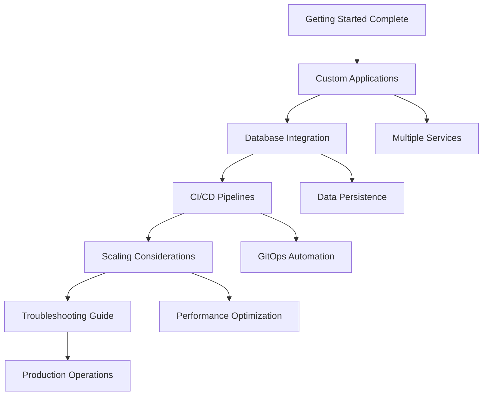

# Intermediate Tutorial Series - Customization and Scaling

**Master advanced application patterns, database integration, and production scaling techniques**

After completing the getting-started series, you're ready to tackle more complex scenarios involving custom applications, persistent data storage, and scaling considerations. This intermediate series builds upon your foundational knowledge to create production-ready application architectures.

## Series Overview

This tutorial series focuses on real-world application patterns that go beyond simple stateless web services. You'll learn to deploy applications with databases, implement custom CI/CD workflows, and design for scale while maintaining operational simplicity.

### Learning Progression



**Prerequisites for this series:**
- Completed all getting-started tutorials
- Familiarity with containerization concepts
- Basic understanding of database concepts
- Knowledge of CI/CD principles
- Experience with YAML configuration

---

## Tutorial 1: Custom Applications

**[01-custom-applications.md](01-custom-applications.md)**

Learn to deploy complex multi-service applications with advanced patterns:

- **Multi-container applications** with sidecar patterns
- **Inter-service communication** and service mesh basics
- **Configuration management** with ConfigMaps and Secrets
- **Health checks and lifecycle management**
- **Resource optimization** and quality of service
- **Security contexts and pod security standards**

**Key takeaways:**
- Deploy applications with multiple interconnected services
- Implement secure communication between application components
- Use advanced Kubernetes features for production workloads
- Optimize resource allocation and implement proper security controls

**Time estimate:** 60 minutes  
**Difficulty:** Intermediate

---

## Tutorial 2: Database Integration

**[02-database-integration.md](02-database-integration.md)**

Master persistent data storage patterns for stateful applications:

- **PostgreSQL deployment** with high availability
- **Data persistence** with proper storage classes
- **Backup and recovery** strategies
- **Connection pooling** and performance optimization
- **Database migrations** and schema management
- **Security** hardening and access controls

**Key takeaways:**
- Deploy production-ready databases in Kubernetes
- Implement reliable backup and disaster recovery procedures
- Optimize database performance and connection management
- Secure database access and implement compliance controls

**Time estimate:** 75 minutes  
**Difficulty:** Intermediate-Advanced

---

## Tutorial 3: CI/CD Pipelines *(Session 6)*

**[03-cicd-pipelines.md](03-cicd-pipelines.md)**

Build sophisticated continuous integration and deployment workflows:

- **Advanced GitOps patterns** beyond basic deployment
- **Multi-environment promotion** pipelines
- **Automated testing integration** with deployment gates
- **Rollback strategies** and canary deployments
- **Security scanning** in CI/CD workflows
- **Performance testing automation**

**Key takeaways:**
- Create robust CI/CD pipelines that ensure code quality
- Implement safe deployment practices with automated rollbacks
- Integrate security and performance testing into development workflow
- Design multi-environment promotion strategies

**Time estimate:** 90 minutes  
**Difficulty:** Advanced

---

## Tutorial 4: Scaling Considerations *(Session 6)*

**[04-scaling-considerations.md](04-scaling-considerations.md)**

Design applications and infrastructure for horizontal and vertical scaling:

- **Horizontal Pod Autoscaling** (HPA) configuration
- **Vertical Pod Autoscaling** (VPA) patterns
- **Cluster autoscaling** strategies
- **Resource planning** and capacity management
- **Performance testing** and bottleneck identification
- **Cost optimization** at scale

**Key takeaways:**
- Implement automated scaling policies for applications and infrastructure
- Design applications that scale efficiently and cost-effectively
- Monitor and optimize resource utilization patterns
- Plan capacity requirements based on growth projections

**Time estimate:** 60 minutes  
**Difficulty:** Intermediate-Advanced

---

## Tutorial 5: Troubleshooting Guide *(Session 6)*

**[05-troubleshooting-guide.md](05-troubleshooting-guide.md)**

Master production troubleshooting techniques and operational procedures:

- **Systematic debugging** approaches for complex applications
- **Log aggregation** and analysis techniques
- **Performance profiling** and optimization
- **Network troubleshooting** in Kubernetes
- **Storage and persistence** issue resolution
- **Emergency response** procedures and runbooks

**Key takeaways:**
- Develop systematic approaches to troubleshooting complex issues
- Use advanced debugging tools and techniques effectively
- Create operational runbooks for common production scenarios
- Implement proactive monitoring and alerting strategies

**Time estimate:** 45 minutes  
**Difficulty:** Intermediate

---

## Prerequisites Deep Dive

### Required Knowledge

Before starting this series, ensure you have solid understanding of:

**Kubernetes Concepts:**
- Pod, Service, Deployment, ConfigMap, Secret fundamentals
- Ingress configuration and SSL termination
- Persistent Volumes and Storage Classes
- Resource requests, limits, and Quality of Service
- Health checks (liveness, readiness, startup probes)

**Container Technology:**
- Docker container creation and optimization
- Multi-stage builds and layer caching
- Container security best practices
- Image registry management

**Infrastructure as Code:**
- YAML configuration management
- Kustomize for configuration variants
- Helm chart basics and templating
- GitOps principles with FluxCD

**Monitoring and Observability:**
- Prometheus metrics collection
- Grafana dashboard creation
- AlertManager notification configuration
- Log analysis and troubleshooting

### Infrastructure Requirements

**Minimum cluster specifications:**
- **3 worker nodes** with 4GB RAM, 2 CPU cores each
- **50GB storage** available for persistent volumes
- **LoadBalancer** capability (MetalLB or cloud provider)
- **Ingress controller** with SSL termination (NGINX + cert-manager)
- **Monitoring stack** deployed (Prometheus + Grafana)

**External services:**
- **Domain name** with DNS management API access
- **Container registry** access (GitHub Container Registry recommended)
- **SMTP server** for alert notifications (optional but recommended)

### Development Environment

**Local tools required:**
- `kubectl` with cluster access configured
- `helm` v3.x for package management
- `docker` for container operations
- `git` for version control
- Code editor with YAML syntax support

**Recommended tools:**
- `k9s` for interactive cluster management
- `kubectx/kubens` for context switching
- `stern` for multi-pod log streaming
- `dive` for container image analysis

---

## Learning Approach

### Hands-On Focus

Each tutorial in this series emphasizes practical implementation over theoretical concepts. You'll:

1. **Deploy real applications** with actual business logic
2. **Encounter realistic problems** and learn to solve them systematically
3. **Build production-ready solutions** that can be adapted for actual use
4. **Develop operational skills** through troubleshooting exercises

### Progressive Complexity

The tutorials build upon each other progressively:

- **Tutorial 1** introduces multi-service patterns
- **Tutorial 2** adds persistent data requirements  
- **Tutorial 3** incorporates automated delivery workflows
- **Tutorial 4** addresses scale and performance considerations
- **Tutorial 5** develops operational troubleshooting skills

### Validation and Testing

Each tutorial includes:
- **Verification steps** to confirm successful implementation
- **Testing procedures** to validate functionality
- **Troubleshooting sections** for common issues
- **Production checklists** for deployment readiness

---

## Common Patterns and Anti-Patterns

### Recommended Patterns

**Configuration Management:**
```yaml
# Good: Externalized configuration
apiVersion: apps/v1
kind: Deployment
spec:
  template:
    spec:
      containers:
      - name: app
        envFrom:
        - configMapRef:
            name: app-config
        - secretRef:
            name: app-secrets
```

**Resource Management:**
```yaml
# Good: Explicit resource requests and limits
resources:
  requests:
    memory: "256Mi"
    cpu: "250m"
  limits:
    memory: "512Mi" 
    cpu: "500m"
```

**Health Checks:**
```yaml
# Good: Comprehensive health checking
livenessProbe:
  httpGet:
    path: /health
    port: 8080
  initialDelaySeconds: 30
  periodSeconds: 10
readinessProbe:
  httpGet:
    path: /ready
    port: 8080
  initialDelaySeconds: 5
  periodSeconds: 5
```

### Anti-Patterns to Avoid

**❌ Don't:** Deploy without resource limits
- **Problem:** Can cause node resource exhaustion
- **Solution:** Always specify resource requests and limits

**❌ Don't:** Store secrets in container images
- **Problem:** Security vulnerability and poor operational practices
- **Solution:** Use Kubernetes Secrets and external secret management

**❌ Don't:** Deploy single points of failure
- **Problem:** Application unavailability during updates or failures
- **Solution:** Design for high availability with multiple replicas

**❌ Don't:** Ignore persistent volume backup
- **Problem:** Data loss during disasters or mistakes
- **Solution:** Implement automated backup and tested restore procedures

---

## Production Readiness Framework

### Deployment Checklist

Before considering any intermediate tutorial application "production ready":

**Security:**
- [ ] Non-root containers with explicit user IDs
- [ ] Pod Security Standards compliance
- [ ] Network policies for traffic segmentation
- [ ] Secret management with external providers
- [ ] Regular vulnerability scanning

**Reliability:**
- [ ] Multiple replicas with anti-affinity rules
- [ ] Proper health checks configured
- [ ] Resource requests and limits set
- [ ] Graceful shutdown handling
- [ ] Circuit breaker patterns implemented

**Observability:**
- [ ] Structured logging with correlation IDs
- [ ] Prometheus metrics exposed
- [ ] Grafana dashboards created
- [ ] Alert rules configured and tested
- [ ] Distributed tracing (for complex applications)

**Operational Excellence:**
- [ ] Automated deployment pipelines
- [ ] Rollback procedures tested
- [ ] Disaster recovery plan documented
- [ ] Performance benchmarks established
- [ ] Runbooks created for common operations

### Success Metrics

Track these metrics to validate intermediate tutorial outcomes:

**Performance Metrics:**
- Application response times < 200ms (95th percentile)
- Database query times < 50ms (average)
- Container startup times < 30 seconds
- Zero-downtime deployment success rate > 99%

**Reliability Metrics:**
- Application uptime > 99.9%
- Recovery time from failures < 5 minutes
- Backup success rate = 100%
- Alert false positive rate < 5%

**Operational Metrics:**
- Deployment frequency (daily capability)
- Mean time to resolution < 30 minutes
- Change failure rate < 5%
- Documentation coverage > 90%

---

## Getting Help

### Troubleshooting Resources

**Within tutorials:**
- Each tutorial includes comprehensive troubleshooting sections
- Common error patterns and solutions documented
- Debug commands and diagnostic procedures provided

**External resources:**
- [Kubernetes Official Documentation](https://kubernetes.io/docs/)
- [Cloud Native Computing Foundation](https://www.cncf.io/) resources
- Community forums and Stack Overflow

### Community Support

**Best practices for getting help:**
1. **Search existing resources** before asking questions
2. **Provide context** including error messages and configurations
3. **Include environment details** (cluster version, operating system, etc.)
4. **Share reproducible examples** when possible

---

## Next Steps

Ready to begin? Start with **[Tutorial 1: Custom Applications](01-custom-applications.md)** to learn advanced application deployment patterns.

**After completing this series, you'll be ready for:**
- Advanced tutorial series (Session 6)
- Production deployment of complex applications
- Infrastructure optimization and cost management
- Team leadership in DevOps and platform engineering roles

**Estimated total series completion time:** 4-5 hours  
**Recommended pace:** 1-2 tutorials per week with hands-on practice

---

The intermediate series represents a significant step forward in your cloud-native journey. These tutorials will challenge you with real-world scenarios and prepare you for the complexities of production infrastructure management. Take your time, practice extensively, and don't hesitate to revisit concepts as needed.

**Your infrastructure foundation is solid. Now let's build something impressive on top of it.**